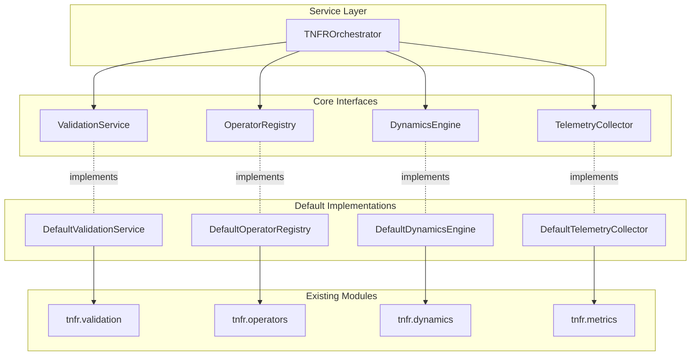
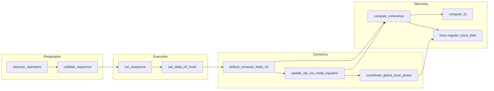

# TNFR Architecture Guide

This guide expands the README summary by detailing how the TNFR Python Engine organises its modules, maintains data flow between orchestration layers, and enforces the canonical invariants that define Resonant Fractal Nature Theory (TNFR). Use it whenever you extend structural operators, instrumentation, or runtime coordination.

## Modular Architecture (New)

TNFR 2.0 introduces a clean separation of responsibilities through Protocol-based interfaces and dependency injection, enabling flexible composition while maintaining backward compatibility.

### Core Interfaces

The engine is now structured around four fundamental interfaces defined in `tnfr.core.interfaces`:

| Interface | Responsibility | Implementation |
| --- | --- | --- |
| `OperatorRegistry` | Maps operator tokens to implementations | `DefaultOperatorRegistry` wraps `tnfr.operators.registry` |
| `ValidationService` | Validates sequences and graph states | `DefaultValidationService` wraps `tnfr.validation` |
| `DynamicsEngine` | Computes ΔNFR and integrates nodal equation | `DefaultDynamicsEngine` wraps `tnfr.dynamics` |
| `TelemetryCollector` | Captures coherence, Si, and traces | `DefaultTelemetryCollector` wraps `tnfr.metrics` |

### Orchestration Service

The `TNFROrchestrator` coordinates execution with clear separation:

```python
from tnfr.core import TNFRContainer
from tnfr.services import TNFROrchestrator
from tnfr.structural import create_nfr

# Create orchestrator with default services
container = TNFRContainer.create_default()
orchestrator = TNFROrchestrator.from_container(container)

# Execute sequence with separated responsibilities
G, node = create_nfr("test", epi=1.0, vf=1.0)
orchestrator.execute_sequence(
    G, node, 
    ["emission", "reception", "coherence", "coupling", "dissonance", "resonance", "silence"],
    enable_telemetry=True
)
```

### Dependency Injection

Custom implementations can be injected without modifying the engine:

```python
from tnfr.core import TNFRContainer, ValidationService

class StrictValidator:
    def validate_sequence(self, sequence):
        # Custom validation logic
        pass
    
    def validate_graph_state(self, graph):
        # Custom graph validation
        pass

# Register custom implementation
container = TNFRContainer()
container.register_singleton(ValidationService, StrictValidator())
# ... register other services
orchestrator = TNFROrchestrator.from_container(container)
```

### Benefits

1. **Testability**: Each layer can be mocked independently for unit testing
2. **Extensibility**: Custom implementations without modifying core code
3. **Maintainability**: Clear boundaries reduce coupling and complexity
4. **Backward Compatibility**: Existing code using `run_sequence` continues to work

### Architecture Diagram



## Layered responsibilities

| Layer | Key modules | Primary responsibilities | TNFR invariants guarded |
| --- | --- | --- | --- |
| Structural grammar | `tnfr.structural`, `tnfr.validation`, `tnfr.flatten` | Instantiate nodes, validate operator sequences, expand THOL blocks, and ensure all operations traverse the canonical grammar before execution.【F:src/tnfr/structural.py†L39-L109】【F:src/tnfr/validation/__init__.py†L1-L104】【F:src/tnfr/operators/grammar.py†L1-L318】【F:src/tnfr/flatten.py†L1-L120】 | Invariants 1, 4, 5, 7 — operators drive EPI evolution, maintain closure, enforce phase checks, and preserve fractality. |
| Operator registry | `tnfr.operators.definitions`, `tnfr.operators.registry` | Declare canonical operators, bind glyphs to ASCII names, and auto-discover implementations so the structural layer never executes unknown tokens.【F:src/tnfr/operators/definitions.py†L45-L180】【F:src/tnfr/operators/registry.py†L13-L50】 | Invariants 3, 4, 10 — ΔNFR semantics remain canonical, closure is preserved, and the glyph alphabet stays domain-neutral. |
| Dynamics and adaptation | `tnfr.dynamics.__init__`, `tnfr.dynamics.dnfr`, `tnfr.dynamics.integrators` | Mix ΔNFR, adapt νf/phase, integrate the nodal equation, and route job overrides or clamps so runtime evolution honours reproducibility and unit constraints.【F:src/tnfr/dynamics/__init__.py†L59-L169】【F:src/tnfr/dynamics/dnfr.py†L1958-L2020】【F:src/tnfr/dynamics/integrators.py†L420-L483】 | Invariants 1, 2, 3, 5, 8 — nodal equation controls EPI, νf stays in Hz_str, ΔNFR keeps canonical meaning, coupling checks phase synchrony, and stochastic hooks remain traceable. |
| Telemetry and traces | `tnfr.metrics.common`, `tnfr.metrics.sense_index`, `tnfr.trace`, `tnfr.metrics.trig`, `tnfr.metrics.trig_cache` | Compute C(t), ΔNFR summaries, Si, and phase telemetry; capture before/after snapshots; expose caches for reproducible analytics.【F:src/tnfr/metrics/common.py†L32-L111】【F:src/tnfr/metrics/common.py†L96-L149】【F:src/tnfr/metrics/sense_index.py†L1-L200】【F:src/tnfr/trace.py†L169-L319】【F:src/tnfr/metrics/trig_cache.py†L1-L120】 | Invariants 8, 9 — telemetry remains reproducible, coherence metrics stay visible, and trace history documents operator effects. |
| Shared services | `tnfr.utils`, `tnfr.utils.cache`, `tnfr.locking`, `tnfr.rng` | Provide deterministic caches, named locks, and RNG orchestration that higher layers reference through stable facades.【F:src/tnfr/utils/__init__.py†L1-L160】【F:src/tnfr/utils/cache.py†L1-L220】【F:src/tnfr/locking.py†L1-L36】【F:src/tnfr/rng.py†L1-L88】 | Invariants 8, 9 — shared state is synchronised and telemetry-aware.

### Structural loop orchestration



1. **Discovery** imports the operator package so decorators populate the registry before any structural execution.【F:src/tnfr/operators/registry.py†L33-L50】
2. **Validation** confirms the canonical RECEPTION→COHERENCE segment, checks THOL closure, and rejects unknown tokens before touching graph state.【F:src/tnfr/validation/__init__.py†L1-L104】【F:src/tnfr/operators/grammar.py†L600-L720】
3. **Execution** invokes each operator, then defers ΔNFR/EPI recomputation to the configured hook, keeping the structural layer free of ad-hoc state mutation.【F:src/tnfr/structural.py†L87-L105】
4. **Dynamics** recompute ΔNFR, integrate the nodal equation, and coordinate phase coupling. Hooks accept per-run overrides while clamping νf/EPI against canonical bounds.【F:src/tnfr/dynamics/dnfr.py†L1958-L2006】【F:src/tnfr/dynamics/integrators.py†L420-L483】【F:src/tnfr/dynamics/__init__.py†L172-L199】
5. **Telemetry** extracts coherence, Si, and trace snapshots with caches that ensure reproducible neighbour maps and glyph histories.【F:src/tnfr/metrics/common.py†L32-L111】【F:src/tnfr/metrics/sense_index.py†L1-L200】【F:src/tnfr/trace.py†L169-L319】

## ΔNFR and telemetry data paths

The following table highlights how ΔNFR values propagate through the engine and how related telemetry is persisted.

| Stage | Source module | Data emitted | Consumers |
| --- | --- | --- | --- |
| Hook install | `tnfr.dynamics.set_delta_nfr_hook` | Registers callable and metadata under `G.graph['compute_delta_nfr']`, seeding DNFR weights if absent.【F:src/tnfr/dynamics/dnfr.py†L1985-L2020】 | Structural loop (`run_sequence`), dynamics runners (`step`, `run`) |
| Gradient mix | `tnfr.dynamics.dnfr.default_compute_delta_nfr` | Updates per-node ΔNFR attributes and records hook metadata for traces.【F:src/tnfr/dynamics/dnfr.py†L1958-L1982】 | Nodal integrators, telemetry caches |
| Integration | `tnfr.dynamics.integrators.update_epi_via_nodal_equation` | Produces EPI, dEPI/dt, and d²EPI/dt² while advancing graph time.【F:src/tnfr/dynamics/integrators.py†L434-L483】 | Metrics (`compute_coherence`), trace snapshots |
| Coherence metrics | `tnfr.metrics.common.compute_coherence` | Aggregates C(t), mean |ΔNFR|, and |dEPI/dt| across nodes.【F:src/tnfr/metrics/common.py†L32-L58】 | Trace captures, CLI/SDK consumers |
| Sense index | `tnfr.metrics.sense_index.compute_Si` | Evaluates Si with cached neighbour topology and harmonic weighting.【F:src/tnfr/metrics/sense_index.py†L40-L188】 | Trace captures, selectors |
| Trace capture | `tnfr.trace.register_trace_field` et al. | Stores ΔNFR weights, Kuramoto order, glyph counts, and callbacks into history buffers.【F:src/tnfr/trace.py†L169-L319】 | Audit tooling, reproducibility checks |

## Operator registration mechanics

Operator classes apply the `@register_operator` decorator, which verifies unique ASCII names, binds glyphs, and inserts implementations into the shared `OPERATORS` map used by syntax validators and dynamic dispatch.【F:src/tnfr/operators/definitions.py†L45-L180】【F:src/tnfr/operators/registry.py†L13-L58】 The discovery routine scans the `tnfr.operators` package exactly once per interpreter session, importing every submodule except the registry itself so that registration side effects run reliably before the structural loop accesses them.【F:src/tnfr/operators/registry.py†L33-L58】

When introducing new operators:

- Provide ASCII `name` and canonical `Glyph` binding on the class definition.【F:src/tnfr/operators/definitions.py†L45-L180】
- Update grammar/syntax tables if the operator alters the canonical sequence, ensuring THOL blocks and closure sets remain valid.【F:src/tnfr/validation/__init__.py†L1-L104】【F:src/tnfr/operators/grammar.py†L600-L720】
- Supply trace fields or telemetry hooks if the operator produces novel metrics, keeping the coherence log consistent.【F:src/tnfr/trace.py†L169-L319】

### Operator vocabulary (English only)

TNFR 2.0 completes the transition to **English-only** operator identifiers. The registry,
validation helpers, CLI, and documentation all use the same canonical ASCII tokens:

| Token         | Role summary            |
| ------------- | ----------------------- |
| `emission`    | Initiates resonance     |
| `reception`   | Captures information    |
| `coherence`   | Stabilises the form     |
| `dissonance`  | Introduces controlled Δ |
| `coupling`    | Synchronises nodes      |
| `resonance`   | Propagates coherence    |
| `silence`     | Freezes evolution       |
| `expansion`   | Scales the structure    |
| `contraction` | Densifies the form      |
| `self_organization` | Guides self-order |
| `mutation`    | Adjusts phase safely    |
| `transition`  | Crosses thresholds      |
| `recursivity` | Maintains memory        |

Only the canonical English spellings remain in the public API, the exported ``__all__`` bindings,
and the validation layer. Downstream callers must use the names shown above; the registry no
longer performs alias canonicalisation and ``get_operator_class()`` raises :class:`KeyError` for
non-English identifiers.【F:src/tnfr/config/operator_names.py†L1-L77】【F:src/tnfr/operators/registry.py†L13-L45】

## Enforcing TNFR invariants in runtime orchestration

Runtime functions coordinate clamps, selectors, and job overrides to keep simulations reproducible without sacrificing performance:

- `apply_canonical_clamps` enforces configured bounds for EPI, νf, and θ, optionally recording clamp alerts for strict graphs.【F:src/tnfr/validation/runtime.py†L46-L103】
- `_normalize_job_overrides` and `_resolve_jobs_override` map user overrides to canonical keys, ensuring distributed execution honours reproducibility contracts.【F:src/tnfr/dynamics/__init__.py†L114-L169】
- Trace helpers attach before/after callbacks through the central manager so that operator applications, glyph selectors, and Kuramoto order parameters remain auditable.【F:src/tnfr/trace.py†L169-L319】

Together these layers ensure every structural change maps back to the TNFR grammar, preserves unit semantics, and leaves behind a telemetry trail suitable for coherence analysis.

## Numerical Stability and Boundary Protection

### TNFR Structural Boundaries

In TNFR, the EPI range [-1.0, 1.0] represents the **structural container** of node identity. Boundaries are not arbitrary restrictions but intrinsic limits that preserve coherence:

- **EPI_MAX = 1.0**: Maximum structural expansion before identity fragmentation
- **EPI_MIN = -1.0**: Maximum structural contraction before identity collapse

These boundaries define the **operational space** within which a node maintains its structural identity. Exceeding them does not simply produce "out of range" values—it represents a transition beyond the node's capacity to maintain coherent form.

### Boundary Protection System

The engine implements a **three-layer protection system** that progressively enforces structural boundaries while preserving TNFR operational principles:

1. **Conservative constants**: Reduced expansion factors that naturally stay within bounds
2. **Edge-aware scaling**: Operators dynamically adapt their magnitude near boundaries  
3. **Structural clipping**: Unified boundary enforcement preserving continuity

This layered approach embodies the TNFR principle that **operators are the only paths for change**—boundaries are maintained through operational awareness, not post-hoc corrections.

#### Layer 1: Conservative Constants

The `VAL_scale` parameter controls expansion rate for the VAL (expansion) operator:

- **Current value**: 1.05 (reduced from previous 1.15)
- **Critical threshold**: EPI ≥ 0.952381 (vs previous 0.869565)
- **Rationale**: 8.7% reduction in scale factor improves numerical stability while maintaining meaningful expansion capacity

This conservative value means that single VAL applications rarely approach boundaries under normal operation, reducing the need for downstream interventions.

#### Layer 2: Edge-aware Scaling

Operators dynamically adapt near boundaries through **edge-aware scaling**, which adjusts the effective scale factor based on proximity to structural limits:

**VAL (Expansion) edge-awareness**:
```python
scale_eff = min(VAL_scale, EPI_MAX / max(abs(EPI_current), ε))
```

This ensures that `EPI_current * scale_eff ≤ EPI_MAX`, providing a **gradual approach** to boundaries without overshoot.

**NUL (Contraction) edge-awareness**:
```python
if EPI_current < 0:
    scale_eff = min(NUL_scale, abs(EPI_MIN / min(EPI_current, -ε)))
else:
    scale_eff = NUL_scale  # Normal contraction (always safe with scale < 1.0)
```

For negative EPI values approaching EPI_MIN, the scale is adapted to prevent underflow.

**Configuration**:
- `EDGE_AWARE_ENABLED`: Enable/disable edge-aware scaling (default: `True`)
- `EDGE_AWARE_EPSILON`: Small value to prevent division by zero (default: `1e-12`)

**Telemetry**: When scale adaptation occurs, the engine records intervention metadata in `graph["edge_aware_interventions"]`, tracking:
- Glyph name (VAL/NUL)
- EPI before/after
- Requested vs. effective scale
- Adaptation flag

#### Layer 3: Structural Clipping

The `structural_clip()` function provides the final enforcement layer, applied during nodal equation integration. See the "Structural Boundary Preservation" section below for detailed documentation.

### TNFR Principles Alignment

This three-layer system preserves core TNFR principles:

- **Operator closure**: All operators produce valid EPI values within structural bounds
- **Coherence preservation**: Boundaries define valid structural space; violations represent identity loss
- **Structural continuity**: Edge-aware scaling provides smooth approach to limits
- **Operational fractality**: Boundary awareness operates at all scales
- **Reproducibility**: Deterministic adaptation ensures identical results across runs

The key insight is that **boundary protection is integrated into the operational fabric**, not imposed externally. Operators "know" about boundaries and adapt accordingly, maintaining the TNFR principle that structure emerges from resonance, not constraint.

## Structural Boundary Preservation

TNFR maintains strict structural boundaries to preserve coherence and ensure that the Primary Information Structure (EPI) remains within valid ranges. This prevents numerical precision issues from violating structural invariants during operator application and integration.

### The structural_clip Function

The `structural_clip` function in `tnfr.dynamics.structural_clip` implements canonical TNFR boundary enforcement with two modes:

- **Hard mode** (default): Classic clamping for immediate stability. Values outside [EPI_MIN, EPI_MAX] are clamped to the nearest boundary. Fast and ensures strict bounds.
- **Soft mode**: Smooth hyperbolic tangent mapping that preserves derivative continuity. Values are smoothly compressed near boundaries using a sigmoid function, controlled by the `CLIP_SOFT_K` steepness parameter.

### Integration Point

Structural clipping is automatically applied during nodal equation integration in `DefaultIntegrator.integrate()`. After computing the new EPI value via the canonical equation `∂EPI/∂t = νf · ΔNFR(t)`, the integrator applies `structural_clip` before updating node attributes:

```python
# In src/tnfr/dynamics/integrators.py, line ~565
epi_clipped = structural_clip(
    epi, 
    lo=epi_min,  # From graph config or DEFAULTS
    hi=epi_max,  # From graph config or DEFAULTS
    mode=clip_mode,  # "hard" (default) or "soft"
    k=clip_k,  # Steepness for soft mode (default: 3.0)
)
```

### Configuration

Structural boundary behavior is configured via graph-level parameters:

- `EPI_MIN`: Lower boundary for EPI (default: -1.0)
- `EPI_MAX`: Upper boundary for EPI (default: 1.0)
- `CLIP_MODE`: Clipping mode, either "hard" or "soft" (default: "hard")
- `CLIP_SOFT_K`: Steepness parameter for soft mode (default: 3.0)

### Critical Use Cases

This mechanism solves the VAL/NUL operator boundary issue documented in the issue tracker:

1. **VAL (Expansion) overflow**: With the conservative VAL_scale=1.05, the critical threshold is EPI ≥ 0.952381 (vs previous 0.869565 with VAL_scale=1.15). This 8.7% reduction in scale factor significantly improves numerical stability while maintaining meaningful expansion capacity. `structural_clip` provides secondary protection ensuring EPI ≤ EPI_MAX.
2. **NUL (Contraction) underflow**: Symmetric case for negative EPI values. `structural_clip` ensures EPI ≥ EPI_MIN.
3. **Repeated operator applications**: Multiple VAL or NUL applications in sequence maintain boundaries through consistent clipping. Note that TNFR canonical grammar prevents consecutive VAL→VAL transitions (high→high), requiring intermediate consolidation operators (RA, IL, UM) to preserve structural coherence.

### Telemetry (Optional)

The `structural_clip` function supports optional telemetry via `StructuralClipStats`, which tracks:
- Number of hard and soft clip interventions
- Maximum and average deltas applied
- Total adjustments made

This telemetry is disabled by default for performance but can be enabled via `record_stats=True` for debugging and tuning.

### TNFR Principles

Structural boundary preservation aligns with core TNFR principles:

- **Coherence preservation**: Boundaries define valid structural space; clipping prevents fragmentation
- **Operator closure**: All operators must produce valid EPI values within structural bounds
- **Structural continuity**: Soft mode preserves smooth derivatives for gradient-based analysis
- **Reproducibility**: Deterministic clipping ensures identical results across runs

## Test isolation and module management

### Module clearing pattern for test independence

Test files use `sys.modules` manipulation to guarantee test isolation and enable
controlled re-import scenarios. This pattern is **not URL validation** or sanitization —
it is legitimate module cache management for testing purposes.

#### Using the utility function

The canonical approach is to use the `clear_test_module()` utility from `tests.utils`:

```python
from tests.utils import clear_test_module

# Clear a module before re-importing
clear_test_module('tnfr.utils.io')
import tnfr.utils.io  # Fresh import with clean state
```

#### Why this pattern exists

1. **Test isolation**: Ensures each test starts with a fresh module state
2. **Import side effects**: Tests deprecation warnings, lazy imports, and initialization logic
3. **Cache clearing**: Validates that caching mechanisms work correctly across imports
4. **Fixture cleanup**: Guarantees fixtures provide truly independent module instances

#### Static analysis considerations

The pattern `'module.name' in sys.modules` may trigger false positives in static analysis
tools (e.g., CodeQL's `py/incomplete-url-substring-sanitization`). This is because:

- Module paths contain dots (like `tnfr.utils.io`)
- Security scanners may mistake this for incomplete URL validation
- The substring check is NOT validating hostnames or URLs

**Resolution**: The repository includes `.codeql/codeql-config.yml` that excludes test files
from this specific rule, since test code legitimately uses module path checking for isolation,
not security validation.

#### Direct manipulation (avoid)

While the following pattern works, it should be avoided in favor of the utility function:

```python
# Discouraged: direct manipulation may trigger security scanners
if 'module.name' in sys.modules:  # May be flagged as URL sanitization
    del sys.modules['module.name']
```

The utility function approach provides better clarity and centralizes the pattern in one
well-documented location.

