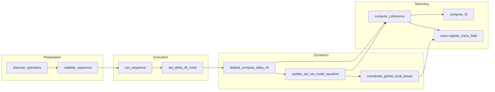

# TNFR Architecture Guide

This guide expands the README summary by detailing how the TNFR Python Engine organises its modules, maintains data flow between orchestration layers, and enforces the canonical invariants that define Resonant Fractal Nature Theory (TNFR). Use it whenever you extend structural operators, instrumentation, or runtime coordination.

## Layered responsibilities

| Layer | Key modules | Primary responsibilities | TNFR invariants guarded |
| --- | --- | --- | --- |
| Structural grammar | `tnfr.structural`, `tnfr.validation.syntax`, `tnfr.validation.grammar`, `tnfr.flatten` | Instantiate nodes, validate operator sequences, expand THOL blocks, and ensure all operations traverse the canonical grammar before execution.【F:src/tnfr/structural.py†L39-L109】【F:src/tnfr/validation/syntax.py†L27-L121】【F:src/tnfr/validation/grammar.py†L1-L90】【F:src/tnfr/flatten.py†L1-L120】 | Invariants 1, 4, 5, 7 — operators drive EPI evolution, maintain closure, enforce phase checks, and preserve fractality. |
| Operator registry | `tnfr.operators.definitions`, `tnfr.operators.registry` | Declare canonical operators, bind glyphs to ASCII names, and auto-discover implementations so the structural layer never executes unknown tokens.【F:src/tnfr/operators/definitions.py†L45-L180】【F:src/tnfr/operators/registry.py†L13-L50】 | Invariants 3, 4, 10 — ΔNFR semantics remain canonical, closure is preserved, and the glyph alphabet stays domain-neutral. |
| Dynamics and adaptation | `tnfr.dynamics.__init__`, `tnfr.dynamics.dnfr`, `tnfr.dynamics.integrators` | Mix ΔNFR, adapt νf/phase, integrate the nodal equation, and route job overrides or clamps so runtime evolution honours reproducibility and unit constraints.【F:src/tnfr/dynamics/__init__.py†L59-L169】【F:src/tnfr/dynamics/dnfr.py†L1958-L2020】【F:src/tnfr/dynamics/integrators.py†L420-L483】 | Invariants 1, 2, 3, 5, 8 — nodal equation controls EPI, νf stays in Hz_str, ΔNFR keeps canonical meaning, coupling checks phase synchrony, and stochastic hooks remain traceable. |
| Telemetry and traces | `tnfr.metrics.common`, `tnfr.metrics.sense_index`, `tnfr.trace`, `tnfr.metrics.trig`, `tnfr.metrics.trig_cache` | Compute C(t), ΔNFR summaries, Si, and phase telemetry; capture before/after snapshots; expose caches for reproducible analytics.【F:src/tnfr/metrics/common.py†L32-L111】【F:src/tnfr/metrics/common.py†L96-L149】【F:src/tnfr/metrics/sense_index.py†L1-L200】【F:src/tnfr/trace.py†L169-L319】【F:src/tnfr/metrics/trig_cache.py†L1-L120】 | Invariants 8, 9 — telemetry remains reproducible, coherence metrics stay visible, and trace history documents operator effects. |
| Shared services | `tnfr.helpers`, `tnfr.cache`, `tnfr.locking`, `tnfr.rng` | Provide deterministic caches, named locks, and RNG orchestration that higher layers reference through stable facades.【F:src/tnfr/helpers/__init__.py†L1-L74】【F:src/tnfr/cache.py†L1-L120】【F:src/tnfr/locking.py†L1-L36】【F:src/tnfr/rng.py†L1-L88】 | Invariants 8, 9 — shared state is synchronised and telemetry-aware.

### Structural loop orchestration

1. **Discovery** imports the operator package so decorators populate the registry before any structural execution.【F:src/tnfr/operators/registry.py†L33-L50】
2. **Validation** confirms the canonical RECEPTION→COHERENCE segment, checks THOL closure, and rejects unknown tokens before touching graph state.【F:src/tnfr/validation/syntax.py†L27-L115】
3. **Execution** invokes each operator, then defers ΔNFR/EPI recomputation to the configured hook, keeping the structural layer free of ad-hoc state mutation.【F:src/tnfr/structural.py†L87-L105】
4. **Dynamics** recompute ΔNFR, integrate the nodal equation, and coordinate phase coupling. Hooks accept per-run overrides while clamping νf/EPI against canonical bounds.【F:src/tnfr/dynamics/dnfr.py†L1958-L2006】【F:src/tnfr/dynamics/integrators.py†L420-L483】【F:src/tnfr/dynamics/__init__.py†L172-L199】
5. **Telemetry** extracts coherence, Si, and trace snapshots with caches that ensure reproducible neighbour maps and glyph histories.【F:src/tnfr/metrics/common.py†L32-L111】【F:src/tnfr/metrics/sense_index.py†L1-L200】【F:src/tnfr/trace.py†L169-L319】

## ΔNFR and telemetry data paths

The following table highlights how ΔNFR values propagate through the engine and how related telemetry is persisted.

| Stage | Source module | Data emitted | Consumers |
| --- | --- | --- | --- |
| Hook install | `tnfr.dynamics.set_delta_nfr_hook` | Registers callable and metadata under `G.graph['compute_delta_nfr']`, seeding DNFR weights if absent.【F:src/tnfr/dynamics/dnfr.py†L1985-L2020】 | Structural loop (`run_sequence`), dynamics runners (`step`, `run`) |
| Gradient mix | `tnfr.dynamics.dnfr.default_compute_delta_nfr` | Updates per-node ΔNFR attributes and records hook metadata for traces.【F:src/tnfr/dynamics/dnfr.py†L1958-L1982】 | Nodal integrators, telemetry caches |
| Integration | `tnfr.dynamics.integrators.update_epi_via_nodal_equation` | Produces EPI, dEPI/dt, and d²EPI/dt² while advancing graph time.【F:src/tnfr/dynamics/integrators.py†L434-L483】 | Metrics (`compute_coherence`), trace snapshots |
| Coherence metrics | `tnfr.metrics.common.compute_coherence` | Aggregates C(t), mean |ΔNFR|, and |dEPI/dt| across nodes.【F:src/tnfr/metrics/common.py†L32-L58】 | Trace captures, CLI/SDK consumers |
| Sense index | `tnfr.metrics.sense_index.compute_Si` | Evaluates Si with cached neighbour topology and harmonic weighting.【F:src/tnfr/metrics/sense_index.py†L40-L188】 | Trace captures, selectors |
| Trace capture | `tnfr.trace.register_trace_field` et al. | Stores ΔNFR weights, Kuramoto order, glyph counts, and callbacks into history buffers.【F:src/tnfr/trace.py†L169-L319】 | Audit tooling, reproducibility checks |

## Operator registration mechanics

Operator classes apply the `@register_operator` decorator, which verifies unique ASCII names, binds glyphs, and inserts implementations into the shared `OPERATORS` map used by syntax validators and dynamic dispatch.【F:src/tnfr/operators/definitions.py†L45-L180】【F:src/tnfr/operators/registry.py†L13-L58】 The discovery routine scans the `tnfr.operators` package exactly once per interpreter session, importing every submodule except the registry itself so that registration side effects run reliably before the structural loop accesses them.【F:src/tnfr/operators/registry.py†L33-L58】

> **Compatibility note**: The previous `OPERADORES` export now resolves through a deprecated module attribute. Existing consumers that import `tnfr.operators.registry.OPERADORES` continue to receive the same mapping but will emit a `DeprecationWarning`; new code should use `OPERATORS` instead.【F:src/tnfr/operators/registry.py†L44-L58】

When introducing new operators:

- Provide ASCII `name` and canonical `Glyph` binding on the class definition.【F:src/tnfr/operators/definitions.py†L45-L180】
- Update grammar/syntax tables if the operator alters the canonical sequence, ensuring THOL blocks and closure sets remain valid.【F:src/tnfr/validation/syntax.py†L27-L121】【F:src/tnfr/validation/grammar.py†L1-L90】
- Supply trace fields or telemetry hooks if the operator produces novel metrics, keeping the coherence log consistent.【F:src/tnfr/trace.py†L169-L319】

### Operator vocabulary (English only)

TNFR 2.0 completes the transition to **English-only** operator identifiers. The registry,
validation helpers, CLI, and documentation all use the same canonical ASCII tokens:

| Token         | Role summary            |
| ------------- | ----------------------- |
| `emission`    | Initiates resonance     |
| `reception`   | Captures information    |
| `coherence`   | Stabilises the form     |
| `dissonance`  | Introduces controlled Δ |
| `coupling`    | Synchronises nodes      |
| `resonance`   | Propagates coherence    |
| `silence`     | Freezes evolution       |
| `expansion`   | Scales the structure    |
| `contraction` | Densifies the form      |
| `self_organization` | Guides self-order |
| `mutation`    | Adjusts phase safely    |
| `transition`  | Crosses thresholds      |
| `recursivity` | Maintains memory        |

Legacy Spanish spellings (``emision``, ``recepcion``, …) have been removed from the public
API, the exported ``__all__`` bindings, and the validation layer. Downstream callers must use
the canonical names shown above; the registry no longer performs alias canonicalisation and
``get_operator_class()`` raises :class:`KeyError` for Spanish identifiers.【F:src/tnfr/config/operator_names.py†L1-L77】【F:src/tnfr/operators/registry.py†L13-L45】

## Enforcing TNFR invariants in runtime orchestration

Runtime functions coordinate clamps, selectors, and job overrides to keep simulations reproducible without sacrificing performance:

- `apply_canonical_clamps` enforces configured bounds for EPI, νf, and θ, optionally recording clamp alerts for strict graphs.【F:src/tnfr/dynamics/__init__.py†L172-L199】
- `_normalize_job_overrides` and `_resolve_jobs_override` map user overrides to canonical keys, ensuring distributed execution honours reproducibility contracts.【F:src/tnfr/dynamics/__init__.py†L114-L169】
- Trace helpers attach before/after callbacks through the central manager so that operator applications, glyph selectors, and Kuramoto order parameters remain auditable.【F:src/tnfr/trace.py†L169-L319】

Together these layers ensure every structural change maps back to the TNFR grammar, preserves unit semantics, and leaves behind a telemetry trail suitable for coherence analysis.
