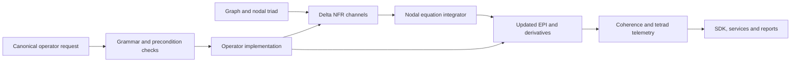

# TNFR Python Engine Architecture

**Version:** 0.0.3.5
**Status:** Implemented architecture reference

This document describes the repository as implemented. Mathematical claims are
owned by [AGENTS.md](AGENTS.md) and the scoped specifications under
[`theory/`](theory/README.md); this guide links to those sources rather than
strengthening their claims.

## Authority and ownership

| Concern | Source of truth |
| --- | --- |
| Canonical TNFR synthesis and invariants | [AGENTS.md](AGENTS.md) |
| Operator channel, scale and postcondition | [`operator_contracts.py`](src/tnfr/operators/operator_contracts.py) |
| Operator-role derivation | [`physics_derivation.py`](src/tnfr/config/physics_derivation.py) |
| Grammar specification | [`grammar_canon.py`](src/tnfr/operators/grammar_canon.py) |
| Grammar validation facade | [`grammar.py`](src/tnfr/operators/grammar.py) |
| Canonical and operational constants | [`constants/`](src/tnfr/constants/) |
| Nodal pressure computation | [`dnfr.py`](src/tnfr/dynamics/dnfr.py) |
| Nodal integration | [`integrators.py`](src/tnfr/dynamics/integrators.py) |
| Structural fields | [`fields.py`](src/tnfr/physics/fields.py) |
| Coherence and equilibrium kernel | [`common.py`](src/tnfr/metrics/common.py) |
| Public high-level API | [`sdk/simple.py`](src/tnfr/sdk/simple.py) |

Derived documents and tables must import or link to these owners. They must not
define competing constants, operator sets, or theorem scope.

## Nodal execution flow


```mermaid
flowchart LR
    A[Graph and nodal triad] --> B[Delta NFR channels]
    B --> C[Nodal equation integrator]
    C --> D[Updated EPI and derivatives]
    D --> E[Coherence and tetrad telemetry]
    E --> F[SDK, services and reports]
    G[Canonical operator request] --> H[Grammar and precondition checks]
    H --> I[Operator implementation]
    I --> B
    I --> D
```

1. Nodes store EPI, structural frequency, phase, pressure, and trace metadata.
2. `tnfr.dynamics.dnfr` computes the configured pressure channels. The EPI
   channel realizes random-walk graph diffusion; other channels retain their
   documented circular, capacity, and topology semantics.
3. `tnfr.dynamics.integrators` advances EPI through the nodal equation and
   records derivatives needed by coherence telemetry.
4. `tnfr.metrics` and `tnfr.physics` compute coherence, equilibrium, the tetrad,
   conservation diagnostics, pulse, and other read-outs.
5. Operator execution passes through canonical grammar and operator
   preconditions. Coupling and Resonance enforce the U3 phase gate before state
   mutation.

## Package boundaries

### Foundations

- `tnfr.constants` separates canonical structural quantities from operational
  tuning parameters.
- `tnfr.config` owns attribute configuration and physics-derived operator
  classifications.
- `tnfr.errors` provides contextual public exceptions.
- `tnfr.mathematics` owns numerical backends and domain-neutral mathematical
  structures.

### Structural dynamics

- `tnfr.operators` implements the fixed 13-operator catalog, contracts,
  grammar, preconditions, postconditions, and sequence execution.
- `tnfr.dynamics` computes `Delta NFR`, integrates the nodal equation, and owns
  adaptive evolution services.
- `tnfr.physics` computes fields and mathematically scoped diagnostics.
- `tnfr.metrics` owns shared constitutive and telemetry kernels.

### Orchestration and public APIs

- `tnfr.core` defines service protocols, default implementations, and the
  dependency container.
- `tnfr.services` provides the orchestrator facade over those protocols.
- `tnfr.sdk` provides the supported Simple and fluent user interfaces.
- `tnfr.engines` groups optimization, discovery, integration, and computation
  services that build on the canonical core.

### Domain and research modules

`tnfr.riemann`, `tnfr.navier_stokes`, `tnfr.yang_mills`,
`tnfr.factorization`, and arithmetic modules under `tnfr.mathematics` apply the
same nodal vocabulary to bounded research programs. They do not redefine the
canonical operator catalog, grammar, coherence kernel, or tetrad.

## Structural fields and scope

The canonical diagnostic tetrad is `(Phi_s, |grad phi|, K_phi, xi_C)`.
`Psi = K_phi + i J_phi` is a derived complex field and does not replace `K_phi`
in the tetrad.

- Wrapped phase differences and wrapped curvature have exact magnitude bound
  `pi`.
- `0.9*pi` is an operational curvature warning margin.
- `pi/4` per-node potential and `pi/2` potential drift are selected safety
  policies, not topology-independent bounds.
- The spectral coherence-length estimate scales as `1/sqrt(lambda_2)` under
  its stated graph hypotheses.
- The tetrad is the canonical read-out. Complete reconstruction of arbitrary
  system state from four scalars remains an open stronger claim.

See [the field specification](docs/STRUCTURAL_FIELDS_TETRAD.md) and
[the minimality scope note](theory/MINIMAL_STRUCTURAL_DEGREES.md).

## Operator registry and grammar

The registry in [`operators/registry.py`](src/tnfr/operators/registry.py) is a
lazily populated fixed map of the 13 implementations. `discover_operators()` is
a compatibility no-op; runtime package scanning is not part of current
registration.

Public operator identifiers are the canonical English tokens. Glyphs remain
internal structural symbols. The grammar authority is split deliberately:

1. contract predicates derive operator roles;
2. `grammar_canon.py` materializes U1-U6;
3. `grammar.py` exposes validation;
4. precondition modules enforce state-dependent requirements during execution.

Passing a word validator does not prove infinite-horizon convergence or future
U6 confinement. The exact scope is stated in
[Unified Grammar Rules](theory/UNIFIED_GRAMMAR_RULES.md).

## Public API

The stable high-level entry point is:

```python
from tnfr.sdk import TNFR

net = TNFR.create(20).ring().evolve(5)
result = net.results()
tetrad = net.tetrad()
telemetry = net.telemetry()
analysis = TNFR.analyze(net)
```

The fluent network API supports chained construction, named sequences, and
measurement:

```python
from tnfr.sdk.fluent import NetworkConfig, TNFRNetwork

config = NetworkConfig(random_seed=7, default_epi_range=(0.1, 0.5))

result = (
    TNFRNetwork("experiment", config)
    .add_nodes(20, phase_range=(0.0, 0.1))
    .connect_nodes(connection_pattern="ring")
    .apply_sequence(["emission", "coherence", "silence"])
    .measure()
)
```

Low-level operator and dynamics APIs remain available for research code, but
documentation examples should prefer the SDK unless they demonstrate a
specific contract.

## Numerical backends

NumPy is a core dependency. JAX and Torch are optional numerical backends
selected through the mathematics backend interface and tested through the
backend suite. The repository does not currently contain a dedicated
`TNFRGPUEngine`; backend availability alone is not evidence of CUDA acceleration
or a performance guarantee. Any future GPU claim requires an implementation,
hardware metadata, reproducible benchmark inputs, and recorded results.

## Self-optimization

Self-optimization analyzes telemetry and chooses bounded actions through the
implemented engine and SDK paths. It is an adaptive strategy layer. The current
implementation does not expose a general structural-manifold gradient, so it
must not be documented as a proved gradient-descent method. Its operational
parameters live in `tnfr.constants.operational`.

## Documentation architecture

The documentation has four layers:

1. canonical doctrine: `AGENTS.md` and its exact agent mirror;
2. normative specifications: grammar, field, and operator-contract documents;
3. user and developer guides: README, architecture, testing, contributing, and
   examples;
4. dated research and audit records.

`scripts/check_documentation.py` verifies invariant documentation assumptions.
`scripts/verify_internal_references.py` validates local paths and Markdown
fragments. `scripts/prepare_docs.py` stages canonical repository sources for the
single MkDocs build. CI builds with strict mode and publishes the same artifact
to GitHub Pages.

## Extension constraints

Changes must preserve the six invariants in
[AGENTS.md](AGENTS.md#8-canonical-invariants):

- EPI changes remain traceable to canonical operators and the nodal equation;
- Coupling and Resonance retain the U3 phase gate;
- nested EPI identity is preserved;
- sequences remain grammar-valid;
- telemetry retains TNFR units and canonical read-outs;
- seeded evolution remains reproducible.

New domain modules should depend on the canonical core and expose diagnostics
without adding parallel definitions of constants, grammar sets, coherence, or
operator contracts.
