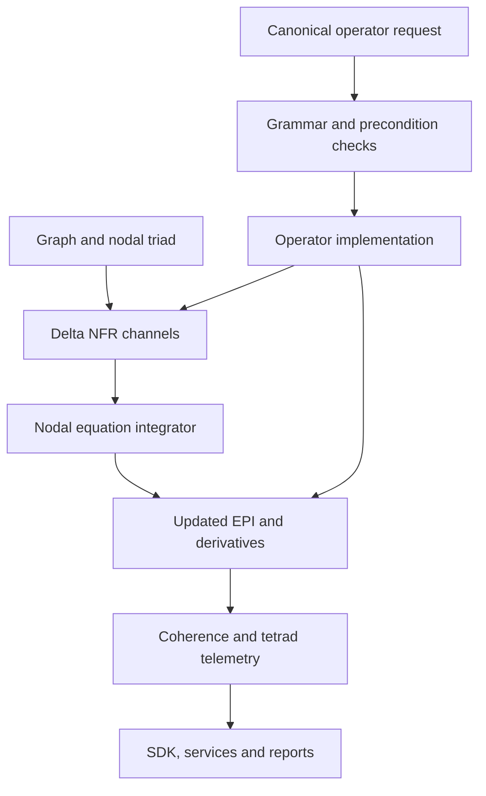

# TNFR Python Engine Architecture

**Version:** 0.0.3.6
**Status:** Implemented architecture reference

This document describes the repository as implemented. Mathematical claims are
owned by the scoped specifications under
[`theory/`](theory/README.md); [AGENTS](AGENTS.md) summarizes working conventions.
This guide links to those sources rather than
strengthening their claims.

## Implementation owners

| Concern | Source of truth |
| --- | --- |
| Canonical TNFR synthesis and invariants | [AGENTS.md](AGENTS.md) |
| Operator channel, scale and postcondition | [`operator_contracts.py`](src/tnfr/operators/operator_contracts.py) |
| Operator-role derivation | [`physics_derivation.py`](src/tnfr/config/physics_derivation.py) |
| Grammar specification | [`grammar_canon.py`](src/tnfr/operators/grammar_canon.py) |
| Grammar validation facade | [`grammar.py`](src/tnfr/operators/grammar.py) |
| Canonical and operational constants | [`constants/`](src/tnfr/constants/) |
| Nodal pressure computation | [`dnfr.py`](src/tnfr/dynamics/dnfr.py) |
| Nodal integration | [`integrators.py`](src/tnfr/dynamics/integrators.py) |
| Active acceleration history and detached evidence | [`nodal_equation.py`](src/tnfr/operators/nodal_equation.py), `observe_structural_acceleration` |
| Optional THOL preconditions and threshold resolution | [`preconditions/self_organization.py`](src/tnfr/operators/preconditions/self_organization.py), [`_thol_config.py`](src/tnfr/operators/_thol_config.py) |
| Public THOL birth proposals | [`self_organization.py`](src/tnfr/operators/self_organization.py) |
| All-node THOL eligibility and explicit finite dispatch | [`self_organization_selection.py`](src/tnfr/operators/self_organization_selection.py) |
| Simultaneous stage execution and graph transactions | [`network_stage.py`](src/tnfr/operators/network_stage.py) |
| Structural fields | [`fields.py`](src/tnfr/physics/fields.py) |
| Coherence and equilibrium kernel | [`common.py`](src/tnfr/metrics/common.py) |
| Public high-level API | [`sdk/simple.py`](src/tnfr/sdk/simple.py) |

These are implementation responsibilities. The [documentation ownership map](docs/README.md)
identifies the single maintained guide for each responsibility.

## Nodal execution flow


```mermaid
flowchart TD
    A[Graph and nodal triad] --> B[Delta NFR channels]
    B --> C[Nodal equation integrator]
    C --> D[Updated EPI and derivatives]
    D --> E[Coherence and tetrad telemetry]
    E --> F[SDK, services and reports]
    G[Canonical operator request] --> H[Grammar and precondition checks]
    H --> I[Operator implementation]
    I --> B
    I --> D
```

1. Nodes store EPI, structural frequency, phase, pressure, and trace metadata.
2. `tnfr.dynamics.dnfr` computes the configured pressure channels. The EPI
   channel realizes random-walk graph diffusion; other channels retain their
   documented circular, capacity, and topology semantics.
3. `tnfr.dynamics.integrators` advances the declared nodal row. Optional Gamma
   is an additive rate source, separate from the unforced product. Rate/history
   evidence depends on the selected execution path.
4. `tnfr.metrics` and `tnfr.physics` compute coherence, equilibrium, the tetrad,
   conservation diagnostics, pulse, and other read-outs.
5. Grammar-aware sequence and runtime paths enforce word policies and live
   checks. Direct glyphs, public classes and atomic stages have distinct
   secondary effects; a low-level map is not a full sequence certificate.
   Coupling and Resonance retain their path-specific circular U3 checks.

For THOL, grammar admission, the optional public precondition gate, acceleration
threshold crossing and a viable birth proposal are distinct checks. The public
operator and simultaneous THOL stage share proposal/commit logic; the ordinary
glyph selector's primitive THOL route writes pressure without creating children.
Legacy `validate_self_organization` now delegates to the shared read-only public
gate and does not write execution telemetry. Gate activation remains a caller/
configuration choice. Birth metadata does not create a transport edge; UM and
its candidate inventory retain their separate owners. These boundaries also
apply to research readiness observations, which must not implement competing
gates or silently select an execution policy.

`observe_self_organization_eligibility` reads all current nodes and retains
independent history, grammar, configured preconditions and complete proposal
results. It shares the stage's detached collision/hierarchy validation.
`execute_eligible_self_organization_stage` is an explicit all-eligible-once
policy: it recomputes eligibility inside one outer transaction, skips empty
sets and reuses the built-in simultaneous public stage. It checks actual
isolated births and preserved original node/edge support; it does not derive
autonomous selection, certify every old attribute or connect the newborns.

History observations expose source, availability, time basis and validated
samples. THOL, SDK nodal reports and propagation diagnostics share this owner.
The numeric `compute_d2epi_dt2` wrapper retains its compatibility zero for
unavailable history; callers needing evidence must inspect the observation.
Mutation's two-sample signed secant and the integrator's cached RHS-rate
difference are distinct quantities. Neither a threshold crossing nor a
historical propagation record proves that an operator caused a bifurcation.

Approximate diffusion readouts reject nonrepresentable nonzero balance terms;
exact support observers retain their rational domain. Forced-support event and
reset observations share a private reset core after public inputs have been
reconstructed and validated within the invocation. No cross-graph result cache
or second transport law is introduced.

## Package boundaries

### Foundations

- `tnfr.constants` separates canonical structural quantities from operational
  tuning parameters.
- `tnfr.config` owns attribute configuration and physics-derived operator
  classifications.
- `tnfr.errors` provides contextual public exceptions.
- `tnfr.mathematics` owns numerical backends and domain-neutral mathematical
  structures.

### Structural dynamics

- `tnfr.operators` implements the fixed 13-operator catalog, contracts,
  grammar, preconditions, postconditions, and sequence execution.
- `tnfr.dynamics` computes `Delta NFR`, integrates the nodal equation, and owns
  adaptive evolution services.
- `tnfr.physics` computes fields and mathematically scoped diagnostics.
- `tnfr.metrics` owns shared constitutive and telemetry kernels.

### Orchestration and public APIs

- `tnfr.core` defines service protocols, default implementations, and the
  dependency container.
- `tnfr.services` provides the orchestrator facade over those protocols.
- `tnfr.sdk` provides the supported Simple and fluent user interfaces.
- `tnfr.engines` groups optimization, discovery, integration, and computation
  services that build on the canonical core.

### Domain and research modules

`tnfr.riemann`, `tnfr.navier_stokes`, `tnfr.yang_mills`,
`tnfr.factorization`, and arithmetic modules under `tnfr.mathematics` apply the
same nodal vocabulary to bounded research programs. They do not redefine the
canonical operator catalog, grammar, coherence kernel, or tetrad.

## Structural fields and scope

The canonical diagnostic tetrad is `(Phi_s, |grad phi|, K_phi, xi_C)`.
`Psi = K_phi + i J_phi` is a derived complex field and does not replace `K_phi`
in the tetrad.

- Wrapped phase differences have magnitude bound `pi`; wrapped curvature has
  that bound where its represented resultant defines a direction.
- `0.9*pi` is an operational curvature warning margin.
- `pi/4` per-node potential and `pi/2` potential drift are selected safety
  policies, not topology-independent bounds.
- Fitted coherence length is distinct from the tagged spectral fallback, which
  selects the first eigenvalue above `1e-9`; it is `1/sqrt(lambda_2)` only under
  the corresponding connectivity and cutoff hypotheses.
- The tetrad is the canonical read-out. Complete reconstruction of arbitrary
  system state from four scalars remains an open stronger claim.

See [the field specification](docs/STRUCTURAL_FIELDS_TETRAD.md) and
[the minimality scope note](theory/MINIMAL_STRUCTURAL_DEGREES.md).

## Operator registry and grammar

The registry in [`operators/registry.py`](src/tnfr/operators/registry.py) is a
lazily populated fixed map of the 13 implementations. `discover_operators()` is
a compatibility no-op; runtime package scanning is not part of current
registration.

Public operator identifiers are the canonical English tokens. Glyphs remain
internal structural symbols. The grammar authority is split deliberately:

1. contract predicates derive operator roles;
2. `grammar_canon.py` materializes U1-U6;
3. `grammar.py` exposes validation;
4. precondition modules enforce state-dependent requirements during execution.

Passing a word validator does not prove infinite-horizon convergence or future
U6 confinement. The exact scope is stated in
[Unified Grammar Rules](theory/UNIFIED_GRAMMAR_RULES.md).

## Public API

The stable high-level entry point is:

```python
from tnfr.sdk import TNFR

net = TNFR.create(20).ring().evolve(5)
result = net.results()
tetrad = net.tetrad()
telemetry = net.telemetry()
analysis = TNFR.analyze(net)
```

The fluent network API supports chained construction, named sequences, and
measurement:

```python
from tnfr.sdk.fluent import NetworkConfig, TNFRNetwork

config = NetworkConfig(random_seed=7, default_epi_range=(0.1, 0.5))

result = (
    TNFRNetwork("experiment", config)
    .add_nodes(20, phase_range=(0.0, 0.1))
    .connect_nodes(connection_pattern="ring")
    .apply_sequence(["emission", "coherence", "silence"])
    .measure()
)
```

Low-level operator and dynamics APIs remain available for research code, but
documentation examples should prefer the SDK unless they demonstrate a
specific contract.

## Numerical backends

NumPy is a core dependency. JAX and Torch are optional numerical backends
selected through the mathematics backend interface and tested through the
backend suite. The repository does not currently contain a dedicated
`TNFRGPUEngine`; backend availability alone is not evidence of CUDA acceleration
or a performance guarantee. Any future GPU claim requires an implementation,
hardware metadata, reproducible benchmark inputs, and recorded results.

## Self-optimization

Self-optimization analyzes telemetry and chooses bounded actions through the
implemented engine and SDK paths. It is an adaptive strategy layer. The current
implementation does not expose a general structural-manifold gradient, so it
must not be documented as a proved gradient-descent method. Its operational
parameters live in `tnfr.constants.operational`.

## Documentation architecture

The [documentation map](docs/README.md) owns guide responsibilities and update
rules. The [theory index](theory/README.md) owns scientific reference status;
the [execution plan](theory/research/FIVE_STAGE_EXECUTION_PLAN.md) owns research
work. Generated contract tables read the registry; historical captures retain
their original context and do not redefine current behavior.

Documentation checks, staging and site construction are described in
[scripts/README](scripts/README.md). Publication triggers and permissions belong
to [workflow YAML and its guide](.github/WORKFLOWS.md).

### Single-file public facades

These modules remain files, not importable same-named directories. Their
functions/stubs own API details; this compact map replaces the separate guide.

| Module | Responsibility |
| --- | --- |
| `tnfr.flatten` | Nested-data projection helpers; not an evolution or identity theorem |
| `tnfr.gamma` | Registry of optional additive EPI-rate sources, separate from unforced nodal evolution |
| `tnfr.glyph_history` | Recorded operator history |
| `tnfr.glyph_runtime` | Runtime glyph execution |
| `tnfr.immutable` | Immutable data helpers |
| `tnfr.initialization` | Node/network initial conditions |
| `tnfr.io` | Input/output facade |
| `tnfr.node` | Nodal data/lifecycle helpers |
| `tnfr.observers` | Runtime observer interfaces |
| `tnfr.structural` | NFR creation and sequence execution |

## Extension constraints

Use the [working invariants](AGENTS.md#8-canonical-invariants) and the actual
operator/solver contract. Reproducibility requires fixed source, inputs,
configuration, seed, order, precision and backend. Do not replace a scoped
precondition with an unconditional claim that a name, seed or grammar label
ensures a trajectory property.

New domain modules should depend on the canonical core and expose diagnostics
without adding parallel definitions of constants, grammar sets, coherence, or
operator contracts.
