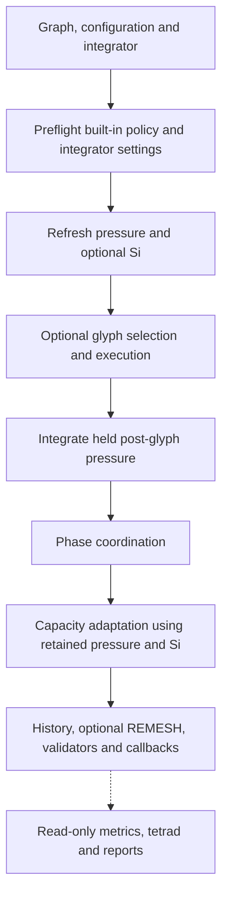

# TNFR Python Engine Architecture

**Version:** 0.0.3.8
**Status:** Implemented architecture reference

This document describes the repository as implemented. Mathematical claims are
owned by the scoped specifications under
[`theory/`](theory/README.md); [AGENTS](AGENTS.md) provides contributor and agent instructions.
This guide links to those sources rather than
strengthening their claims.

Shared edge artifacts are owned by `utils.cache.edge_version_cache`. For
NetworkX graphs it checks ordered support, node/parallel-key identity and raw
`weight`/`length` channels before reuse, so direct edits with unchanged graph
size cannot retain old neighbor arrays, pressure preparation or Si inputs.
That check costs O(V+E) per access for scalar edge channels; it is a correctness
boundary, not a measured speedup. Other state/configuration dependencies remain
part of each consumer's key or explicit invalidation contract. Graph views use
fresh computations; concurrent mutation during a read is unsupported.

LRU storage and callback handling have one implementation in
[`utils/unified_cache.py`](src/tnfr/utils/unified_cache.py). The compatibility
`InstrumentedLRUCache` and `ManagedLRUCache` names remain aliases in `utils.cache`;
graph invalidation and persistence retain their separate responsibilities.

## Implementation owners

| Concern | Source of truth |
| --- | --- |
| Contributor and agent instructions; six invariant identifiers | [AGENTS.md](AGENTS.md) |
| Mathematical definitions, derivations and scientific scope | [Theory catalog](theory/README.md) |
| Operator channel, scale and postcondition | [`operator_contracts.py`](src/tnfr/operators/operator_contracts.py) |
| Operator-role derivation | [`physics_derivation.py`](src/tnfr/config/physics_derivation.py) |
| Grammar specification | [`grammar_canon.py`](src/tnfr/operators/grammar_canon.py) |
| Grammar validation facade | [`grammar.py`](src/tnfr/operators/grammar.py) |
| Canonical and operational constants | [`constants/`](src/tnfr/constants) |
| Shared selector and Si threshold resolution | [`selector_thresholds.py`](src/tnfr/config/selector_thresholds.py) |
| U3 admission limits and phase-neighbor selection | [`_phase_gate.py`](src/tnfr/operators/_phase_gate.py) |
| Resonance capacity proposal and identity predicates | [`_resonance_identity.py`](src/tnfr/operators/_resonance_identity.py) |
| Nodal pressure computation | [`dnfr.py`](src/tnfr/dynamics/dnfr.py) |
| Nodal integration | [`integrators.py`](src/tnfr/dynamics/integrators.py) |
| Runtime invocation ordinals | [`_runtime_steps.py`](src/tnfr/_runtime_steps.py); separate from physical time, operator counts and retained metric samples |
| Represented-real scalar admission | [`_exact_time.py`](src/tnfr/_exact_time.py), reused by clocks, phases, rates and operator gates |
| Signed scalar EPI admission | [`types.py`](src/tnfr/types.py), validating raw scalars and serialized components before BEPI coercion; shared by standard and optimized execution |
| Finite matrix products, differences and norms for reductions | [`physics/_finite_linear_algebra.py`](src/tnfr/physics/_finite_linear_algebra.py); quotient and morphism checks preserve finite-range failures |
| Active acceleration history and detached evidence | [`nodal_equation.py`](src/tnfr/operators/nodal_equation.py), `observe_structural_acceleration` |
| Optional THOL preconditions and threshold resolution | [`preconditions/self_organization.py`](src/tnfr/operators/preconditions/self_organization.py), [`_thol_config.py`](src/tnfr/operators/_thol_config.py) |
| Public THOL birth proposals | [`self_organization.py`](src/tnfr/operators/self_organization.py) |
| All-node THOL eligibility and explicit finite dispatch | [`self_organization_selection.py`](src/tnfr/operators/self_organization_selection.py) |
| Simultaneous stage execution and graph transactions | [`network_stage.py`](src/tnfr/operators/network_stage.py) |
| Structural fields | [`fields.py`](src/tnfr/physics/fields.py) |
| Regional/relational observations, proof adapters and retained evidence | [Dependency map below](#relational-execution-and-observation-dependencies) |
| Coherence and equilibrium kernel | [`common.py`](src/tnfr/metrics/common.py) |
| Public high-level API | [`sdk/simple.py`](src/tnfr/sdk/simple.py) |
| JSON decoding and atomic file writes | [`utils/io.py`](src/tnfr/utils/io.py); one strict JSON value policy shared by configuration and SDK readers |
| JSON report I/O | [`sdk/utils.py`](src/tnfr/sdk/utils.py); delegates to shared decoding/writing, also used by the CLI and fluent `save()` |
| Configured validation orchestration | [`validation/validator.py`](src/tnfr/validation/validator.py); fresh checks, shared input/precondition owners and explicit runtime clamp effects |
| Manifest graph transport | [`engines/manifest.py`](src/tnfr/engines/manifest.py); strict v1 records for the supported finite JSON state subset |
| Buffered event storage | [`telemetry/unified_telemetry_system.py`](src/tnfr/telemetry/unified_telemetry_system.py); shared capture/flush path using `utils.io` atomic writes |

These are implementation responsibilities. The [documentation ownership map](docs/README.md)
identifies the single maintained guide for each responsibility.

## Nodal execution flow

The ordinary runtime composes the following configured operations. The diagram
does not assert that their laws or invocation schedule emerge from one another.


```mermaid
flowchart TD
    A[Graph, configuration and integrator] --> P[Preflight built-in policy and integrator settings]
    P --> B[Refresh pressure and optional Si]
    B --> G[Optional glyph selection and execution]
    G --> C[Integrate held post-glyph pressure]
    C --> D[Phase coordination]
    D --> E[Capacity adaptation using retained pressure and Si]
    E --> F[History, optional REMESH, validators and callbacks]
    F -.-> R[Read-only metrics, tetrad and reports]
```

1. Nodes store EPI, structural frequency, phase, pressure, and trace metadata.
2. `tnfr.dynamics.dnfr` computes the configured pressure channels. The EPI
   channel realizes random-walk graph diffusion; other channels retain their
   documented circular, capacity, and topology semantics.
3. `tnfr.dynamics.integrators` advances the declared nodal row. Optional Gamma
   is an additive rate source, separate from the unforced product. Rate/history
   evidence depends on the selected execution path.
4. `tnfr.metrics` and `tnfr.physics` compute coherence, equilibrium, the tetrad,
   conservation diagnostics, auxiliary spectra and other read-outs.
5. Grammar-aware sequence and runtime paths enforce word policies and live
   checks. Direct glyphs, public classes and atomic stages have distinct
   secondary effects; a low-level map is not a full sequence certificate.
   Coupling and Resonance retain their path-specific circular U3 checks.

[`runtime.step`](src/tnfr/dynamics/runtime.py) rejects malformed initial
selector, capacity and phase policies before callbacks or state evolution.
The default integrator additionally preflights its own numerical parameters.
This is not validation of every configuration field or a transaction covering
arbitrary callbacks, custom integrators or later
configuration changes; consumption-time validation remains necessary.
Setting `apply_glyphs=False` also skips selector construction. Pressure/Si
freshness is explicit: the native capacity gate reads retained inputs after
integration and phase coordination. Research compositions that refresh them
at a later boundary implement a different declared schedule and must not
transfer their conclusions to this path automatically.

Built-in glyph selectors share one validated metric snapshot and decision
kernel across scalar, vector and worker paths. Standalone decisions and each
new `prepare` read current stored metrics, normalizers and score weights.
Engine-owned batches release their snapshot on success or failure; a manually
prepared selector stays frozen until `prepare` or `clear`. Snapshot freshness
does not itself refresh pressure or Si. Live operator admission remains separate.

### Foundational integration boundaries

The [parameter ledger](theory/NODAL_PARAMETER_FOUNDATIONS.md#11-thresholds-constants-and-numerical-settings-have-different-duties)
owns the mathematical status and units of thresholds. The principal engine
uses shared configuration for selector decisions, capacity admission and Si
aggregation; partial phase policies inherit the same defaults as complete
ones. CLI and structural U3 diagnostics read the same hard gate as operators,
without adding numerical slack. Operator preconditions retain independent
state requirements; a diagnostic warning is not a new physical selection law.

Temporal parameters and consumed phase/rate aliases retain their raw type until
shared admission. Trigonometric caches cannot hide an invalid current phase.
Generic error guidance describes these domains and points to current references;
it supplies neither arbitrary global EPI/pressure/capacity bounds nor universal
coherence monotonicity. Consumer-specific bounds remain explicit configuration.

Nodal held-step validation and THOL proposal validation share a comparison
kernel and the configured tolerance/clipping policy. They check a supplied
single held-input step; they do not authenticate pressure provenance, account
for an undeclared Gamma input or turn an instantaneous operator event into a
continuous solution. Actual integration and the exact event certificates
remain the owners of their stronger execution evidence.

The clipping resolver in `dynamics/structural_clip.py` owns numerical-policy
admission for execution and held-step comparisons. The shared Euler arithmetic
also serves detached proposals; their unforced/unclipped scope does not include
the runtime's forcing, projection or history effects. Optimized pure-EPI
proposals and graph/dense CPU adapters reuse
`mathematics/_neighbor_differences.py` rather than average absolute form or
multiply rounded transition probabilities. Spectral matrices remain separate
representations with their own rounding scope. Dense DNFR support counts each
neighbor once; parallel edges contribute multiplicity only to conductance.

Gamma dispatch is registry-owned for both scalar and array execution. Runtime
evaluation is strict, and custom/replaced entries take the staged scalar path;
a fast path cannot silently omit a declared source. The Kuramoto cache follows
phase content as well as time. Structural path admission and distance-weighted
source accumulation also have shared owners across dense/streamed field paths.
SDK summaries reuse stable metric reductions and one circular-mean availability
adapter; they do not install another phase or pressure law.

Tetrad reports preserve unavailable values and estimator provenance. A fitted
coherence length uses the same length-aware geometry as its comparison;
dimensionless spectral fallback is not silently compared with path lengths.
A multiscale curvature fit cannot override a measured variance-cut violation.
These are diagnostic consistency requirements, not a complete state basis or
a stability proof. Numerical precision settings preserve intended definitions
but do not guarantee identical rounded decisions at every strict threshold.

### Relational execution and observation dependencies

The repository exposes distinct execution and evidence paths. Reusing state
admission, a coefficient container or an arithmetic kernel does not select the
same complete law.

| Path | Entry point | Execution boundary |
| --- | --- | --- |
| Configured operator runtime | `runtime.step`, `StudySpec` / `run_study` | Pressure refresh, operator policy, integration and later updates follow their declared schedule. |
| Native relational law | `Network.relational_exchange`, `Network.step_relational` | `dynamics/relational.py` owns the neighbor-resultant Arg field and atomic Euler step. |
| Normalized-sine comparison law | `physics/relational_sine_*` functions | Detached observations, theorem assessments and separately requested validated flow bounds; no native dispatch or default replacement. |
| Supplied observations or linear models | Regional, sample-jet and exact linear-observation functions | The caller supplies the observation map, input law or error premises; a reader does not create them. |

Native `phase_domain` values (`acute`, `positive_resultant`, `regular`) select
admission domains for the **same native law**. Sine readers reuse a regular
`RelationalExchangeModel` as an explicit coefficient/storage reference, but
capture graph/scalar state without evaluating native Arg admission. Their
baseline law identifier is `normalized_sine_reciprocal_exchange`. The declared
`current_squared_reciprocal_mobility` counterfamily shares that capture and
storage but changes both rate rows; its readers retain the separate law ID.
Shared arithmetic does not transfer baseline recurrence or pulse theorems. The
[execution contract](docs/contracts/RELATIONAL_DYNAMICS.md#conditional-relational-execution)
and [sine contract](docs/contracts/RELATIONAL_DYNAMICS.md#detached-normalized-sine-complete-law-comparison)
own the exact domains and differences.

Coefficient admission has one base owner:
`dynamics/relational.py::_relational_model_coefficients`. The constructor
normalizes weights once; later readers validate the stored coefficients without
renormalizing them. Native staging and `_sine_admission.py` both use that owner.
The sine wrapper adds the regular reference-model requirement, while each
consumer retains its stronger loss, capacity and numerical-budget premises.
`_exact_time.py` distinguishes exact rational admission from finite represented
materialization; a consumer that requires a float must reject nonzero values
lost in that conversion.

#### Shared observation and proof kernels

| Owner | Responsibility and dependency |
| --- | --- |
| [`physics/form_geometry.py`](src/tnfr/physics/form_geometry.py) | Stored-pressure regional contrasts, Gram geometry and conditional affine closure; `Network.regional_form` delegates here. |
| [`physics/source_relative_form.py`](src/tnfr/physics/source_relative_form.py) | Composes the form observer with an independently supplied held rate source; `Network.source_relative_form` is the adapter. |
| [`physics/relational_observations.py`](src/tnfr/physics/relational_observations.py) | Native field, region and hypothetical support-change reports; separately, graph-independent coefficient/rate/sample-jet bounds. Sample adapters share stencils and outward error propagation. |
| [`mathematics/linear_observation.py`](src/tnfr/mathematics/linear_observation.py) | Exact row-space realization and visible/hidden memory for a supplied rational generator. `physics/epi_memory.py` retains its own diffusion admission. |
| [`mathematics/_exact_linear_algebra.py`](src/tnfr/mathematics/_exact_linear_algebra.py) | Shared exact products, inverses and rank algebra; compatibility physics imports delegate here. |
| [`mathematics/_phase_resultant_chamber.py`](src/tnfr/mathematics/_phase_resultant_chamber.py) | Rational trigonometric/resultant bounds, principal-argument charts and supplied-rate kinematics. Reused geometry does not transfer a law. |
| [`mathematics/_validated_taylor.py`](src/tnfr/mathematics/_validated_taylor.py) | Strict Picard tubes, Taylor remainders and initial-box propagation; the comparison kernel owns the shared 1–24-coordinate work limit. Each flow adapter retains its layout and other admission budgets. |
| [`sdk/relational_reports.py`](src/tnfr/sdk/relational_reports.py) | Shared exact JSON projection and supported report delegation, using the atomic SDK writer; not a checkpoint or provenance authenticator. |

Native regional reports consume `dynamics/relational.py`, preserving its nodal
work, mobility and numerical defects. Winding and cut accounting delegate to
`winding_certificates.py` and `support_transport.py`. Hypothetical attachments,
relocations and resets keep event work separate from continuous loss; they do
not change live edges. See the [regional guide](docs/guides/REGIONAL_AND_RELATIONAL.md)
for public adapters and the [composition owner](theory/nodal/RELATIONAL_PATTERN_COMPOSITION.md)
for closure and hidden-information obligations.

#### Native relational proof adapters

| Owner | Responsibility and shared inputs |
| --- | --- |
| [`relational_capture.py`](src/tnfr/physics/relational_capture.py) | Protected basins, cycle/sector geometry, formation obstructions and hypothetical detachment; shared phase/storage and support-reset bounds. |
| [`relational_cycle_memory.py`](src/tnfr/physics/relational_cycle_memory.py), [`relational_memory_contact.py`](src/tnfr/physics/relational_memory_contact.py) | Conditional limiting/finite-time memory and contact/retention certificates; reuse capture, exact exponential bounds and event accounting. |
| [`relational_transit.py`](src/tnfr/physics/relational_transit.py), [`relational_reflected_transit.py`](src/tnfr/physics/relational_reflected_transit.py) | Separate four- and eight-coordinate reflected flow enclosures using the shared validated Taylor kernel; neither evolves a live graph. |
| [`relational_reflected_equilibria.py`](src/tnfr/physics/relational_reflected_equilibria.py) | Named exact equilibrium enclosures and full-network stiffness, reusing the reflected field. |
| [`relational_regularity.py`](src/tnfr/physics/relational_regularity.py), [`relational_reflected_boundary.py`](src/tnfr/physics/relational_reflected_boundary.py) | Native continuous-domain and boundary-access evidence; limiting algebra is not an execution bypass. |

These adapters retain their own state, symmetry and storage hypotheses. Their
[contracts](docs/contracts/RELATIONAL_DYNAMICS.md#conditional-relational-capture)
separate a static basin, an admitted finite step, continuous transit and future
recovery. None follows merely from a small rate or work residual.

#### Normalized-sine proof adapters

| Owner | Responsibility and dependency |
| --- | --- |
| [`relational_sine_comparison.py`](src/tnfr/physics/relational_sine_comparison.py) | Shared detached capture, primitive-state gradient/current construction, `_sine_rates`, `_sine_work` and resultant kinematics. Regional accounting reuses source admission and rebuilds consumed rates; supplied endpoint increments remain a separate calculation. |
| [`_sine_admission.py`](src/tnfr/physics/_sine_admission.py) | Shared regular-model and detached source admission; authoritative coefficient checks delegate to `dynamics/relational.py`, also used by native staging. Budget-neutral validation and a separate sector-budget wrapper. Does not load recovery, run a theorem or authenticate provenance. |
| [`_sine_preparation.py`](src/tnfr/physics/_sine_preparation.py) | Shared weighted analytic domain, full-state preparation and uncertainty bounds for entry/reduction/budget readers; adds positive-loss and positive-capacity premises to primitive admission. |
| [`relational_sine_mediation.py`](src/tnfr/physics/relational_sine_mediation.py) | Retained environmental pressure and a separately scoped conditional minimum; keeps hidden state, degrees and tracking defects. |
| [`relational_sine_observation.py`](src/tnfr/physics/relational_sine_observation.py) | Hidden-state/capacity bounds from independently supplied earlier rate/acceleration evidence; shared primitive-evidence rebuilding for chained inverse and forecast consumers. |
| [`relational_sine_sampling.py`](src/tnfr/physics/relational_sine_sampling.py) | Full-network smoothness bounds; `sample_budget` rebuilds the declared class before composing shared sample-jet budgets. Generates no observations. |
| [`relational_sine_forecast.py`](src/tnfr/physics/relational_sine_forecast.py) | Joint prior admission rebuilds hidden-state/capacity evidence before checking a witness. Requested full-box propagation uses `_sine_rates` and the validated Taylor kernel; held hidden capacity remains an augmented coordinate. |
| [`relational_sine_pattern.py`](src/tnfr/physics/relational_sine_pattern.py) | Full-state relative observations; forecasts rebuild initial boxes from nominal coordinates and original residual radii, then project against an evolving reference. Keeps every environmental node. |
| [`relational_sine_recovery.py`](src/tnfr/physics/relational_sine_recovery.py) | Shared uncertainty/geometry bounds for positive-loss recovery and separately admitted conservative trapping families; reuses exact target reconstruction and full-support spectral gaps. |
| [`relational_sine_formation.py`](src/tnfr/physics/relational_sine_formation.py) | Supplied donor preparations and necessary-condition/timed-exclusion bounds, sharing sine work and C5 face geometry; no evolution or event selection. |
| [`relational_sine_entry.py`](src/tnfr/physics/relational_sine_entry.py), [`relational_sine_reduction.py`](src/tnfr/physics/relational_sine_reduction.py) | Prepared entry, finite slow-phase comparison and full-state capture handoff; share weighted preparation bounds and existing capture geometry without replacing a trajectory or dropping initial form information. |
| [`relational_sine_budget.py`](src/tnfr/physics/relational_sine_budget.py), [`relational_sine_symmetry.py`](src/tnfr/physics/relational_sine_symmetry.py) | State-free budget-family consensus and exact captured-source symmetry discrimination, respectively; sufficient bounds and unavailable results retain distinct meanings. |
| [`relational_sine_resonance.py`](src/tnfr/physics/relational_sine_resonance.py) | Declared tangent input/output response; `gain` rebuilds its mode before evaluating the transfer. Exact pair pulse, path memory and nonlinear recurrent-family assessments retain their own hypotheses. |
| [`relational_sine_scale.py`](src/tnfr/physics/relational_sine_scale.py) | Full replica observations, unordered internal state and separate symbolic pulse/variation/splitting assessments; reuses capture/rates and the pair-pulse period bound. |

The chained sampling, modal-gain, inverse, forecast and regional-accounting
readers rebuild consumed bounds from retained primitive declarations or
observations through the owners above. Forecast endpoint readers instead check
the complete source association at the actual validated time. The
[chained-report contract](docs/contracts/RELATIONAL_DYNAMICS.md#sine-chained-report-admission)
owns these distinct admission paths, normalized computation and retained-source
limits. Serialization remains a separate projection boundary.

Source-capture reports, symbolic preparation families and validated endpoints
are different inputs. Static correlated errors are not a future Cartesian
box; a chosen phase reference is not a frozen node. The
[sine contracts](docs/contracts/RELATIONAL_DYNAMICS.md#detached-normalized-sine-complete-law-comparison)
and [scale contracts](docs/contracts/RELATIONAL_DYNAMICS.md#sine-replica-scale)
retain those distinctions. Proofs remain with the
[pattern-memory](theory/nodal/RELATIONAL_PATTERN_MEMORY.md),
[sine pattern dynamics](theory/nodal/SINE_PATTERN_DYNAMICS.md),
[resonance](theory/nodal/RESONANCE_FOUNDATIONS.md) and
[scale](theory/TNFR_SCALE_GEOMETRY_AND_BRIDGE.md) owners. Prepared periodicity,
family recurrence and orbital stability are separate claims, not additional
runtime variables or operator-selection rules.

#### Retained evidence adapters

[`research/relational_acquisition.py`](src/tnfr/research/relational_acquisition.py)
and [`research/relational_formation_robustness.py`](src/tnfr/research/relational_formation_robustness.py)
read saved protocols, source archives and reports through the shared numerical
owners. They do not replay producers or authenticate historical execution.
The separately staged sine prior experiment keeps preparation, prior-only
prediction and reserved evaluation distinct. Retained instruments and their
verdicts belong to the [benchmark catalog](benchmarks/README.md); their presence
does not authorize a new campaign.

The unforced product, conditional diffusion identities, named operator
contracts and coherent diagnostics are implemented foundations. Unique phase,
capacity, support-formation and autonomous operator-selection laws remain
constitutive research obligations; the implementation does not label those
supplied policies as derived emergence. The sole research queue remains the
[execution plan](theory/research/FIVE_STAGE_EXECUTION_PLAN.md).

### Operator events and history

For THOL, grammar admission, the optional public precondition gate, acceleration
threshold crossing and a viable birth proposal are distinct checks. The public
operator and simultaneous THOL stage share proposal/commit logic; the ordinary
glyph selector's primitive THOL route writes pressure without creating children.
`validate_self_organization` delegates to the shared read-only public
gate and does not write execution telemetry. Gate activation remains a caller/
configuration choice. Birth metadata does not create a transport edge; UM and
its candidate inventory retain their separate owners. These boundaries also
apply to research readiness observations, which must not implement competing
gates or silently select an execution policy.

`observe_self_organization_eligibility` reads all current nodes and retains
independent history, grammar, configured preconditions and complete proposal
results. It shares the stage's detached collision/hierarchy validation.
`execute_eligible_self_organization_stage` is an explicit all-eligible-once
policy: it recomputes eligibility inside one outer transaction, skips empty
sets and reuses the built-in simultaneous public stage. It checks actual
isolated births and preserved original node/edge support; it does not derive
autonomous selection, certify every old attribute or connect the newborns.

History observations expose source, availability, time basis and validated
samples. THOL, SDK nodal reports and propagation diagnostics share this owner.
The numeric `compute_d2epi_dt2` wrapper retains its compatibility zero for
unavailable history; callers needing evidence must inspect the observation.
Mutation's two-sample signed secant and the integrator's cached RHS-rate
difference are distinct quantities. Neither a threshold crossing nor a
historical propagation record proves that an operator caused a bifurcation.

Approximate diffusion readouts reject nonrepresentable nonzero balance terms;
exact support observers retain their rational domain. Forced-support event and
reset observations share a private reset core after public inputs have been
reconstructed and validated within the invocation. No cross-graph result cache
or second transport law is introduced.

## Package boundaries

### Foundations

- `tnfr.constants` separates canonical structural quantities from operational
  tuning parameters.
- `tnfr.config` owns attribute configuration and physics-derived operator
  classifications.
- `tnfr.errors` provides contextual public exceptions.
- `tnfr.mathematics` owns numerical backends and domain-neutral mathematical
  structures.

### Structural dynamics

- `tnfr.operators` implements the fixed 13-operator catalog, contracts,
  grammar, preconditions, postconditions, and sequence execution.
- `tnfr.dynamics` computes `Delta NFR`, integrates the nodal equation, and owns
  adaptive evolution services.
- `tnfr.physics` computes fields and mathematically scoped diagnostics.
- `tnfr.metrics` owns shared constitutive and telemetry kernels.

### Orchestration and public APIs

- `tnfr.core` defines service protocols, default implementations, and the
  dependency container.
- `tnfr.services` provides the orchestrator facade over those protocols.
- `tnfr.sdk` provides the supported Simple and fluent user interfaces.
- `tnfr.engines` groups optimization, discovery, integration, and computation
  services that build on the canonical core.

### Domain and research modules

`tnfr.riemann`, `tnfr.factorization`, and arithmetic modules under
`tnfr.mathematics` supply explicitly constructed arithmetic/spectral models.
`tnfr.research` owns reusable evidence and admission infrastructure. These
modules do not redefine the operator catalog, grammar, coherence kernel or
tetrad. Their constructions keep explicit premises; arithmetic or spectral
results do not identify a physical mechanism. Shared graph diffusion, phase
geometry and conditional algebra can be reused under their own contracts.

## Structural fields and scope

The canonical diagnostic tetrad is `(Phi_s, |grad phi|, K_phi, xi_C)`.
`Psi = K_phi + i J_phi` is a derived complex field and does not replace `K_phi`
in the tetrad.

- Wrapped phase differences have magnitude bound `pi`; wrapped curvature has
  that bound where its represented resultant defines a direction.
- `0.9*pi` is an operational curvature warning margin.
- `pi/4` per-node potential and `pi/2` potential drift are selected safety
  policies, not topology-independent bounds.
- Fitted coherence length is distinct from the tagged spectral fallback, which
  selects the first eigenvalue above `1e-9`; it is `1/sqrt(lambda_2)` only under
  the corresponding connectivity and cutoff hypotheses.
- The tetrad is a diagnostic read-out and does not reconstruct arbitrary full
  nodal states in general. Any sufficient reduced description requires its own
  restricted state domain and closure proof.

See [the field specification](docs/STRUCTURAL_FIELDS_TETRAD.md) and
[the minimality scope note](theory/MINIMAL_STRUCTURAL_DEGREES.md).

## Operator registry and grammar

The registry in [`operators/registry.py`](src/tnfr/operators/registry.py) is a
lazily populated fixed map of the 13 implementations. `discover_operators()` is
a compatibility no-op; runtime package scanning is not part of current
registration.

Public operator identifiers are the canonical English tokens. Glyphs remain
internal structural symbols. The grammar authority is split deliberately:

1. contract predicates derive operator roles;
2. `grammar_canon.py` materializes U1-U6;
3. `grammar.py` exposes validation;
4. precondition modules enforce state-dependent requirements during execution.

Passing a word validator does not prove infinite-horizon convergence or future
U6 confinement. The exact scope is stated in
[Unified Grammar Rules](theory/UNIFIED_GRAMMAR_RULES.md).

## Public API

The stable high-level entry point is:

```python
from tnfr.sdk import TNFR

net = TNFR.create(20).ring().evolve(5)
result = net.results()
tetrad = net.tetrad()
telemetry = net.telemetry()
analysis = TNFR.analyze(net)
```

The fluent network API supports chained construction, named sequences, and
measurement:

```python
from tnfr.sdk.fluent import NetworkConfig, TNFRNetwork

config = NetworkConfig(random_seed=7, default_epi_range=(0.1, 0.5))

result = (
    TNFRNetwork("experiment", config)
    .add_nodes(20, phase_range=(0.0, 0.1))
    .connect_nodes(connection_pattern="ring")
    .apply_sequence(["emission", "coherence", "silence"])
    .measure()
)
```

Low-level operator and dynamics APIs remain available for research code, but
documentation examples should prefer the SDK unless they demonstrate a
specific contract.

## Numerical backends

NumPy is a core dependency. JAX and Torch are optional numerical backends
selected through the mathematics backend interface and tested through the
backend suite. The repository does not currently contain a dedicated
`TNFRGPUEngine`; backend availability alone is not evidence of CUDA acceleration
or a performance guarantee. Any future GPU claim requires an implementation,
hardware metadata, reproducible benchmark inputs, and recorded results.

## Self-optimization

Self-optimization analyzes telemetry and chooses bounded actions through the
implemented engine and SDK paths. It is an adaptive strategy layer. The current
implementation does not expose a general structural-manifold gradient, so it
must not be documented as a proved gradient-descent method. Its operational
parameters live in `tnfr.constants.operational`.

Registered strategy tokens and explicit legacy hints resolve to computation
services. An explicit service request is preserved even outside automatic
size/density preferences; the service admits or rejects its actual domain.
Automatic selection stays within its available candidates. Learning records
the executed strategy, while reports retain the requested strategy separately.
Timing history and configured scores select candidates, not a globally optimal
algorithm or an emergent TNFR evolution law.

Manifest graph decoding admits the declared v1 record fields and copies finite
JSON attributes. Unknown fields and pair-list attributes reject instead of
being discarded or collapsed. The execution script reads manifest, summary
and partition JSON through the SDK's strict decoder before graph construction.
This preserves supported state transport; it does not restore arbitrary
callbacks, backend/RNG objects or a complete runtime checkpoint.

## Event storage

The optional telemetry sink records supplied values in structural, performance
and failure channels. It does not compute or certify structural fields. All
channels share detached payload capture, serialization and atomic UTF-8 batch
writes. Distinct batch filenames prevent same-second overwrites. A failed write
raises on the manual path, leaves accepted events buffered and can be retried
with `flush_all()`; timer failures are logged. Cleanup cancels future scheduling,
rejects new emission and retains failed pending writes for a later flush retry.
The global switch disables collection in every channel.

Correlation IDs are admitted before enqueueing. Events and SDK reports share
JSON object-name collision rejection, so distinct Python keys cannot silently
collapse into one decoded metadata field. Invalid JSON/UTF-8 data rejects
before an event enters the accepted buffer or count.

Supported storage formats are JSON and JSONL. Compression, memory-limit and
severity/type-filter settings remain reserved compatibility fields, with no
active guarantees. Collection timestamps are wall time, not a derived TNFR
clock. Scientific provenance and unavailable observations remain the caller's
responsibility; specialized cache and count telemetry keep their own owners.

## Documentation architecture

The [documentation map](docs/README.md) owns guide responsibilities and update
rules. The [theory index](theory/README.md) owns scientific reference status;
the [execution plan](theory/research/FIVE_STAGE_EXECUTION_PLAN.md) owns research
work. Generated contract tables read the registry; historical captures retain
their original context and do not redefine current behavior.

Documentation checks, staging and site construction are described in
[scripts/README](scripts/README.md). Publication triggers and permissions belong
to [workflow YAML and its guide](.github/WORKFLOWS.md).

### Single-file public facades

These modules remain files, not importable same-named directories. Their
functions/stubs own API details; this compact map replaces the separate guide.

| Module | Responsibility |
| --- | --- |
| `tnfr.flatten` | Nested-data projection helpers; not an evolution or identity theorem |
| `tnfr.gamma` | Registry of optional additive EPI-rate sources, separate from unforced nodal evolution |
| `tnfr.glyph_history` | Recorded operator history |
| `tnfr.glyph_runtime` | Runtime glyph execution |
| `tnfr.immutable` | Immutable data helpers |
| `tnfr.initialization` | Node/network initial conditions |
| `tnfr.io` | Input/output facade |
| `tnfr.node` | Nodal data/lifecycle helpers |
| `tnfr.observers` | Runtime observer interfaces |
| `tnfr.structural` | NFR creation and sequence execution |

## Extension constraints

Use the [working invariants](AGENTS.md#8-canonical-invariants) and the actual
operator/solver contract. Reproducibility requires fixed source, inputs,
configuration, seed, order, precision and backend. Do not replace a scoped
precondition with an unconditional claim that a name, seed or grammar label
ensures a trajectory property.

New domain modules should depend on the canonical core and expose diagnostics
without adding parallel definitions of constants, grammar sets, coherence, or
operator contracts.
