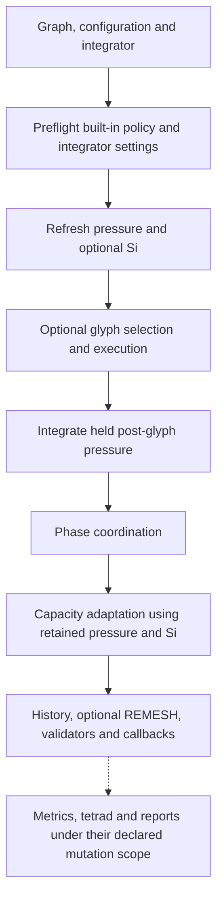

# TNFR Python Engine Architecture

**Version:** 0.0.3.8
**Status:** Implemented architecture reference

This document describes the repository as implemented. Mathematical claims are
owned by the scoped specifications under
[`theory/`](theory/README.md); [AGENTS](AGENTS.md) provides contributor and agent instructions.
This guide links to those sources rather than
strengthening their claims.

Shared edge artifacts are owned by `utils.cache.edge_version_cache`. For
NetworkX graphs it checks ordered support, node/parallel-key identity and raw
`weight`/`length` channels before reuse, so direct edits with unchanged graph
size cannot retain old neighbor arrays, pressure preparation or Si inputs.
That check costs O(V+E) per access for scalar edge channels; it is a correctness
boundary, not a measured speedup. Other state/configuration dependencies remain
part of each consumer's key or explicit invalidation contract. Graph views use
fresh computations; concurrent mutation during a read is unsupported.

The structural random-walk verifier reuses one resistance geometry within a
call for resistance and commute-time projections. The comparison still uses
the separate component-volume multiplication of materialized resistance.
There is no persistent geometry cache; a later call re-admits the graph.

LRU storage and callback handling have one implementation in
[`utils/unified_cache.py`](src/tnfr/utils/unified_cache.py). The compatibility
`InstrumentedLRUCache` and `ManagedLRUCache` names remain aliases in `utils.cache`;
graph invalidation and persistence retain their separate responsibilities.

## Implementation owners

| Concern | Source of truth |
| --- | --- |
| Contributor and agent instructions; six invariant identifiers | [AGENTS.md](AGENTS.md) |
| Mathematical definitions, derivations and scientific scope | [Theory catalog](theory/README.md) |
| Operator channel, scale and postcondition | [`operator_contracts.py`](src/tnfr/operators/operator_contracts.py) |
| Operator-role derivation | [`physics_derivation.py`](src/tnfr/config/physics_derivation.py) |
| Grammar specification | [`grammar_canon.py`](src/tnfr/operators/grammar_canon.py) |
| Grammar validation facade | [`grammar.py`](src/tnfr/operators/grammar.py) |
| Canonical and operational constants | [`constants/`](src/tnfr/constants) |
| Shared selector and Si threshold resolution | [`selector_thresholds.py`](src/tnfr/config/selector_thresholds.py) |
| U3 admission limits and phase-neighbor selection | [`_phase_gate.py`](src/tnfr/operators/_phase_gate.py) |
| Resonance capacity proposal and identity predicates | [`_resonance_identity.py`](src/tnfr/operators/_resonance_identity.py) |
| Nodal pressure computation | [`dnfr.py`](src/tnfr/dynamics/dnfr.py) |
| Nodal integration | [`integrators.py`](src/tnfr/dynamics/integrators.py) |
| Runtime invocation ordinals | [`_runtime_steps.py`](src/tnfr/_runtime_steps.py); separate from physical time, operator counts and retained metric samples |
| Represented-real scalar admission | [`_exact_time.py`](src/tnfr/_exact_time.py), reused by clocks, phases, rates and operator gates |
| Signed scalar EPI admission | [`types.py`](src/tnfr/types.py), validating raw scalars and serialized components before BEPI coercion; shared by standard and optimized execution |
| Finite matrix products, differences and norms for reductions | [`physics/_finite_linear_algebra.py`](src/tnfr/physics/_finite_linear_algebra.py); quotient and morphism checks preserve finite-range failures |
| Active acceleration history and detached evidence | [`nodal_equation.py`](src/tnfr/operators/nodal_equation.py), `observe_structural_acceleration` |
| Optional THOL preconditions and threshold resolution | [`preconditions/self_organization.py`](src/tnfr/operators/preconditions/self_organization.py), [`_thol_config.py`](src/tnfr/operators/_thol_config.py) |
| Public THOL birth proposals | [`self_organization.py`](src/tnfr/operators/self_organization.py) |
| All-node THOL eligibility and explicit finite dispatch | [`self_organization_selection.py`](src/tnfr/operators/self_organization_selection.py) |
| Simultaneous stage execution and graph transactions | [`network_stage.py`](src/tnfr/operators/network_stage.py) |
| Structural fields | [`fields.py`](src/tnfr/physics/fields.py) |
| Regional/relational observations, proof adapters and retained evidence | [Dependency map below](#relational-execution-and-observation-dependencies) |
| Coherence and equilibrium kernel | [`common.py`](src/tnfr/metrics/common.py) |
| Public high-level API | [`sdk/simple.py`](src/tnfr/sdk/simple.py) |
| JSON decoding and atomic file writes | [`utils/io.py`](src/tnfr/utils/io.py); one strict JSON value policy shared by configuration and SDK readers |
| JSON report I/O | [`sdk/utils.py`](src/tnfr/sdk/utils.py); delegates to shared decoding/writing, also used by the CLI and fluent `save()` |
| Configured validation orchestration | [`validation/validator.py`](src/tnfr/validation/validator.py); fresh checks, shared input/precondition owners and explicit runtime clamp effects |
| Manifest graph transport | [`engines/manifest.py`](src/tnfr/engines/manifest.py); strict v1 records for the supported finite JSON state subset |
| Buffered event storage | [`telemetry/unified_telemetry_system.py`](src/tnfr/telemetry/unified_telemetry_system.py); shared capture/flush path using `utils.io` atomic writes |

These are implementation responsibilities. The [documentation ownership map](docs/README.md)
identifies the single maintained guide for each responsibility.

The `tnfr.physics` public namespace resolves its exports on first access.
One ordered owner map supplies `__all__`, discovery through `dir()` and lazy
dispatch; resolved names are the actual owner objects, not proxies. Importing
one field or observer therefore does not eagerly load unrelated research and
runtime certificates. Direct module imports retain their own dependencies.
The [facade controls](tests/physics/test_physics_facade_imports.py) check cold
imports, public object identity and discovery independently of timing.
The generated [typing facade](src/tnfr/physics/__init__.pyi) re-exports those
same owners for static analyzers. Its
[generator](scripts/generate_physics_stub.py) reads the runtime map without
importing the package; the [testing guide](TESTING.md#code-quality-and-documentation-checks)
owns regeneration and drift checks.

Physics imports NumPy and NetworkX as core dependencies declared in
`pyproject.toml`. Optional SciPy and acceleration paths retain their own
availability checks and fallback behavior.

## Nodal execution flow

The ordinary runtime composes the following configured operations. The diagram
does not assert that their laws or invocation schedule emerge from one another.

```mermaid
flowchart TD
    A[Graph, configuration and integrator] --> P[Preflight built-in policy and integrator settings]
    P --> B[Refresh pressure and optional Si]
    B --> G[Optional glyph selection and execution]
    G --> C[Integrate held post-glyph pressure]
    C --> D[Phase coordination]
    D --> E[Capacity adaptation using retained pressure and Si]
    E --> F[History, optional REMESH, validators and callbacks]
    F -.-> R[Metrics, tetrad and reports under their declared mutation scope]
```

1. Nodes store EPI, structural frequency, phase, pressure, and trace metadata.
2. `tnfr.dynamics.dnfr` computes the configured pressure channels. The EPI
   channel realizes random-walk graph diffusion; other channels retain their
   documented circular, capacity, and topology semantics.
3. `tnfr.dynamics.integrators` advances the declared nodal row. Optional Gamma
   is an additive rate source, separate from the unforced product. Rate/history
   evidence depends on the selected execution path.
4. `tnfr.metrics` and `tnfr.physics` compute coherence, equilibrium, the tetrad,
   conservation diagnostics, auxiliary spectra and other read-outs.
5. Grammar-aware sequence and runtime paths enforce word policies and live
   checks. Direct glyphs, public classes and atomic stages have distinct
   secondary effects; a low-level map is not a full sequence certificate.
   Coupling and Resonance retain their path-specific circular U3 checks.

[`runtime.step`](src/tnfr/dynamics/runtime.py) rejects malformed initial
selector, capacity and phase policies before callbacks or state evolution.
The default integrator additionally preflights its own numerical parameters.
This is not validation of every configuration field or a transaction covering
arbitrary callbacks, custom integrators or later
configuration changes; consumption-time validation remains necessary.
Setting `apply_glyphs=False` also skips selector construction. Pressure/Si
freshness is explicit: the native capacity gate reads retained inputs after
integration and phase coordination. Research compositions that refresh them
at a later boundary implement a different declared schedule and must not
transfer their conclusions to this path automatically.

Built-in glyph selectors share one validated metric snapshot and decision
kernel across scalar, vector and worker paths. Standalone decisions and each
new `prepare` read current stored metrics, normalizers and score weights.
Engine-owned batches release their snapshot on success or failure; a manually
prepared selector stays frozen until `prepare` or `clear`. Snapshot freshness
does not itself refresh pressure or Si. Live operator admission remains separate.

### Foundational integration boundaries

The [parameter ledger](theory/NODAL_PARAMETER_FOUNDATIONS.md#11-thresholds-constants-and-numerical-settings-have-different-duties)
owns the mathematical status and units of thresholds. The principal engine
uses shared configuration for selector decisions, capacity admission and Si
aggregation; partial phase policies inherit the same defaults as complete
ones. CLI and structural U3 diagnostics read the same hard gate as operators,
without adding numerical slack. Operator preconditions retain independent
state requirements; a diagnostic warning is not a new physical selection law.

Temporal parameters and consumed phase/rate aliases retain their raw type until
shared admission. Trigonometric caches cannot hide an invalid current phase.
Generic error guidance describes these domains and points to current references;
it supplies neither arbitrary global EPI/pressure/capacity bounds nor universal
coherence monotonicity. Consumer-specific bounds remain explicit configuration.

Nodal held-step validation and THOL proposal validation share a comparison
kernel and the configured tolerance/clipping policy. They check a supplied
single held-input step; they do not authenticate pressure provenance, account
for an undeclared Gamma input or turn an instantaneous operator event into a
continuous solution. Actual integration and the exact event certificates
remain the owners of their stronger execution evidence.

The clipping resolver in `dynamics/structural_clip.py` owns numerical-policy
admission for execution and held-step comparisons. The shared Euler arithmetic
also serves detached proposals; their unforced/unclipped scope does not include
the runtime's forcing, projection or history effects. Optimized pure-EPI
proposals and graph/dense CPU adapters reuse
`mathematics/_neighbor_differences.py` rather than average absolute form or
multiply rounded transition probabilities. Spectral matrices remain separate
representations with their own rounding scope. Dense DNFR support counts each
neighbor once; parallel edges contribute multiplicity only to conductance.

Gamma dispatch is registry-owned for both scalar and array execution. Runtime
evaluation is strict, and custom/replaced entries take the staged scalar path;
a fast path cannot silently omit a declared source. The Kuramoto cache follows
phase content as well as time. Structural path admission and distance-weighted
source accumulation also have shared owners across dense/streamed field paths.
SDK summaries reuse stable metric reductions and one circular-mean availability
adapter; they do not install another phase or pressure law.

Tetrad reports preserve unavailable values and estimator provenance. A fitted
coherence length uses the same length-aware geometry as its comparison;
dimensionless spectral fallback is not silently compared with path lengths.
A multiscale curvature fit cannot override a measured variance-cut violation.
These are diagnostic consistency requirements, not a complete state basis or
a stability proof. Numerical precision settings preserve intended definitions
but do not guarantee identical rounded decisions at every strict threshold.

### Relational execution and observation dependencies

The repository exposes distinct execution and evidence paths. Reusing state
admission, a coefficient container or an arithmetic kernel does not select the
same complete law.

| Path | Entry point | Execution boundary |
| --- | --- | --- |
| Configured operator runtime | `runtime.step`, `StudySpec` / `run_study` | Pressure refresh, operator policy, integration and later updates follow their declared schedule. |
| Native relational law | `Network.relational_exchange`, `Network.step_relational` | `dynamics/relational.py` owns the neighbor-resultant Arg field and atomic Euler step. |
| Normalized-sine comparison law | `physics/relational_sine_*` functions | Detached observations, theorem assessments and separately requested validated flow bounds; no native dispatch or default replacement. |
| Supplied observations or linear models | Regional, sample-jet and exact linear-observation functions | The caller supplies the observation map, input law or error premises; a reader does not create them. |

Native `phase_domain` values (`acute`, `positive_resultant`, `regular`) select
admission domains for the **same native law**. Sine readers reuse a regular
`RelationalExchangeModel` as an explicit coefficient/storage reference, but
capture graph/scalar state without evaluating native Arg admission. Their
baseline law identifier is `normalized_sine_reciprocal_exchange`. The declared
`current_squared_reciprocal_mobility` counterfamily shares that capture and
storage but changes both rate rows; its readers retain the separate law ID.
Shared arithmetic does not transfer baseline recurrence or pulse theorems. The
[execution contract](docs/contracts/relational/RELATIONAL_EXECUTION.md#conditional-relational-execution)
and [sine contract](docs/contracts/relational/SINE_COMPARISON_AND_INFERENCE.md#detached-normalized-sine-complete-law-comparison)
own the exact domains and differences.

Coefficient admission has one base owner:
`dynamics/relational.py::_relational_model_coefficients`. The constructor
normalizes weights once; later readers validate the stored coefficients without
renormalizing them. Native staging and `_sine_admission.py` both use that owner.
The sine wrapper adds the regular reference-model requirement, while each
consumer retains its stronger loss, capacity and numerical-budget premises.
`_exact_time.py` distinguishes exact rational admission from finite represented
materialization; a consumer that requires a float must reject nonzero values
lost in that conversion.

#### Shared observation and proof kernels

| Owner | Responsibility and dependency |
| --- | --- |
| [`physics/form_geometry.py`](src/tnfr/physics/form_geometry.py) | Stored-pressure regional contrasts, Gram geometry and conditional affine closure; `Network.regional_form` delegates here. |
| [`physics/source_relative_form.py`](src/tnfr/physics/source_relative_form.py) | Composes the form observer with an independently supplied held rate source; `Network.source_relative_form` is the adapter. |
| [`physics/relational_observations.py`](src/tnfr/physics/relational_observations.py) | Native field, region and hypothetical support-change reports; separately, graph-independent coefficient/rate/sample-jet bounds. Sample adapters share stencils and outward error propagation. |
| [`mathematics/linear_observation.py`](src/tnfr/mathematics/linear_observation.py) | Exact row-space realization and visible/hidden memory for a supplied rational generator; scoped lower bounds distinguish conservative observation from a supplied form-loss model. `physics/epi_memory.py` retains its own diffusion admission. |
| [`mathematics/_exact_linear_algebra.py`](src/tnfr/mathematics/_exact_linear_algebra.py) | Shared exact products, powers, inverses and semidefinite tests; compatibility physics imports, fixed-map network-stage powers and p-adic tower products delegate here. The tower adapter retains its mutable list rows. Products skip exact zero factors while retaining full rational output shapes and the consumers' product-call accounting. |
| [`mathematics/krylov.py`](src/tnfr/mathematics/krylov.py) | Exact rational rank, Krylov reachability and Hankel moment calculations under their declared input/output premises. |
| [`mathematics/_phase_resultant_chamber.py`](src/tnfr/mathematics/_phase_resultant_chamber.py) | Rational trigonometric/resultant bounds, principal-argument charts and supplied-rate kinematics. Reused geometry does not transfer a law. |
| [`mathematics/_validated_taylor.py`](src/tnfr/mathematics/_validated_taylor.py) | Strict Picard tubes, Taylor remainders and initial-box propagation; the comparison kernel owns the shared 1–24-coordinate work limit. Each flow adapter retains its layout and other admission budgets. |
| [`mathematics/_validated_metric.py`](src/tnfr/mathematics/_validated_metric.py) | Reuses Picard/Taylor machinery while retaining an SPD-metric radius between steps. The caller proves its whole-tube logarithmic bound; local truncation/rounding errors enter the same norm. Coordinate projections do not replace the retained uncertainty. |
| [`sdk/relational_reports.py`](src/tnfr/sdk/relational_reports.py) | Shared exact JSON projection and supported report delegation, using the atomic SDK writer; not a checkpoint or provenance authenticator. |

Native regional reports consume `dynamics/relational.py`, preserving its nodal
work, mobility and numerical defects. Winding and cut accounting delegate to
`winding_certificates.py` and `support_transport.py`. Hypothetical attachments,
relocations and resets keep event work separate from continuous loss; they do
not change live edges. See the [regional guide](docs/guides/REGIONAL_AND_RELATIONAL.md)
for public adapters and the [composition owner](theory/nodal/RELATIONAL_PATTERN_COMPOSITION.md)
for closure and hidden-information obligations.

#### Native relational proof adapters

Native capture, memory, recovery and transit adapters reuse the admitted field
from `dynamics/relational.py`. They add their own domain, symmetry, positive
capacity/loss and uncertainty premises. Validated trajectories share the Taylor
kernel; static basin readers do not execute an integrator or mutate a graph.

The [theory-to-execution map](theory/README.md#theory-to-execution) owns the
module/proof/test inventory. Public admission and outputs belong to the
[native relational contract](docs/contracts/relational/RELATIONAL_CAPTURE_AND_MEMORY.md).
A small residual cannot substitute for a theorem's full hypothesis set.

#### Normalized-sine proof adapters

The sine layer shares four boundaries:

1. `_sine_admission.py` delegates stored model coefficients to the native
   coefficient owner, then adds the sine reference-model requirements.
2. `relational_sine_comparison.py` owns detached state reconstruction, rates,
   work and resultant kinematics. Mobility and regional/mediated readers reuse
   these primitives while retaining their own complete-law identifiers.
3. `_sine_preparation.py` supplies weighted preparation and uncertainty bounds.
   Its report reader re-admits original source primitives before the shared
   row calculation. Fixed-source consumers can use that calculation after
   admitting their law, support, capacities and exact rows, without constructing
   an observation report whose derived rates they do not consume.
   Forecasts share validated Taylor/metric kernels and retain environmental
   coordinates, hidden initialization and original error associations.
4. `sdk/relational_reports.py` delegates reports and projects exact JSON values;
   it neither installs a solver nor authenticates an evaluated response.

`relational_sine_pair.py` owns exact global pair state, cancellation
observations and finite exchange/receiver certificates. It depends directly on
shared scalar, phasor and rational-interval admission. The larger
`relational_sine_scale.py` retains replica geometry, grouping and emission.
`relational_sine_replica_pulse.py` owns prepared internal pulses, their
variations, splitting and work-response assessments, including the validated
Taylor solver dependency. The scale module re-exports the established pair
and pulse APIs for compatibility. Their defining classes/functions live in
the corresponding owners; old imports resolve to those same objects,
including SDK dispatch and older pickle class lookups. These boundaries
change neither the complete laws nor the report schemas.

`relational_sine_formation_response.py` combines the shared preparation kernel
with exact Poisson and interval bounds for its fixed positive-loss sources.
One fresh domain admission serves both source rows in a call; all public
budgets are admitted anew. It keeps its own complete-law and clock premises,
independent of the conservative pair certificates. No prepared-state or
verdict cache substitutes for source admission.

Downstream calculations re-admit the producer's primitive source and rebuild
consumed gradients, rates, work and bounds. Forecast readers also check the
source association at the actual validated time. The
[chained-report contract](docs/contracts/relational/SINE_COMPARISON_AND_INFERENCE.md#sine-chained-report-admission)
owns those interfaces. A static correlated error set, a captured state, a
symbolic invariant family and a validated endpoint box are different inputs.
A chosen moving reference is not a frozen environmental node.

See the [theory-to-execution map](theory/README.md#theory-to-execution) for each
proof adapter and its independent tests, and the
[regional guide](docs/guides/REGIONAL_AND_RELATIONAL.md) for usage. Prepared
periodicity, recurrence and orbital stability do not select an execution law.
A tangent memory kernel cannot replace a different nonlinear environment;
actual off-family deviations remain part of collective interaction.
The [scientific connection map](theory/EMERGENT_ONTOLOGY.md#pulse-resonance-scale-connections)
owns the mathematical implications of this reuse.

#### Retained evidence adapters

`tnfr.research` readers consume frozen protocols, source archives and responses
through the shared numerical owners. They can reconstruct declared sources,
compare retained bounds or analyze an evaluated trajectory without replaying
the producer. A source hash binds bytes; it does not prove a mathematical model
or authenticate the historical execution.

The [benchmark catalog](benchmarks/README.md) owns instrument selection and
lifecycle. Preparation, prospective prediction, reserved evaluation and
retrospective analysis remain distinct. Available code or a saved verdict does
not create another campaign: the [execution plan](theory/research/FIVE_STAGE_EXECUTION_PLAN.md)
alone schedules research.

### Operator events and history

For THOL, grammar admission, the optional public precondition gate, acceleration
threshold crossing and a viable birth proposal are distinct checks. The public
operator and simultaneous THOL stage share proposal/commit logic; the ordinary
glyph selector's primitive THOL route writes pressure without creating children.
`validate_self_organization` delegates to the shared read-only public
gate and does not write execution telemetry. Gate activation remains a caller/
configuration choice. Birth metadata does not create a transport edge; UM and
its candidate inventory retain their separate owners. These boundaries also
apply to research readiness observations, which must not implement competing
gates or silently select an execution policy.

`observe_self_organization_eligibility` reads all current nodes and retains
independent history, grammar, configured preconditions and complete proposal
results. It shares the stage's detached collision/hierarchy validation.
`execute_eligible_self_organization_stage` is an explicit all-eligible-once
policy: it recomputes eligibility inside one outer transaction, skips empty
sets and reuses the built-in simultaneous public stage. It checks actual
isolated births and preserved original node/edge support; it does not derive
autonomous selection, certify every old attribute or connect the newborns.

History observations expose source, availability, time basis and validated
samples. THOL, SDK nodal reports and propagation diagnostics share this owner.
The numeric `compute_d2epi_dt2` wrapper retains its compatibility zero for
unavailable history; callers needing evidence must inspect the observation.
Mutation's two-sample signed secant and the integrator's cached RHS-rate
difference are distinct quantities. Neither a threshold crossing nor a
historical propagation record proves that an operator caused a bifurcation.

Approximate diffusion readouts reject nonrepresentable nonzero balance terms;
exact support observers retain their rational domain. Forced-support event and
reset observations share a private reset core after public inputs have been
reconstructed and validated within the invocation. No cross-graph result cache
or second transport law is introduced.

## Package boundaries

### Foundations

- `tnfr.constants` separates canonical structural quantities from operational
  tuning parameters.
- `tnfr.config` owns attribute configuration and contract-derived operator
  classifications.
- `tnfr.errors` provides contextual public exceptions.
- `tnfr.mathematics` owns numerical backends and domain-neutral mathematical
  structures. Its private `_complex_arrays` reader shares original-component
  admission and range-safe normalization across spectral consumers.
  `_integer_admission` owns exact integer/index admission for arithmetic
  modules; primality dispatch and optional SymPy selection remain with
  `number_theory`.
- `tnfr.math.symbolic` owns supplied-law symbolic calculus when SymPy is
  installed. Its public helpers are re-exported by `tnfr.mathematics` and
  `tnfr`; those import paths share the same implementations.

### Structural dynamics

- `tnfr.operators` implements the fixed 13-operator catalog, contracts,
  grammar, preconditions, postconditions, and sequence execution.
- `tnfr.dynamics` computes `Delta NFR`, integrates the nodal equation, and owns
  adaptive evolution services.
- `tnfr.physics` computes fields and mathematically scoped diagnostics.
- `tnfr.metrics` owns shared constitutive and telemetry kernels.

### Orchestration and public APIs

- `tnfr.core` defines service protocols, default implementations, and the
  dependency container.
- `tnfr.services` provides the orchestrator facade over those protocols.
- `tnfr.sdk` provides the supported Simple and fluent user interfaces.
- `tnfr.engines` groups optimization, discovery, integration, and computation
  services that build on the canonical core.

### Domain and research modules

`tnfr.riemann`, `tnfr.factorization`, and arithmetic modules under
`tnfr.mathematics` supply explicitly constructed arithmetic/spectral models.
`tnfr.research` owns reusable evidence and admission infrastructure. These
modules do not redefine the operator catalog, grammar, coherence kernel or
tetrad. Their constructions keep explicit premises; arithmetic or spectral
results do not identify a physical mechanism. Shared graph diffusion, phase
geometry and conditional algebra can be reused under their own contracts.

## Structural fields and scope

`physics/fields.py` owns the tetrad `(Phi_s, |grad phi|, K_phi, xi_C)`;
`metrics/common.py` owns coherence reductions. Consumers preserve undefined
curvature and distinguish a fitted coherence length from its spectral fallback.
The [field specification](docs/STRUCTURAL_FIELDS_TETRAD.md) owns formulas,
geometry channels, thresholds and availability; this architecture guide does
not maintain another parameter table.

Derived fields and diagnostic reductions are observations of the admitted
state. They do not reconstruct arbitrary full nodal states or predict future
evolution. Restricted sufficient descriptions need their own closure proof;
see [state-information scope](theory/MINIMAL_STRUCTURAL_DEGREES.md).

## Operator registry and grammar

The lookup in [`operators/registry.py`](src/tnfr/operators/registry.py) lazily
loads the 13 built-in classes and retains distinct-name compatibility
registration. Runtime package scanning is not part of registration. The
canonical inventory remains `operator_contracts`; registering a class does not
add a canonical glyph, grammar role or atomic-stage contract.

Public operator identifiers are the canonical English tokens. Glyphs remain
internal structural symbols. The grammar authority is split deliberately:

1. contract predicates derive operator roles;
2. `grammar_canon.py` materializes U1-U6;
3. `grammar.py` exposes validation;
4. precondition modules enforce state-dependent requirements during execution.

Passing a word validator does not prove infinite-horizon convergence or future
U6 confinement. The exact scope is stated in
[Unified Grammar Rules](theory/UNIFIED_GRAMMAR_RULES.md).

## Public API

`tnfr.sdk.TNFR` owns the Simple interface; `tnfr.sdk.fluent.TNFRNetwork` owns
fluent construction and measurement. Both delegate to shared runtime and report
owners. `StudySpec` / `run_study` owns the common operator-study workflow used
by the CLI. Public serialization uses the same strict JSON reader and atomic
writer; exports retain their stated projection scope.

The [CLI/SDK guide](docs/CLI_AND_SDK.md) owns executable usage, and the
[API contracts](docs/API_CONTRACTS.md) own admission and migration. Low-level
operator and dynamics APIs retain their separate event/runtime contracts.

## Numerical backends

NumPy is a core dependency. JAX and Torch are optional numerical backends
selected through the mathematics backend interface and tested through the
backend suite. The repository does not currently contain a dedicated
`TNFRGPUEngine`; backend availability alone is not evidence of CUDA acceleration
or a performance guarantee. Any future GPU claim requires an implementation,
hardware metadata, reproducible benchmark inputs, and recorded results.

## Self-optimization

Self-optimization analyzes telemetry and chooses bounded actions through the
implemented engine and SDK paths. It is an adaptive strategy layer. The current
implementation does not expose a general structural-manifold gradient, so it
must not be documented as a proved gradient-descent method. Its operational
parameters live in `tnfr.constants.operational`.

Registered strategy tokens and explicit legacy hints resolve to computation
services. An explicit service request is preserved even outside automatic
size/density preferences; the service admits or rejects its actual domain.
Automatic selection stays within its available candidates. Learning records
the executed strategy, while reports retain the requested strategy separately.
Timing history and configured scores select candidates, not a globally optimal
algorithm or an emergent TNFR evolution law.

Manifest graph decoding admits the declared v1 record fields and copies finite
JSON attributes. Unknown fields and pair-list attributes reject instead of
being discarded or collapsed. The execution script reads manifest, summary
and partition JSON through the SDK's strict decoder before graph construction.
This preserves supported state transport; it does not restore arbitrary
callbacks, backend/RNG objects or a complete runtime checkpoint.

## Event storage

The optional telemetry sink records supplied values in structural, performance
and failure channels. It does not compute or certify structural fields. All
channels share detached payload capture, serialization and atomic UTF-8 batch
writes. Distinct batch filenames prevent same-second overwrites. A failed write
raises on the manual path, leaves accepted events buffered and can be retried
with `flush_all()`; timer failures are logged. Cleanup cancels future scheduling,
rejects new emission and retains failed pending writes for a later flush retry.
The global switch disables collection in every channel.

Correlation IDs are admitted before enqueueing. Events and SDK reports share
JSON object-name collision rejection, so distinct Python keys cannot silently
collapse into one decoded metadata field. Invalid JSON/UTF-8 data rejects
before an event enters the accepted buffer or count.

Supported storage formats are JSON and JSONL. Compression, memory-limit and
severity/type-filter settings remain reserved compatibility fields, with no
active guarantees. Collection timestamps are wall time, not a derived TNFR
clock. Scientific provenance and unavailable observations remain the caller's
responsibility; specialized cache and count telemetry keep their own owners.

## Documentation architecture

The [documentation map](docs/README.md) owns guide responsibilities and update
rules. The [theory index](theory/README.md) owns scientific reference status;
the [execution plan](theory/research/FIVE_STAGE_EXECUTION_PLAN.md) owns research
work. Generated contract tables read the registry; historical captures retain
their original context and do not redefine current behavior.

Documentation checks, staging and site construction are described in
[scripts/README](scripts/README.md). Publication triggers and permissions belong
to [workflow YAML and its guide](.github/WORKFLOWS.md).

### Single-file public facades

These modules remain files, not importable same-named directories. Their
functions/stubs own API details; this compact map replaces the separate guide.

| Module | Responsibility |
| --- | --- |
| `tnfr.flatten` | Nested-data projection helpers; not an evolution or identity theorem |
| `tnfr.gamma` | Registry of optional additive EPI-rate sources, separate from unforced nodal evolution |
| `tnfr.glyph_history` | Recorded operator history |
| `tnfr.glyph_runtime` | Runtime glyph execution |
| `tnfr.immutable` | Immutable data helpers |
| `tnfr.initialization` | Node/network initial conditions |
| `tnfr.io` | Input/output facade |
| `tnfr.node` | Nodal data/lifecycle helpers |
| `tnfr.observers` | Runtime observer interfaces |
| `tnfr.structural` | NFR creation and sequence execution |

## Extension constraints

Use the [working invariants](AGENTS.md#8-canonical-invariants) and the actual
operator/solver contract. Reproducibility requires fixed source, inputs,
configuration, seed, order, precision and backend. Do not replace a scoped
precondition with an unconditional claim that a name, seed or grammar label
ensures a trajectory property.

New domain modules should depend on the canonical core and expose diagnostics
without adding parallel definitions of constants, grammar sets, coherence, or
operator contracts.
