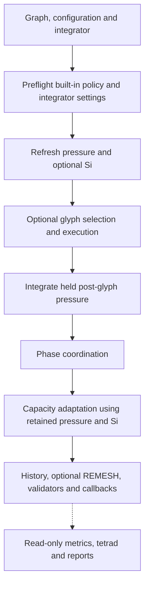

# TNFR Python Engine Architecture

**Version:** 0.0.3.7
**Status:** Implemented architecture reference

This document describes the repository as implemented. Mathematical claims are
owned by the scoped specifications under
[`theory/`](theory/README.md); [AGENTS](AGENTS.md) summarizes working conventions.
This guide links to those sources rather than
strengthening their claims.

Shared edge artifacts are owned by `utils.cache.edge_version_cache`. For
NetworkX graphs it checks ordered support, node/parallel-key identity and raw
`weight`/`length` channels before reuse, so direct edits with unchanged graph
size cannot retain old neighbor arrays, pressure preparation or Si inputs.
That check costs O(V+E) per access for scalar edge channels; it is a correctness
boundary, not a measured speedup. Other state/configuration dependencies remain
part of each consumer's key or explicit invalidation contract. Graph views use
fresh computations; concurrent mutation during a read is unsupported.

LRU storage and callback handling have one implementation in
[`utils/unified_cache.py`](src/tnfr/utils/unified_cache.py). The historical
`InstrumentedLRUCache` and `ManagedLRUCache` names remain aliases in `utils.cache`;
graph invalidation and persistence retain their separate responsibilities.

## Implementation owners

| Concern | Source of truth |
| --- | --- |
| Canonical TNFR synthesis and invariants | [AGENTS.md](AGENTS.md) |
| Operator channel, scale and postcondition | [`operator_contracts.py`](src/tnfr/operators/operator_contracts.py) |
| Operator-role derivation | [`physics_derivation.py`](src/tnfr/config/physics_derivation.py) |
| Grammar specification | [`grammar_canon.py`](src/tnfr/operators/grammar_canon.py) |
| Grammar validation facade | [`grammar.py`](src/tnfr/operators/grammar.py) |
| Canonical and operational constants | [`constants/`](src/tnfr/constants) |
| Shared selector and Si threshold resolution | [`selector_thresholds.py`](src/tnfr/config/selector_thresholds.py) |
| U3 admission limits and phase-neighbor selection | [`_phase_gate.py`](src/tnfr/operators/_phase_gate.py) |
| Resonance capacity proposal and identity predicates | [`_resonance_identity.py`](src/tnfr/operators/_resonance_identity.py) |
| Nodal pressure computation | [`dnfr.py`](src/tnfr/dynamics/dnfr.py) |
| Nodal integration | [`integrators.py`](src/tnfr/dynamics/integrators.py) |
| Runtime invocation ordinals | [`_runtime_steps.py`](src/tnfr/_runtime_steps.py); separate from physical time, operator counts and retained metric samples |
| Represented-real scalar admission | [`_exact_time.py`](src/tnfr/_exact_time.py), reused by clocks, phases, rates and operator gates |
| Signed scalar EPI admission | [`types.py`](src/tnfr/types.py), validating raw scalars and serialized components before BEPI coercion; shared by standard and optimized execution |
| Finite matrix products, differences and norms for reductions | [`physics/_finite_linear_algebra.py`](src/tnfr/physics/_finite_linear_algebra.py); quotient and morphism checks preserve finite-range failures |
| Active acceleration history and detached evidence | [`nodal_equation.py`](src/tnfr/operators/nodal_equation.py), `observe_structural_acceleration` |
| Optional THOL preconditions and threshold resolution | [`preconditions/self_organization.py`](src/tnfr/operators/preconditions/self_organization.py), [`_thol_config.py`](src/tnfr/operators/_thol_config.py) |
| Public THOL birth proposals | [`self_organization.py`](src/tnfr/operators/self_organization.py) |
| All-node THOL eligibility and explicit finite dispatch | [`self_organization_selection.py`](src/tnfr/operators/self_organization_selection.py) |
| Simultaneous stage execution and graph transactions | [`network_stage.py`](src/tnfr/operators/network_stage.py) |
| Structural fields | [`fields.py`](src/tnfr/physics/fields.py) |
| Regional form observations and affine mean/Gram closure | [`form_geometry.py`](src/tnfr/physics/form_geometry.py); the SDK delegates rather than defining another reduction |
| Regional orientation relative to a supplied rate source | [`source_relative_form.py`](src/tnfr/physics/source_relative_form.py); reuses the regional form observer |
| Conditional relational phase/form execution | [`dynamics/relational.py`](src/tnfr/dynamics/relational.py); one admitted field and atomic Euler step, reused by the SDK |
| Prepared relational pattern observations | [`physics/relational_observations.py`](src/tnfr/physics/relational_observations.py); supplied regions/reference lifts, shared winding and regional support accounting |
| Protected relational basins | [`physics/relational_capture.py`](src/tnfr/physics/relational_capture.py); reflected, full-state local and acute-sector theorems sharing exact phase/energy enclosures for conditional ideal-law limits |
| Validated relational transit | [`physics/relational_transit.py`](src/tnfr/physics/relational_transit.py); exact reflected ODE enclosure using shared rational intervals, Taylor derivatives and signed-diagonal comparison; read-only proof computation, not live engine evolution |
| Coherence and equilibrium kernel | [`common.py`](src/tnfr/metrics/common.py) |
| Public high-level API | [`sdk/simple.py`](src/tnfr/sdk/simple.py) |
| JSON report I/O | [`sdk/utils.py`](src/tnfr/sdk/utils.py); strict decoding and atomic export, also used by the CLI and fluent `save()` |

These are implementation responsibilities. The [documentation ownership map](docs/README.md)
identifies the single maintained guide for each responsibility.

## Nodal execution flow

The ordinary runtime composes the following configured operations. The diagram
does not assert that their laws or invocation schedule emerge from one another.


```mermaid
flowchart TD
    A[Graph, configuration and integrator] --> P[Preflight built-in policy and integrator settings]
    P --> B[Refresh pressure and optional Si]
    B --> G[Optional glyph selection and execution]
    G --> C[Integrate held post-glyph pressure]
    C --> D[Phase coordination]
    D --> E[Capacity adaptation using retained pressure and Si]
    E --> F[History, optional REMESH, validators and callbacks]
    F -.-> R[Read-only metrics, tetrad and reports]
```

1. Nodes store EPI, structural frequency, phase, pressure, and trace metadata.
2. `tnfr.dynamics.dnfr` computes the configured pressure channels. The EPI
   channel realizes random-walk graph diffusion; other channels retain their
   documented circular, capacity, and topology semantics.
3. `tnfr.dynamics.integrators` advances the declared nodal row. Optional Gamma
   is an additive rate source, separate from the unforced product. Rate/history
   evidence depends on the selected execution path.
4. `tnfr.metrics` and `tnfr.physics` compute coherence, equilibrium, the tetrad,
   conservation diagnostics, pulse, and other read-outs.
5. Grammar-aware sequence and runtime paths enforce word policies and live
   checks. Direct glyphs, public classes and atomic stages have distinct
   secondary effects; a low-level map is not a full sequence certificate.
   Coupling and Resonance retain their path-specific circular U3 checks.

[`runtime.step`](src/tnfr/dynamics/runtime.py) rejects malformed initial
selector, capacity and phase policies before callbacks or state evolution.
The default integrator additionally preflights its own numerical parameters.
This is not validation of every configuration field or a transaction covering
arbitrary callbacks, custom integrators or later
configuration changes; consumption-time validation remains necessary.
Setting `apply_glyphs=False` also skips selector construction. Pressure/Si
freshness is explicit: the native capacity gate reads retained inputs after
integration and phase coordination. Research compositions that refresh them
at a later boundary implement a different declared schedule and must not
transfer their conclusions to this path automatically.

Built-in glyph selectors share one validated metric snapshot and decision
kernel across scalar, vector and worker paths. Standalone decisions and each
new `prepare` read current stored metrics, normalizers and score weights.
Engine-owned batches release their snapshot on success or failure; a manually
prepared selector stays frozen until `prepare` or `clear`. Snapshot freshness
does not itself refresh pressure or Si. Live operator admission remains separate.

### Foundational integration boundaries

The [parameter ledger](theory/NODAL_PARAMETER_FOUNDATIONS.md#11-thresholds-constants-and-numerical-settings-have-different-duties)
owns the mathematical status and units of thresholds. The principal engine
uses shared configuration for selector decisions, capacity admission and Si
aggregation; partial phase policies inherit the same defaults as complete
ones. CLI and structural U3 diagnostics read the same hard gate as operators,
without adding numerical slack. Operator preconditions retain independent
state requirements; a diagnostic warning is not a new physical selection law.

Temporal parameters and consumed phase/rate aliases retain their raw type until
shared admission. Trigonometric caches cannot hide an invalid current phase.
Generic error guidance describes these domains and points to current references;
it supplies neither arbitrary global EPI/pressure/capacity bounds nor universal
coherence monotonicity. Consumer-specific bounds remain explicit configuration.

Nodal held-step validation and THOL proposal validation share a comparison
kernel and the configured tolerance/clipping policy. They check a supplied
single held-input step; they do not authenticate pressure provenance, account
for an undeclared Gamma input or turn an instantaneous operator event into a
continuous solution. Actual integration and the exact event certificates
remain the owners of their stronger execution evidence.

The clipping resolver in `dynamics/structural_clip.py` owns numerical-policy
admission for execution and held-step comparisons. The shared Euler arithmetic
also serves detached proposals; their unforced/unclipped scope does not include
the runtime's forcing, projection or history effects. Optimized pure-EPI
proposals and graph/dense CPU adapters reuse
`mathematics/_neighbor_differences.py` rather than average absolute form or
multiply rounded transition probabilities. Spectral matrices remain separate
representations with their own rounding scope. Dense DNFR support counts each
neighbor once; parallel edges contribute multiplicity only to conductance.

Gamma dispatch is registry-owned for both scalar and array execution. Runtime
evaluation is strict, and custom/replaced entries take the staged scalar path;
a fast path cannot silently omit a declared source. The Kuramoto cache follows
phase content as well as time. Structural path admission and distance-weighted
source accumulation also have shared owners across dense/streamed field paths.
SDK summaries reuse stable metric reductions and one circular-mean availability
adapter; they do not install another phase or pressure law.

Tetrad reports preserve unavailable values and estimator provenance. A fitted
coherence length uses the same length-aware geometry as its comparison;
dimensionless spectral fallback is not silently compared with path lengths.
A multiscale curvature fit cannot override a measured variance-cut violation.
These are diagnostic consistency requirements, not a complete state basis or
a stability proof. Numerical precision settings preserve intended definitions
but do not guarantee identical rounded decisions at every strict threshold.

Regional form observations have a separate shared owner in
[`form_geometry.py`](src/tnfr/physics/form_geometry.py). The supplied ordered
triples define Cartesian contrasts, their Gram matrix and instantaneous rates
from the same admitted `nu_f * stored_DeltaNFR` product used by the nodal
kernel. Exact represented quantities retain the rate-rounding defect; polar
estimates retain their own availability. No pressure refresh, graph mutation,
primitive phase substitution or reduced evolution occurs in the observer.
`Network.regional_form` is the public adapter.

The same module's `derive_regional_affine_closure` checks an independently
supplied fixed affine law on the full real fine-state domain. Source terms are
rates; only sources constant within each region preserve the all-state
mean/Gram closure when the generator passes its block-circulant test. A failed
reduction retains defects and leaves the fine law usable. The report is not
proof that runtime policy holds support, capacity, coefficients and primitive
phase fixed. The [derived-form note](theory/nodal/DERIVED_FORM_PHASE.md) owns
the proof and source-relative response; the
[SDK guide](docs/CLI_AND_SDK.md#observe-regional-form-and-its-nodal-response)
owns usage and representation conventions.

[`source_relative_form.py`](src/tnfr/physics/source_relative_form.py) composes
that observer with an independently supplied held source in form-rate units.
It retains `W=z*c^dagger`, where `c` is the source's regional contrast, and its
instantaneous held-source rate. A nonzero vector `c` makes regional contrast
recoverable from `W`; a zero vector does not define a reference orientation.
`Network.source_relative_form` delegates to this read-only owner. The observer
does not derive the source, authenticate its future constancy or add a phase
law to the engine.

The opt-in relational execution owner also supplies the joint law used by the
[local-recovery and paired-region studies](theory/nodal/RELATIONAL_EXCHANGE_ADMISSION.md#relational-local-recovery).
Their continuous hypotheses and finite controls are distinct from step admission.
The default acute domain and opt-in positive-resultant chamber share this
owner. The latter uses the private rational cosine/resultant helper in
`mathematics/_phase_resultant_chamber.py`, with the existing certified pi
enclosure, to admit complete represented Euler chords. It retains exact
margins without claiming an exact-flow enclosure or a new phase law.
[`relational_observations.py`](src/tnfr/physics/relational_observations.py) reads a
fresh detached field from that owner and projects supplied regions against an
explicit phase reference. It keeps offsets and separate form/phase norms,
delegates winding to `winding_certificates.py`, and reuses
`support_transport.py` for admitted regional accounting. The dynamics field
retains exact nodal dissipation/exchange/work and sums them for its global
balance. Regional observations sum those same contributions and pair form/phase
rates through a single shared outward-cut definition, retaining numerical
defects and explicit divided-rate availability. The engine also retains exact
phase mobility and phase-rate materialization defects. Regional unweighted
phase response uses that same evidence and cut to separate mean-mobility
boundary response from mobility/form covariance, with an exact squared bound.
It remains available at zero capacity and adds no evolution,
region selector or formation mechanism. `Network.relational_pattern` is a
thin adapter; the SDK's `relational_report_to_dict` supplies the exact rational
JSON projection for the existing writer. Reports are observations, not live
checkpoints or authenticated execution histories.

[`mathematics/linear_observation.py`](src/tnfr/mathematics/linear_observation.py)
owns exact invariant-row realization for any supplied finite rational
generator `z'=Jz`. The diffusion-specific `physics/epi_memory.py` wrapper
retains its independently admitted `x'=-Ax+b` model and existing outputs;
it delegates algebra without transferring diffusion premises to joint phase
and form dynamics. Shared exact matrix products/inverses now live in
`mathematics/_exact_linear_algebra.py`, with historical physics import paths
preserved. The [composition study](theory/nodal/RELATIONAL_PATTERN_COMPOSITION.md)
separates that reusable computation from its exact analytic rank proof and
nonlinear counterexample.
The counterexample also rules out closing that coarse state by adding its
instantaneous rate. Full centered nodal coordinates already retain the
responsible internal contrast; the engine does not replace them with a coarse
autonomous model. Static derivative controls check the existing field.
The same composition instrument now verifies the complete visible/hidden
split and quadratic energy balance. The
[joint memory theorem](theory/nodal/RELATIONAL_PATTERN_MEMORY.md) owns its
nonlinear initial-state dependence and conditional finite-time approximation
orders. No new solver or autonomous regional state is installed.

The unforced product, conditional diffusion identities, named operator
contracts and coherent diagnostics are implemented foundations. Unique phase,
capacity, support-formation and autonomous operator-selection laws remain
constitutive research obligations; the implementation does not label those
supplied policies as derived emergence. The sole research queue remains the
[execution plan](theory/research/FIVE_STAGE_EXECUTION_PLAN.md).

For THOL, grammar admission, the optional public precondition gate, acceleration
threshold crossing and a viable birth proposal are distinct checks. The public
operator and simultaneous THOL stage share proposal/commit logic; the ordinary
glyph selector's primitive THOL route writes pressure without creating children.
Legacy `validate_self_organization` now delegates to the shared read-only public
gate and does not write execution telemetry. Gate activation remains a caller/
configuration choice. Birth metadata does not create a transport edge; UM and
its candidate inventory retain their separate owners. These boundaries also
apply to research readiness observations, which must not implement competing
gates or silently select an execution policy.

`observe_self_organization_eligibility` reads all current nodes and retains
independent history, grammar, configured preconditions and complete proposal
results. It shares the stage's detached collision/hierarchy validation.
`execute_eligible_self_organization_stage` is an explicit all-eligible-once
policy: it recomputes eligibility inside one outer transaction, skips empty
sets and reuses the built-in simultaneous public stage. It checks actual
isolated births and preserved original node/edge support; it does not derive
autonomous selection, certify every old attribute or connect the newborns.

History observations expose source, availability, time basis and validated
samples. THOL, SDK nodal reports and propagation diagnostics share this owner.
The numeric `compute_d2epi_dt2` wrapper retains its compatibility zero for
unavailable history; callers needing evidence must inspect the observation.
Mutation's two-sample signed secant and the integrator's cached RHS-rate
difference are distinct quantities. Neither a threshold crossing nor a
historical propagation record proves that an operator caused a bifurcation.

Approximate diffusion readouts reject nonrepresentable nonzero balance terms;
exact support observers retain their rational domain. Forced-support event and
reset observations share a private reset core after public inputs have been
reconstructed and validated within the invocation. No cross-graph result cache
or second transport law is introduced.

## Package boundaries

### Foundations

- `tnfr.constants` separates canonical structural quantities from operational
  tuning parameters.
- `tnfr.config` owns attribute configuration and physics-derived operator
  classifications.
- `tnfr.errors` provides contextual public exceptions.
- `tnfr.mathematics` owns numerical backends and domain-neutral mathematical
  structures.

### Structural dynamics

- `tnfr.operators` implements the fixed 13-operator catalog, contracts,
  grammar, preconditions, postconditions, and sequence execution.
- `tnfr.dynamics` computes `Delta NFR`, integrates the nodal equation, and owns
  adaptive evolution services.
- `tnfr.physics` computes fields and mathematically scoped diagnostics.
- `tnfr.metrics` owns shared constitutive and telemetry kernels.

### Orchestration and public APIs

- `tnfr.core` defines service protocols, default implementations, and the
  dependency container.
- `tnfr.services` provides the orchestrator facade over those protocols.
- `tnfr.sdk` provides the supported Simple and fluent user interfaces.
- `tnfr.engines` groups optimization, discovery, integration, and computation
  services that build on the canonical core.

### Domain and research modules

`tnfr.riemann`, `tnfr.factorization`, and arithmetic modules under
`tnfr.mathematics` supply explicitly constructed arithmetic/spectral models.
`tnfr.research` owns reusable evidence and admission infrastructure. These
modules do not redefine the operator catalog, grammar, coherence kernel or
tetrad. Added fluid, chemistry and physical-gap programmes have been
[retired](theory/research/archive/README.md#foundation-reassessment-2026-09-20);
retained graph diffusion, phase geometry and conditional algebra remain in
their shared owners.

## Structural fields and scope

The canonical diagnostic tetrad is `(Phi_s, |grad phi|, K_phi, xi_C)`.
`Psi = K_phi + i J_phi` is a derived complex field and does not replace `K_phi`
in the tetrad.

- Wrapped phase differences have magnitude bound `pi`; wrapped curvature has
  that bound where its represented resultant defines a direction.
- `0.9*pi` is an operational curvature warning margin.
- `pi/4` per-node potential and `pi/2` potential drift are selected safety
  policies, not topology-independent bounds.
- Fitted coherence length is distinct from the tagged spectral fallback, which
  selects the first eigenvalue above `1e-9`; it is `1/sqrt(lambda_2)` only under
  the corresponding connectivity and cutoff hypotheses.
- The tetrad is the canonical read-out. Complete reconstruction of arbitrary
  system state from four scalars remains an open stronger claim.

See [the field specification](docs/STRUCTURAL_FIELDS_TETRAD.md) and
[the minimality scope note](theory/MINIMAL_STRUCTURAL_DEGREES.md).

## Operator registry and grammar

The registry in [`operators/registry.py`](src/tnfr/operators/registry.py) is a
lazily populated fixed map of the 13 implementations. `discover_operators()` is
a compatibility no-op; runtime package scanning is not part of current
registration.

Public operator identifiers are the canonical English tokens. Glyphs remain
internal structural symbols. The grammar authority is split deliberately:

1. contract predicates derive operator roles;
2. `grammar_canon.py` materializes U1-U6;
3. `grammar.py` exposes validation;
4. precondition modules enforce state-dependent requirements during execution.

Passing a word validator does not prove infinite-horizon convergence or future
U6 confinement. The exact scope is stated in
[Unified Grammar Rules](theory/UNIFIED_GRAMMAR_RULES.md).

## Public API

The stable high-level entry point is:

```python
from tnfr.sdk import TNFR

net = TNFR.create(20).ring().evolve(5)
result = net.results()
tetrad = net.tetrad()
telemetry = net.telemetry()
analysis = TNFR.analyze(net)
```

The fluent network API supports chained construction, named sequences, and
measurement:

```python
from tnfr.sdk.fluent import NetworkConfig, TNFRNetwork

config = NetworkConfig(random_seed=7, default_epi_range=(0.1, 0.5))

result = (
    TNFRNetwork("experiment", config)
    .add_nodes(20, phase_range=(0.0, 0.1))
    .connect_nodes(connection_pattern="ring")
    .apply_sequence(["emission", "coherence", "silence"])
    .measure()
)
```

Low-level operator and dynamics APIs remain available for research code, but
documentation examples should prefer the SDK unless they demonstrate a
specific contract.

## Numerical backends

NumPy is a core dependency. JAX and Torch are optional numerical backends
selected through the mathematics backend interface and tested through the
backend suite. The repository does not currently contain a dedicated
`TNFRGPUEngine`; backend availability alone is not evidence of CUDA acceleration
or a performance guarantee. Any future GPU claim requires an implementation,
hardware metadata, reproducible benchmark inputs, and recorded results.

## Self-optimization

Self-optimization analyzes telemetry and chooses bounded actions through the
implemented engine and SDK paths. It is an adaptive strategy layer. The current
implementation does not expose a general structural-manifold gradient, so it
must not be documented as a proved gradient-descent method. Its operational
parameters live in `tnfr.constants.operational`.

Registered strategy tokens and explicit legacy hints resolve to computation
services. An explicit service request is preserved even outside automatic
size/density preferences; the service admits or rejects its actual domain.
Automatic selection stays within its available candidates. Learning records
the executed strategy, while reports retain the requested strategy separately.
Timing history and configured scores select candidates, not a globally optimal
algorithm or an emergent TNFR evolution law.

## Documentation architecture

The [documentation map](docs/README.md) owns guide responsibilities and update
rules. The [theory index](theory/README.md) owns scientific reference status;
the [execution plan](theory/research/FIVE_STAGE_EXECUTION_PLAN.md) owns research
work. Generated contract tables read the registry; historical captures retain
their original context and do not redefine current behavior.

Documentation checks, staging and site construction are described in
[scripts/README](scripts/README.md). Publication triggers and permissions belong
to [workflow YAML and its guide](.github/WORKFLOWS.md).

### Single-file public facades

These modules remain files, not importable same-named directories. Their
functions/stubs own API details; this compact map replaces the separate guide.

| Module | Responsibility |
| --- | --- |
| `tnfr.flatten` | Nested-data projection helpers; not an evolution or identity theorem |
| `tnfr.gamma` | Registry of optional additive EPI-rate sources, separate from unforced nodal evolution |
| `tnfr.glyph_history` | Recorded operator history |
| `tnfr.glyph_runtime` | Runtime glyph execution |
| `tnfr.immutable` | Immutable data helpers |
| `tnfr.initialization` | Node/network initial conditions |
| `tnfr.io` | Input/output facade |
| `tnfr.node` | Nodal data/lifecycle helpers |
| `tnfr.observers` | Runtime observer interfaces |
| `tnfr.structural` | NFR creation and sequence execution |

## Extension constraints

Use the [working invariants](AGENTS.md#8-canonical-invariants) and the actual
operator/solver contract. Reproducibility requires fixed source, inputs,
configuration, seed, order, precision and backend. Do not replace a scoped
precondition with an unconditional claim that a name, seed or grammar label
ensures a trajectory property.

New domain modules should depend on the canonical core and expose diagnostics
without adding parallel definitions of constants, grammar sets, coherence, or
operator contracts.
