# TNFR Python Engine

Engine for **modeling, simulation and measurement** of multiscale structural coherence through **structural operators** (emission, reception, coherence, dissonance, coupling, resonance, silence, expansion, contraction, self‑organization, mutation, transition, recursivity).

---

## What is `tnfr`?

`tnfr` is a Python library to **operate with form**: build nodes, couple them into networks, and **modulate their coherence** over time using structural operators. It does not describe “things”; it **activates processes**. Its theoretical foundation is the *Resonant Fractal Nature Theory (TNFR)*, which understands reality as **networks of coherence** that persist because they **resonate**.

In practical terms, `tnfr` lets you:

* Model **Resonant Fractal Nodes (NFR)** with parameters for **frequency** (νf), **phase** (θ), and **form** (EPI). Use the ASCII constants `VF_KEY` and `THETA_KEY` to reference these attributes programmatically; the Unicode names remain available as aliases.
* Apply **structural operators** to start, stabilize, propagate, or reconfigure coherence.
* **Simulate** nodal dynamics with discrete/continuous integrators.
* **Measure** global coherence C(t), nodal gradient ΔNFR, and the **Sense Index** (Si).
* **Visualize** states and trajectories (coupling matrices, C(t) curves, graphs).

A form emerges and persists when **internal reorganization** (ΔNFR) **resonates** with the node’s **frequency** (νf).

## Quick start

### From Python

```python
from tnfr import create_nfr, run_sequence
from tnfr.structural import (
    Emision as Emission,
    Recepcion as Reception,
    Coherencia as Coherence,
    Resonancia as Resonance,
    Silencio as Silence,
)
from tnfr.metrics.common import compute_coherence
from tnfr.metrics.sense_index import compute_Si

G, node = create_nfr("A", epi=0.2, vf=1.0, theta=0.0)
ops = [Emission(), Reception(), Coherence(), Resonance(), Silence()]
run_sequence(G, node, ops)

C, mean_delta_nfr, mean_depi = compute_coherence(G, return_means=True)
si_per_node = compute_Si(G)
print(f"C(t)={C:.3f}, ΔNFR̄={mean_delta_nfr:.3f}, dEPI/dt̄={mean_depi:.3f}, Si={si_per_node[node]:.3f}")
```

The sequence preserves the nodal equation because `create_nfr` seeds the node with its **νf** and phase, and `run_sequence` validates the TNFR grammar before applying the operators in the requested order. The Emission→Reception→Coherence→Resonance→Silence chain keeps the structural grammar aligned with the canonical tokens listed in the table below. After each operator it triggers the graph hook `compute_delta_nfr` to recompute only **ΔNFR** (by default using `dnfr_epi_vf_mixed`, which blends EPI and νf without altering phase). The phase changes only when operators mutate it or when you execute later dynamic steps (for example `tnfr.dynamics.step` or `coordinate_global_local_phase`). When you require automatic phase coordination, run the complete dynamics cycle (`tnfr.dynamics.step`/`tnfr.dynamics.run`) or call the phase coordinators explicitly after `run_sequence`. That telemetry exposes **C(t)** and **Si**, anticipating the material covered in [Key concepts (operational summary)](#key-concepts-operational-summary) and [Main metrics](#main-metrics). Refer to the table below for the mapping between the canonical operator tokens and their English names used in this narrative.

Both `step` and `run` accept an optional `n_jobs` dictionary to pin the number of processes or threads used in each parallel stage (ΔNFR, Si, integrators, phase coordination, νf adaptation) without persisting those overrides into `G.graph`.

### From the command line

File `sequence.json` (tokens match the Emission→Reception→Coherence→Resonance→Silence order):

```json
[
  "emision",
  "recepcion",
  "coherencia",
  "resonancia",
  "silencio"
]
```

```bash
tnfr sequence --nodes 1 --sequence-file sequence.json --save-history history.json
```

| Canonical token | English operator name |
| ---------------- | --------------------- |
| `emision`        | Emission              |
| `recepcion`      | Reception             |
| `coherencia`     | Coherence             |
| `resonancia`     | Resonance             |
| `silencio`       | Silence               |

The `sequence` subcommand loads the canonical trajectory from the JSON file, executes the operators with the official grammar, and updates **νf**, **ΔNFR**, and phase using the same hooks as the Python API. The table above keeps the canonical lowercase tokens aligned with the English operator names so the CLI command remains exact while the explanation stays in technical English. When it finishes it writes the series for **C(t)**, mean **ΔNFR**, and **Si** to `history.json`, complementing the sections on [structural operators](#key-concepts-operational-summary) and [metrics](#main-metrics).

## Architecture Overview

For a detailed breakdown of orchestration layers, data paths, and invariant enforcement, consult the [TNFR Architecture Guide](ARCHITECTURE.md).

### Core packages (`src/tnfr/...`)

```
tnfr.structural    — canonical node factory and operator orchestration
tnfr.operators     — operator classes + registry discovery
tnfr.dynamics      — ΔNFR hooks, nodal equation, phase/νf adaptation
tnfr.metrics       — coherence, ΔNFR, Si, telemetry helpers
tnfr.trace         — structured history/trace capture via callbacks
tnfr.helpers       — stable facade for caches, glyph history, numerics
tnfr.locking       — process-wide named locks (shared by RNG/caches)
tnfr.cache         — cache managers exposing shared metrics/evictions
```

`tnfr.structural` exposes `create_nfr` and `run_sequence`, wiring node creation to ΔNFR hooks so every operator pass recomputes the gradient canonically.【F:src/tnfr/structural.py†L12-L70】 Operator implementations register themselves through `tnfr.operators.registry`, enabling automatic discovery while guarding name collisions.【F:src/tnfr/operators/registry.py†L12-L49】 Dynamics modules maintain the nodal equation, phase coordination, and ΔNFR plumbing, keeping νf/phase adjustments consistent with the operator grammar.【F:src/tnfr/dynamics/__init__.py†L1-L120】【F:src/tnfr/dynamics/__init__.py†L320-L408】 Metrics, trace capture, helpers, locks, and cache managers provide the shared utilities that every structural pipeline relies on.【F:src/tnfr/metrics/common.py†L1-L66】【F:src/tnfr/trace.py†L1-L170】【F:src/tnfr/helpers/__init__.py†L1-L74】【F:src/tnfr/locking.py†L1-L36】【F:src/tnfr/cache.py†L1-L120】

### Data flow between structural operators

```mermaid
flowchart LR
    subgraph Registry
        R[tnfr.operators.registry]
    end
    subgraph Structural Loop
        V[tnfr.validation.syntax.validate_sequence]
        S[tnfr.structural.run_sequence]
        D[tnfr.dynamics.set_delta_nfr_hook]
    end
    subgraph Dynamics
        N[tnfr.dynamics.default_compute_delta_nfr]
        E[tnfr.dynamics.update_epi_via_nodal_equation]
        P[tnfr.dynamics.coordinate_global_local_phase]
    end
    subgraph Telemetry
        M[tnfr.metrics.common.compute_coherence]
        T[tnfr.trace.register_trace]
    end
    R --> V --> S --> D
    D --> N --> E --> P
    P --> M
    N --> M
    M --> T
```



1. Operators self-register once `tnfr.operators.registry.discover_operators()` walks the package tree.【F:src/tnfr/operators/registry.py†L28-L45】
2. `run_sequence` validates canonical order, executes each operator, and triggers the configured ΔNFR hook after every call.【F:src/tnfr/structural.py†L72-L109】
3. Dynamics hooks compute ΔNFR mixes, update EPI via the nodal equation, and coordinate phase/global coupling before publishing metrics.【F:src/tnfr/dynamics/dnfr.py†L1958-L1993】【F:src/tnfr/dynamics/integrators.py†L420-L476】【F:src/tnfr/dynamics/__init__.py†L320-L408】
4. Telemetry layers accumulate coherence/Si, register trace callbacks, and persist structured history snapshots for diagnostics.【F:src/tnfr/metrics/common.py†L1-L66】【F:src/tnfr/trace.py†L170-L277】

### Telemetry, logging, and shared services

`tnfr.trace.register_trace` attaches before/after callbacks via the shared callback manager, capturing Γ specs, selector state, ΔNFR weights, Kuramoto metrics, and glyph counts in the graph history so every simulation leaves an auditable trail.【F:src/tnfr/trace.py†L170-L277】 Named locks from `tnfr.locking.get_lock` synchronise shared caches such as the RNG seed tables, ensuring deterministic jitter across processes without duplicating lock definitions.【F:src/tnfr/locking.py†L1-L36】【F:src/tnfr/rng.py†L1-L88】 The helper facade re-exports cache utilities so higher layers depend on a stable API while telemetry-aware caches in `tnfr.cache` expose capacity controls and per-entry metrics for debugging coherence regressions.【F:src/tnfr/helpers/__init__.py†L1-L74】【F:src/tnfr/cache.py†L1-L120】【F:src/tnfr/rng.py†L1-L120】

### Structural invariants → enforcing modules

- **Invariant 1 — EPI changes only through structural operators.** `run_sequence` validates canonical order and delegates EPI updates to the nodal equation so operators never mutate EPI ad-hoc, while `update_epi_via_nodal_equation` integrates ∂EPI/∂t = νf·ΔNFR + Γi(R).【F:src/tnfr/structural.py†L72-L109】【F:src/tnfr/dynamics/integrators.py†L420-L476】
- **Invariant 2 — νf stays in Hz_str.** The nodal equation documentation reiterates the structural unit and updates νf/EPI together, preventing stray unit conversions.【F:src/tnfr/dynamics/integrators.py†L432-L464】
- **Invariant 3 — ΔNFR preserves canonical semantics.** `default_compute_delta_nfr` mixes phase, EPI, νf, and topology via the configured hook, ensuring ΔNFR remains the structural gradient rather than an ML loss proxy.【F:src/tnfr/dynamics/dnfr.py†L1958-L1993】
- **Invariant 4 — Operator closure.** Syntax validation enforces the RECEPCION→COHERENCIA segment, checks THOL closure, and rejects unknown tokens before execution.【F:src/tnfr/validation/syntax.py†L1-L86】
- **Invariant 5 — Explicit phase checks.** `coordinate_global_local_phase` adapts kG/kL and records Kuramoto history so coupling never proceeds without synchrony analysis.【F:src/tnfr/dynamics/__init__.py†L320-L408】
- **Invariant 6 — Node birth/collapse boundaries.** `create_nfr` seeds νf, θ, and EPI together and installs the ΔNFR hook, guaranteeing nodes meet minimum coherence bookkeeping from the first step.【F:src/tnfr/structural.py†L12-L70】
- **Invariant 7 — Operational fractality.** THOL evaluation recursively expands nested operator blocks while preserving closure tokens, allowing sub-EPIs to run without flattening the grammar.【F:src/tnfr/flatten.py†L1-L120】
- **Invariant 8 — Controlled determinism.** RNG scaffolding routes every seed through telemetry-aware caches guarded by named locks so stochastic paths remain reproducible.【F:src/tnfr/rng.py†L1-L120】
- **Invariant 9 — Structural metrics transparency.** Coherence utilities compute C(t), ΔNFR, and dEPI aggregates with deterministic accumulation and cache neighbor maps for reuse.【F:src/tnfr/metrics/common.py†L1-L86】
- **Invariant 10 — Domain neutrality.** Grammar enforcement coerces glyphs against canonical compatibility tables, preventing domain-specific operator drift and keeping the alphabet canonical.【F:src/tnfr/validation/grammar.py†L1-L90】

## Practical TNFR Examples

The following walkthroughs expand the quick start by orchestrating a multi-node workflow twice: first from the Python API and then from the CLI. Each example highlights how canonical operators combine to steer coherence, how telemetry exposes **C(t)**, **ΔNFR**, and **Si**, and where to dig deeper into the APIs ([`tnfr.structural`](src/tnfr/structural.py), [`tnfr.operators`](src/tnfr/operators/definitions.py), [`tnfr.metrics`](src/tnfr/metrics/common.py), [`tnfr.dynamics`](src/tnfr/dynamics/__init__.py)).

### Controlled dissonance with re-coherence (Python API)

This scenario creates a three-node ring, pushes a controlled dissonance on the third node, and lets the network bifurcate before stabilising. The structural operators ship with canonical Spanish identifiers (Emision, Recepcion, etc.), and the example aliases them to their English meanings so the walkthrough remains fully English-aligned while reinforcing the official TNFR tokens. Compare the operator sequence with [Key concepts (operational summary)](#key-concepts-operational-summary) to see how the canonical grammar enforces the AL→EN→IL segment and the OZ→ZHIR mutation path.

```python
from tnfr import create_nfr, run_sequence
from tnfr.structural import (
    Emision as Emission,
    Recepcion as Reception,
    Coherencia as Coherence,
    Acoplamiento as Coupling,
    Resonancia as Resonance,
    Transicion as Transition,
    Disonancia as Dissonance,
    Mutacion as Mutation,
    Silencio as Silence,
)
from tnfr.metrics import register_metrics_callbacks
from tnfr.metrics.common import compute_coherence
from tnfr.metrics.sense_index import compute_Si
from tnfr.trace import register_trace
from tnfr.dynamics import run
from tnfr.glyph_history import ensure_history

# 1) Seed a shared graph and wire a minimal ring for neighbour-aware operators.
G, _ = create_nfr("A", epi=0.24, vf=1.0, theta=0.0)
_, _ = create_nfr("B", epi=0.18, vf=0.9, theta=0.45, graph=G)
_, _ = create_nfr("C", epi=0.27, vf=1.1, theta=-0.35, graph=G)
G.add_edge("A", "B")
G.add_edge("B", "C")

# Activate functional coupling so UM can forge edges when phases align.
G.graph.update({
    "UM_FUNCTIONAL_LINKS": True,
    "UM_CANDIDATE_COUNT": 2,
    "UM_CANDIDATE_MODE": "proximity",
})

# 2) Apply canonical operator sequences per node.
run_sequence(G, "A", [
    Emission(), Reception(), Coherence(),
    Coupling(), Resonance(), Coherence(), Silence(),
])
run_sequence(G, "B", [
    Emission(), Reception(), Coherence(),
    Resonance(), Coherence(), Silence(),
])
run_sequence(G, "C", [
    Emission(), Reception(), Coherence(),
    Transition(), Dissonance(), Mutation(), Coherence(), Silence(),
])

# 3) Collect telemetry while integrating short dynamics.
register_metrics_callbacks(G)
register_trace(G)
run(G, steps=8, dt=0.1)

# 4) Inspect global coherence and node-wise Sense Index.
C, dnfr_mean, depi_mean = compute_coherence(G, return_means=True)
Si = compute_Si(G)
history = ensure_history(G)

print(f"C(t)={C:.3f}, ΔNFR̄={dnfr_mean:.3f}, dEPI/dt̄={depi_mean:.3f}")
print({node: round(val, 3) for node, val in Si.items()})
print(history["W_stats"][-1])          # neighbourhood coherence span
print(list(history["nodal_diag"][-1].items())[:2])  # node-level diagnosis
```

Sample output (with optional dependencies disabled) illustrates the bifurcation and recovery loop:

```
C(t)=0.961, ΔNFR̄=0.022, dEPI/dt̄=0.018
{'A': 0.95, 'B': 0.60, 'C': 0.674}
{'min': 0.4595, 'max': 0.7067, 'mean': 0.6153, 'n_edges': 6, 'mode': 'sparse', 'scope': 'neighbors'}
[
  ('A', {'node': 'A', 'Si': 0.956, 'dnfr_norm': 0.054, 'state': 'stable', ...}),
  ('B', {'node': 'B', 'Si': 0.598, 'dnfr_norm': 1.000, 'state': 'transition', ...})
]
```

* **Node A** rides the UM coupling boost and lands in the `'stable'` diagnosis bucket once Silencio clamps νf while C(t) increases—see the stabilisation criteria in [Main metrics](#main-metrics).
* **Node C** crosses the OZ→ZHIR path, spikes |ΔNFR|, and returns to IL, showing a controlled bifurcation that preserves operator closure.
* **Node B** inherits the dissonance (dnfr_norm → 1.0) and remains in the `'transition'` bucket, signalling a pending coherence push or resonance balancing before the network can converge again.

Explore the data stored in `history` (glyph traces, diagnosis rows, Tg curves) to correlate glyph usage with the coherence span reported in `W_stats`.

### Reproducing the scenario from the CLI

The same workflow can be executed with the `tnfr` CLI. Create the sequence and configuration files (JSON keeps optional dependencies minimal):

```jsonc
// sequence.json
[
  {"TARGET": [0]}, "AL", "EN", "IL", "UM", "RA", "IL", "SHA",
  {"TARGET": [1]}, "AL", "EN", "IL", "RA", "IL", "SHA",
  {"TARGET": [2]}, "AL", "EN", "IL", "NAV", "OZ", "ZHIR", "IL", "SHA"
]
```

```jsonc
// config.json
{
  "UM_FUNCTIONAL_LINKS": true,
  "UM_CANDIDATE_COUNT": 2,
  "UM_CANDIDATE_MODE": "proximity",
  "OZ_NOISE_MODE": false,
  "SIGMA": {"enabled": false}
}
```

Run the sequence on a three-node ring (installing `tnfr[yaml]` removes the YAML warning if you prefer `.yaml` files):

```bash
tnfr sequence \
  --nodes 3 --topology ring --seed 1 \
  --sequence-file sequence.json \
  --config config.json \
  --save-history history.json
```

The command reuses the canonical grammar and ΔNFR hooks from [`tnfr.dynamics`](src/tnfr/dynamics/__init__.py). The saved `history.json` mirrors the Python telemetry; the last samples show the same coherence span and dissonance distribution:

```json
"W_stats": {"min": 0.423, "max": 0.736, "mean": 0.609, "n_edges": 6, "mode": "sparse", "scope": "neighbors"},
"nodal_diag": {
  "0": {"Si": 0.723, "νf": 0.716, "dnfr_norm": 0.785, "state": "transition"},
  "1": {"Si": 0.363, "νf": 0.075, "dnfr_norm": 1.000, "state": "transition"},
  "2": {"Si": 0.797, "νf": 0.463, "dnfr_norm": 0.215, "state": "transition"}
}
```

Interpreting the telemetry against [Main metrics](#main-metrics) reveals the same story as the Python run: node 2 (the controlled dissonance target) expands ΔNFR then folds back toward coherence, node 0 couples to absorb part of the gradient, and node 1 remains the bifurcation frontier until another IL/RA pass reduces its ΔNFR. Use the [metrics helpers](src/tnfr/metrics/reporting.py) to extract Tg summaries or glyphogram series when exploring longer trajectories.

---

## Installation

```bash
pip install tnfr
```
* https://pypi.org/project/tnfr/
* Requires **Python ≥ 3.9**.
* Install extras:
  * NumPy: `pip install tnfr[numpy]`
  * YAML: `pip install tnfr[yaml]`
  * orjson (faster JSON serialization): `pip install tnfr[orjson]`
  * All: `pip install tnfr[numpy,yaml,orjson]`
* When `orjson` is unavailable the engine falls back to Python's built-in
  `json` module.

### Optional imports with cache

Use ``tnfr.utils.cached_import`` to load optional dependencies and cache the
result via a process-wide LRU cache. Missing modules (or attributes) yield
``None`` without triggering repeated imports. The helper records failures and
emits a single warning per module to keep logs tidy. Set ``lazy=True`` to obtain
a lightweight proxy that postpones the real import until the object is first
used—handy when optional dependencies are rarely touched. When optional
packages are installed at runtime call ``tnfr.utils.prune_failed_imports`` to
clear the consolidated failure/warning registry before retrying:

```python
from tnfr.utils import cached_import, prune_failed_imports

np = cached_import("numpy")
safe_load = cached_import("yaml", "safe_load")

# postpone work until the symbol is first accessed
safe_lazy = cached_import("yaml", "safe_load", lazy=True)

# warm optional dependencies during application bootstrap
from tnfr.utils import warm_cached_import

warm_cached_import("numpy", ("yaml", "safe_load"))

# provide a shared cache with an explicit lock
from cachetools import TTLCache
import threading

cache = TTLCache(32, 60)
lock = threading.Lock()
cached_import("numpy", cache=cache, lock=lock)

# clear caches after installing a dependency at runtime
cached_import.cache_clear()
prune_failed_imports()
```

## Tests

Run the test suite from the project root using the helper script, which sets
the necessary `PYTHONPATH` and mirrors the checks described in
[`CONTRIBUTING.md`](CONTRIBUTING.md):

```bash
./scripts/run_tests.sh
```

The script sequentially executes `pydocstyle`, `pytest` under `coverage`, the
coverage summary, and `vulture --min-confidence 80 src tests`. Avoid running
`pytest` directly or executing the script from other directories, as the
environment may be misconfigured and imports will fail. To pass additional
flags to `pytest`, append them after `--`, for example:

```bash
./scripts/run_tests.sh -- -k coherence
```

## Locking policy

The engine centralises reusable process-wide locks in
`tnfr.locking`. Modules obtain named locks via `locking.get_lock()` and
use the returned `threading.Lock` in their own critical sections. This
avoids scattering `threading.Lock` instances across the codebase and
ensures that shared resources are synchronised consistently.
Module-level caches or global state should always use these named
locks; only short-lived objects may instantiate ad-hoc locks directly
when they are not shared.

---

## Callback error handling

Callback errors are stored in a ring buffer attached to the graph.  The
buffer retains at most the last 100 errors by default, but the limit can be
adjusted at runtime via ``tnfr.callback_utils.callback_manager.set_callback_error_limit``
and inspected with ``tnfr.callback_utils.callback_manager.get_callback_error_limit``.

---

## Helper utilities API

`tnfr.helpers` bundles a compact set of public helpers that stay stable across
releases. They provide ergonomic access to the most common preparation steps
when orchestrating TNFR experiments.

### Collections and numeric helpers

* ``ensure_collection(it, *, max_materialize=...)`` — materialize potentially
  lazy iterables once, enforcing a configurable limit to keep simulations
  bounded.
* ``clamp(x, a, b)`` and ``clamp01(x)`` — restrict scalars to safe ranges for
  operator parameters.
* ``kahan_sum_nd(values, dims)`` — numerically stable accumulators used to
  track coherence magnitudes across long trajectories (use ``dims=1`` for
  scalars, ``dims=2`` for paired values, etc.).
* ``angle_diff(a, b)`` — compute minimal angular differences (radians) to
  compare structural phases.

### Structural operator history

* ``push_glyph(nd, glyph, window)`` — record the application of an operator in the
  node history while honoring the configured window.
* ``recent_glyph(nd, glyph, window)`` — check whether a specific operator appears
  in a node's recent history.
* ``ensure_history(G)`` — prepare the graph-level history container with the
  appropriate bounds.
* ``last_glyph(nd)`` — inspect the last operator emitted by a node.
* ``count_glyphs(G, window=None, *, last_only=False)`` — aggregate the usage of
  structural operators across the network using the full history or a bounded
  window.

### Graph caches and ΔNFR invalidation

* ``cached_node_list(G)`` — lazily cache a stable tuple of node identifiers,
  respecting opt-in sorted ordering.
* ``ensure_node_index_map(G)`` / ``ensure_node_offset_map(G)`` — expose cached
  index and offset mappings for graphs that need to project nodes to arrays.
* ``node_set_checksum(G, nodes=None, *, presorted=False, store=True)`` —
  produce deterministic BLAKE2b hashes to detect topology changes.
* ``stable_json(obj)`` — render deterministic JSON strings suited for hashing
  and reproducible logs.
* ``get_graph(obj)`` / ``get_graph_mapping(G, key, warn_msg)`` — normalise
  access to graph-level metadata regardless of wrappers.
* ``EdgeCacheManager`` together with ``edge_version_cache``,
  ``cached_nodes_and_A`` and ``edge_version_update`` encapsulate the edge
  version cache. ``increment_edge_version`` bumps the version manually for
  imperative workflows.
* ``mark_dnfr_prep_dirty(G)`` — invalidate precomputed ΔNFR preparation when
  mutating edges outside the cache helpers.

---

## Why TNFR (in 60 seconds)

* **From objects to coherences:** you model **processes** that hold, not fixed entities.
* **Operators instead of rules:** you compose **structural operators** (e.g., *emission*, *coherence*, *dissonance*) to **build trajectories**.
* **Operational fractality:** the same pattern works for **ideas, teams, tissues, narratives**; the scales change, **the logic doesn’t**.

---

## Key concepts (operational summary)

* **Node (NFR):** a unit that persists because it **resonates**. Parameterized by **νf** (frequency), **θ** (phase), and **EPI** (coherent form).
* **Structural operators** - functions that reorganize the network:

  * **Emission** (start), **Reception** (open), **Coherence** (stabilize), **Dissonance** (creative tension), **Coupling** (synchrony), **Resonance** (propagate), **Silence** (latency), **Expansion**, **Contraction**, **Self‑organization**, **Mutation**, **Transition**, **Recursivity**.
* **Magnitudes:**

  * **C(t):** global coherence.
  * **ΔNFR:** nodal gradient (need for reorganization).
  * **νf:** structural frequency (Hz\_str).
  * **Si:** sense index (ability to generate stable shared coherence).

---

## Typical workflow

1. **Model** your system as a network: nodes (agents, ideas, tissues, modules) and couplings.
2. **Select** a **trajectory of operators** aligned with your goal (e.g., *start → couple → stabilize*).
3. **Simulate** the dynamics: number of steps, step size, tolerances.
4. **Measure**: C(t), ΔNFR, Si; identify bifurcations and collapses.
5. **Iterate** with controlled **dissonance** to open mutations without losing form.

---

## Main metrics

* `coherence(traj) → C(t)`: global stability; higher values indicate sustained form.
* `gradient(state) → ΔNFR`: local demand for reorganization (high = risk of collapse/bifurcation).
* `sense_index(traj) → Si`: proxy for **structural sense** (capacity to generate shared coherence) combining **νf**, phase, and topology.

## Topological remeshing

Use ``tnfr.operators.apply_topological_remesh`` (``from tnfr.operators import apply_topological_remesh``)
to reorganize connectivity based on nodal EPI similarity while preserving
graph connectivity. Modes:

- ``"knn"`` – connect each node to its ``k`` nearest neighbours (with optional
  rewiring).
- ``"mst"`` – retain only a minimum spanning tree.
- ``"community"`` – collapse modular communities and reconnect them by
  similarity.

All modes ensure connectivity by adding a base MST.

---

## History configuration

Recorded series are stored under `G.graph['history']`. Set `HISTORY_MAXLEN` in
the graph (or override the default) to keep only the most recent entries. The
value must be non‑negative; negative values raise ``ValueError``. When the
limit is positive the library uses bounded `deque` objects and removes the
least populated series when the number of history keys grows beyond the limit.

### Random node sampling

To reduce costly comparisons the engine stores a per‑step random subset of
node ids under `G.graph['_node_sample']`. Operators may use this to avoid
scanning the whole network. Sampling is skipped automatically when the graph
has fewer than **50 nodes**, in which case all nodes are included.

### Jitter RNG cache

`random_jitter` uses an LRU cache of `random.Random` instances keyed by `(seed, node)`.
`JITTER_CACHE_SIZE` controls the maximum number of cached generators (default: `256`);
when the limit is exceeded the least‑recently used entry is discarded. Increase it for
large graphs or heavy jitter usage, or lower it to save memory.

To adjust the number of cached jitter sequences used for deterministic noise,
obtain the manager with ``get_jitter_manager`` before calling ``setup``:

```python
from tnfr.operators import get_jitter_manager

manager = get_jitter_manager()
# Resize cache to keep only 512 entries
manager.max_entries = 512

# or in a single call that also clears previous counters
manager.setup(max_entries=512)
```

``setup`` preserves the current size unless a new ``max_entries`` value is
supplied. Custom sizes persist across subsequent ``setup`` calls, and
``max_entries`` assignments take effect immediately.

### Edge version tracking

Wrap sequences of edge mutations with `edge_version_update(G)` so the edge
version increments on entry and exit. This keeps caches and structural logs
aligned with the network's evolution.

### Defaults injection performance

`inject_defaults` avoids deep copies when values are immutable (numbers,
strings, tuples). It resorts to `copy.deepcopy` only for mutable structures,
which reduces the cost of initializing graphs with default parameters.

---

## Trained GPT

https://chatgpt.com/g/g-67abc78885a88191b2d67f94fd60dc97-tnfr-teoria-de-la-naturaleza-fractal-resonante

---

## Changelog

* Removed compatibility layers ``tnfr.logging_utils`` and ``tnfr.import_utils``;
  import logging and import helpers from ``tnfr.utils`` instead.
* Removed deprecated alias `sigma_vector_global`; use `sigma_vector_from_graph` instead.
* Removed legacy `tnfr.program` alias; import programming helpers from `tnfr.execution`.
* Stopped re-exporting ``CallbackSpec`` and ``apply_topological_remesh`` at the
  package root; import them via ``tnfr.trace`` and ``tnfr.operators``.

---

## MIT License

Copyright (c) 2025 TNFR - Resonant Fractal Nature Theory

Permission is hereby granted, free of charge, to any person obtaining a copy of this software and associated documentation files (the "Software"), to deal in the Software without restriction, including without limitation the rights to use, copy, modify, merge, publish, distribute, sublicense, and/or sell copies of the Software, and to permit persons to whom the Software is furnished to do so, subject to the following conditions:

The above copyright notice and this permission notice shall be included in all copies or substantial portions of the Software.

THE SOFTWARE IS PROVIDED "AS IS", WITHOUT WARRANTY OF ANY KIND, EXPRESS OR IMPLIED, INCLUDING BUT NOT LIMITED TO THE WARRANTIES OF MERCHANTABILITY, FITNESS FOR A PARTICULAR PURPOSE AND NONINFRINGEMENT. IN NO EVENT SHALL THE AUTHORS OR COPYRIGHT HOLDERS BE LIABLE FOR ANY CLAIM, DAMAGES OR OTHER LIABILITY, WHETHER IN AN ACTION OF CONTRACT, TORT OR OTHERWISE, ARISING FROM, OUT OF OR IN CONNECTION WITH THE SOFTWARE OR THE USE OR OTHER DEALINGS IN THE SOFTWARE.

---

If you use `tnfr` in research or projects, please cite the TNFR conceptual framework and link to the PyPI package.
