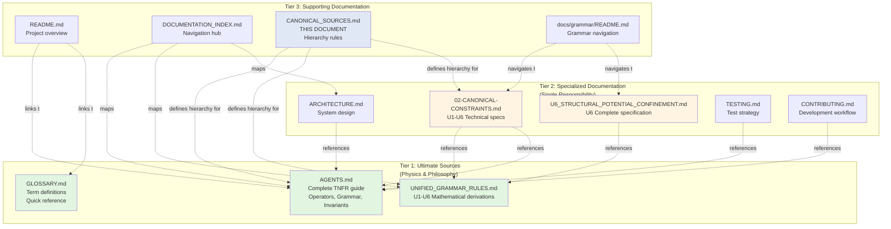
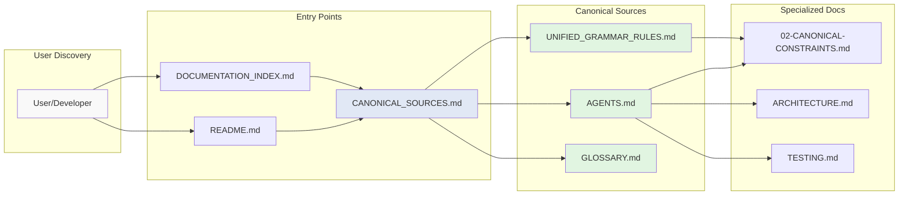
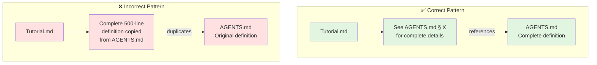

# Documentation Hierarchy - Visual Reference

**Mermaid diagrams showing TNFR documentation structure**

See [CANONICAL_SOURCES.md](CANONICAL_SOURCES.md) for complete hierarchy specification.

---

## Canonical Documentation Hierarchy



## Information Flow



## Concept Ownership Map

```mermaid
graph TD
    subgraph Concepts["TNFR Concepts"]
        NODAL[Nodal Equation<br/>∂EPI/∂t = νf · ΔNFR]
        OPS[13 Canonical Operators<br/>AL, EN, IL, OZ, UM, RA,<br/>SHA, VAL, NUL, THOL,<br/>ZHIR, NAV, REMESH]
        GRAMMARRULES[Grammar Rules U1-U6<br/>Derivations & Proofs]
        SPECS[U1-U6 Technical Specs<br/>Implementation details]
        INV[10 Canonical Invariants<br/>EPI, νf, ΔNFR, etc.]
        TERMS[Terminology<br/>EPI, νf, ΔNFR, C(t), Si, etc.]
    end
    
    subgraph Owners["Canonical Owners"]
        A1[AGENTS.md]
        A2[AGENTS.md]
        G1[UNIFIED_GRAMMAR_RULES.md]
        C1[02-CANONICAL-CONSTRAINTS.md]
        A3[AGENTS.md]
        GL[GLOSSARY.md]
    end
    
    NODAL --> A1
    OPS --> A2
    GRAMMARRULES --> G1
    SPECS --> C1
    INV --> A3
    TERMS --> GL
    
    style A1 fill:#e1f5e1
    style A2 fill:#e1f5e1
    style A3 fill:#e1f5e1
    style G1 fill:#e1f5e1
    style GL fill:#e1f5e1
    style C1 fill:#fff4e1
```

## Correct vs Incorrect Patterns



---

## Usage

**For contributors**: Check concept ownership map before adding definitions  
**For maintainers**: Use hierarchy diagram in PR reviews  
**For AI agents**: Follow information flow when answering questions

**Rule**: If adding >100 words about a concept, check if it's already canonical. If yes, reference instead of replicate.

---

**Related**:
- [CANONICAL_SOURCES.md](CANONICAL_SOURCES.md) - Complete hierarchy specification
- [DOCUMENTATION_INDEX.md](DOCUMENTATION_INDEX.md) - Full documentation map
- [AGENTS.md](AGENTS.md) - Primary canonical source

