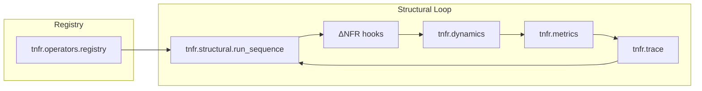

# Architecture overview

The TNFR Python Engine enforces the nodal equation by orchestrating structural operators,
dynamics hooks, and telemetry layers. Use this map to locate functionality before extending
or debugging the engine.

## Core packages (`src/tnfr/...`)

```
tnfr.structural    — canonical node factory and operator orchestration
tnfr.operators     — operator classes + registry discovery
tnfr.dynamics      — ΔNFR hooks, nodal equation, phase/νf adaptation
tnfr.metrics       — coherence, ΔNFR, Si, telemetry helpers
tnfr.trace         — structured history/trace capture via callbacks
tnfr.helpers       — stable facade for caches, structural history, numerics
tnfr.locking       — process-wide named locks (shared by RNG/caches)
tnfr.cache         — cache managers exposing shared metrics/evictions
```

- `tnfr.structural` exposes `create_nfr` and `run_sequence`, wiring node creation to ΔNFR
  hooks so every operator pass recomputes the gradient canonically.
- Operator implementations self-register through `tnfr.operators.registry` to guard name
  collisions and support discovery.
- Dynamics modules maintain the nodal equation, phase coordination, and ΔNFR plumbing,
  keeping νf/phase adjustments consistent with the operator grammar.
- Metrics, trace capture, helper facades, locking, and cache managers provide the utilities
  required by structural pipelines.

## Data flow between structural operators



1. Operators self-register once `tnfr.operators.registry.discover_operators()` walks the
   package tree.
2. `run_sequence` validates canonical order, executes each operator, and triggers the
   configured ΔNFR hook after every call.
3. Dynamics hooks compute ΔNFR mixes, update EPI via the nodal equation, and coordinate
   phase/global coupling before publishing metrics.
4. Telemetry layers accumulate coherence/Si, register trace callbacks, and persist structured
   history snapshots for diagnostics.

## Telemetry, logging, and shared services

- `tnfr.trace.register_trace` attaches before/after callbacks through the shared callback
  manager, capturing Γ specs, selector state, ΔNFR weights, Kuramoto metrics, and operator
  counts in the graph history so every simulation leaves an auditable trail.
- Named locks from `tnfr.locking.get_lock` synchronise shared caches such as the RNG seed
  tables, ensuring deterministic jitter across processes without duplicating lock
  definitions.
- Helper facades re-export cache utilities so higher layers depend on a stable API while
  telemetry-aware caches in `tnfr.cache` expose capacity controls and per-entry metrics for
  debugging coherence regressions.

## Canonical invariants → enforcing modules

- **Invariant 1 — EPI changes only through structural operators.** `run_sequence` validates
  canonical order and delegates EPI updates to the nodal equation so operators never mutate
  EPI ad-hoc, while `update_epi_via_nodal_equation` integrates
  $\partial EPI/\partial t = \nu_f \cdot \Delta NFR + \Gamma_i(R)$.
- **Invariant 2 — νf stays in Hz_str.** Dynamics modules document the structural unit and
  update νf/EPI together, preventing stray unit conversions.
- **Invariant 3 — ΔNFR preserves canonical semantics.** `default_compute_delta_nfr` mixes
  phase, EPI, νf, and topology through the configured hook so ΔNFR remains the structural
  gradient rather than an ML loss proxy.
- **Invariant 4 — Operator closure.** Syntax validation enforces the RECEPTION → COHERENCE
  segment, checks THOL closure, and rejects unknown tokens before execution.
- **Invariant 5 — Explicit phase checks.** `coordinate_global_local_phase` adapts kG/kL and
  records Kuramoto history so coupling never proceeds without synchrony analysis.
- **Invariant 6 — Node birth/collapse boundaries.** `create_nfr` seeds νf, θ, and EPI together
  and installs the ΔNFR hook, guaranteeing nodes meet minimum coherence bookkeeping from the
  first step.
- **Invariant 7 — Operational fractality.** THOL evaluation recursively expands nested
  operator blocks while preserving closure tokens, allowing sub-EPIs to run without
  flattening the grammar.
- **Invariant 8 — Controlled determinism.** RNG scaffolding routes every seed through
  telemetry-aware caches guarded by named locks so stochastic paths remain reproducible.
- **Invariant 9 — Structural metrics transparency.** Coherence utilities compute C(t), ΔNFR,
  and dEPI aggregates with deterministic accumulation and cache neighbour maps for reuse.
- **Invariant 10 — Domain neutrality.** Grammar enforcement coerces structural tokens against
  canonical compatibility tables, preventing domain-specific operator drift and keeping the
  alphabet canonical.

Consult [telemetry and utilities](telemetry.md) for the metrics API and cache helpers, and
[operators](operators.md) for the structural grammar.
