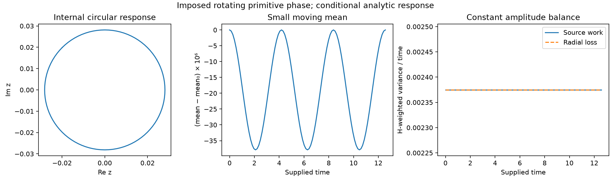

# Nodal parameter foundations and constitutive scope

Reviewed 2026-09-18. This is the cross-channel foundation audit supporting G3
in the [single execution plan](research/FIVE_STAGE_EXECUTION_PLAN.md).
It is not another research queue. The definition of structural form, tangent
pressure and chart changes remains in
[FUNDAMENTAL_THEORY sections 2.4-2.6](FUNDAMENTAL_THEORY.md#24-physical-concepts-mathematical-types-and-implementation).
The [constitutive audit](DIAGNOSTIC_AND_GRAMMAR_SCOPE.md#14-constitutive-closure-audit-from-the-nodal-law)
owns the detailed inventory of implemented auxiliary laws. This document
connects every foundational parameter family to those owners, states additional
derivations and records what the current implementation cannot establish.
The joint-potential consequences, including the distinction between pointwise
source compatibility and the common-mean/phase stability obstruction, are owned
by [variational sections 13.8-13.9](TNFR_VARIATIONAL_PRINCIPLE.md#138-structural-restrictions-do-not-select-the-auxiliary-potential).
Centering a diagnostic does not authorize removing that mean from the dynamics.

**Reading map and ownership.** Sections 1-8 are the cross-channel parameter
ledger and closure requirements. Sections 9-11 retain representation and
finite compatibility results; sections 12-21 develop conditional phase/form
families and their positive results and obstructions. These are reusable
mathematical cases, not parallel active research queues. Current priorities
belong only to the execution plan. Task-specific state reconstruction and
the tetrad's information boundary are centralized in
[minimal structural degrees](MINIMAL_STRUCTURAL_DEGREES.md), with the
[scale/geometry note](TNFR_SCALE_GEOMETRY_AND_BRIDGE.md) owning implemented
quotient and invariant-observation contracts.

## 1. Start from a typed law, not from its defaults

Write the unforced nodal equation as

\[
\dot x_i=\nu_i p_i,\qquad p_i=P_i(z),\qquad
z=(x,\nu,\theta,G,W,\ell,h).
\]

Here `h` denotes whatever history the declared model actually needs. It is not
an assertion that all these coordinates are independent physical primitives.
Some could be observations of a richer form; that requires an explicit map
and a closure proof. Conversely, naming them parts of one structure does not
already provide their equations of motion.

For a chosen real EPI chart, let `[x]=X`, `[t]=T`, `[nu]=T^-1`. Then `[p]=X`.
The phase coordinate is an angle on the circle, expressed in radians; an
explicit structural distance can have a separate unit `L`. All code values
may be nondimensional, but the reference scales and time convention must then
be declared. A finite real number does not certify dimensional consistency.

Three levels must stay distinct:

1. **Definition or identity:** for example, wrapped angles have magnitude at
   most pi in the radian chart.
2. **Conditional consequence:** diffusion dissipates its Dirichlet energy
   under the stated nonnegative reciprocal conductance and mobility premises.
3. **Model or numerical choice:** the pressure mixture, phase/capacity update,
   operator word, clipping interval, threshold, seed or sampling protocol.

An identity involving a chosen coefficient proves properties of that choice;
it does not derive why nature or the nodal law must choose that coefficient.
The naming of `constants.canonical` is not an epistemic classification.

## 2. Parameter and dependency ledger

| Family | Meaning and owner | Established boundary |
| --- | --- | --- |
| EPI `x` | Coherent form in a declared chart; [foundation types](FUNDAMENTAL_THEORY.md#24-physical-concepts-mathematical-types-and-implementation), [scalarization](../src/tnfr/mathematics/epi.py) | Signed real storage and finite BEPI storage exist. Neither storage complexity nor temporal entropy selects the necessary physical state space. |
| Capacity `nu` | Nonnegative local mobility/rate in `xdot=nu*p`; [adaptation](../src/tnfr/dynamics/adaptation.py) | Zero freezes this unforced EPI channel; it need not destroy stored form or freeze all other channels. `nu<=2*pi` is a configured rail, not a phase theorem. No unique autonomous capacity law follows from the product. |
| Pressure `p` | Directed tangent response, evaluated from a declared constitutive map; [dnfr](../src/tnfr/dynamics/dnfr.py), [support transport](../src/tnfr/physics/support_transport.py) | The EPI channel is a graph difference. The full pressure is not generally a potential gradient. Its sign is chart-dependent and does not name an operator. Stored pressure need not be freshly evaluated pressure. |
| Phase `theta` | Circle coordinate and wrapped neighbor separation; [phase response](../src/tnfr/physics/phase_response.py) | A common rotation is a symmetry of the regular difference/phasor formulas. Relative phase is independent of scalar EPI in the present representation. The nodal product does not imply `theta_dot=nu` or any synchronization law. |
| Clock `t`, `dt` | Declared time coordinate and numerical increment; [integrator](../src/tnfr/dynamics/integrators.py), [directed structural time](../src/tnfr/physics/directed_diffusion.py) | Physical time, operator position, invocation count and history index are different. A step size alone supplies no stability guarantee. |
| Channel coefficients | `p=w_phi*g_phi+w_epi*g_epi+w_vf*g_vf+w_topo*g_topo`; [defaults](../src/tnfr/config/defaults_core.py) | Numeric sum one is a selected normalization, not physical dimensional analysis. Priority phase/EPI/capacity is configured. See section 3. |
| Support `G` | Which nodes can be neighbors, including zero-conductance support edges | Phase and capacity support need not equal positive EPI transport support. Isolates, self-loops, multiple edges and directionality require explicit conventions. |
| Conductance `W` | Nonnegative transport strength; [support transport](../src/tnfr/physics/support_transport.py) | Common positive rescaling leaves row-normalized EPI transport unchanged. Reciprocal conductance is an additional assumption, not a consequence of undirected support alone. |
| Distance `ell`, kernel exponent | Structural path-distance read-out; [edge semantics](../src/tnfr/physics/_edge_semantics.py) | Explicit `length` wins; absent length, `weight` is a compatibility fallback, then unit length. Undirected distances can be a pseudometric; distinct-node zero distances are omitted from the potential and coherence fit. Parallel lengths combine by minimum; directed distances follow outgoing arcs and can be asymmetric. No equation here derives distance from conductance or selects inverse-square exponent 2 uniquely. |
| Tetrad | Potential, phase gradient, phase curvature, coherence length; [fields](../src/tnfr/physics/fields.py) | Required complementary diagnostics, not a proved closed state or a four-dimensional complete basis. Section 5 states their different units and domains. |
| Coherence `C`, Sense Index `Si` | Shared diagnostic conventions; [metrics common](../src/tnfr/metrics/common.py), [sense index](../src/tnfr/metrics/sense_index.py) | Normalized read-outs are not new dynamical laws. Their use as feedback is a separately configured controller, including where an old runtime already does so. |
| `dEPI`, acceleration | Stored rate or declared event secant, then rate difference per time | A stored pre-projection rate may differ from the realized clipped increment. An event secant is not automatically the continuous derivative; acceleration inherits both timestamps and rate provenance. |
| Currents, energies, charges | Graph contractions and auxiliary models; [conservation](../src/tnfr/physics/conservation.py), [variational principle](TNFR_VARIATIONAL_PRINCIPLE.md) | Positivity of a sum of squares does not prove decay. A charge label does not prove conservation or quantization. Units and a symmetry/action must be supplied for a physical Noether claim. |
| Memory and scale | Hidden-coordinate elimination; [EPI memory](../src/tnfr/physics/epi_memory.py); declared jumps in [REMESH](../src/tnfr/operators/_delayed_remesh_kernel.py) | Exact projected memory is model-dependent. REMESH mixing factors and integer history delays are selected maps, not the automatically derived kernel. Nesting alone is not self-similarity or an autonomous macro-NFR. |
| Operators and grammar | Named transformation contracts, phase gates, word admission and runtime evidence; [contracts](../src/tnfr/operators/operator_contracts.py), [grammar bases](../src/tnfr/operators/grammar_canon.py) | Channel/sign contracts do not uniquely derive magnitudes, order or occurrence. U1-U6 combine definitions, conditions and policies. Completeness of the 13 transformations remains open. |
| Numerical and statistical controls | Clipping, tolerances, discretization, regression bins, sampling and random seeds | They define an experiment or implementation. Reproducibility is not physical necessity; small residuals need an error scale and cannot replace a proof. |

## 3. Joint changes of form and time units

The type audit imposes a useful positive constraint. Hold support fixed and
write the configured channel readings as

\[
p=w_\phi g_\phi+w_e g_e+w_\nu g_\nu+w_Tg_T.
\]

Here `g_phi` is a wrapped angular displacement divided by pi, `g_e` is the
weighted neighbor EPI difference, `g_nu` is the unweighted neighbor capacity
difference, and `g_T` is the declared dimensionless topology reading. Thus

\[
[w_\phi]=[w_T]=X,\quad [w_e]=1,\quad [w_\nu]=XT.
\]

For `a,c>0`, choose a common affine form chart and a constant time-unit change:

\[
y=ax+b\mathbf1,\quad \tau=ct,\quad \nu_\tau=\nu/c.
\]

Then `g_e` scales by `a`, `g_nu` by `1/c`, and the phase/topology readings
are unchanged. Coefficientwise covariance of this constitutive family uses

\[
(w_\phi',w_e',w_\nu',w_T')=
(a w_\phi,w_e,ac w_\nu,a w_T).
\]

This gives `p'=a*p` and `dy/dtau=(a/c)*dx/dt`, as required. Keeping all
numeric coefficients fixed fails in general, even for a change of time unit
alone. Renormalizing the transformed coefficients to sum one also changes
the rate by `1/S`, where `S` is their transformed sum, unless a compensating
factor is explicitly introduced. The production normalized-weight interface
therefore is not automatically covariant under physical unit changes.

The tests in
[test_nodal_parameter_covariance.py](../tests/physics/test_nodal_parameter_covariance.py)
exercise the existing support/forcing owners with exact rational arithmetic
on their retained finite coefficients. They include wrong-fixed-coefficient
and renormalization counterexamples; they do not claim exact transcendental
phase evaluation or derive new dynamics. Bounds, thresholds, external inputs
and every auxiliary law would also need transformation to establish covariance
of a complete runtime.

The same distinction applies to phase: `theta_dot=nu` treats the numeric
capacity as an angular rate. If `nu` instead counts cycles per time, the
conversion is `theta_dot=2*pi*nu`. Neither choice follows from
`xdot=nu*p`; their relationship requires a stated constitutive premise.
Writing angles in radians gives the exact pi bound, not a universal ceiling
on a rate or a unique coefficient for other channels.

## 4. What locality and symmetry can derive

Consider only an affine local EPI pressure on a finite loopless support:

\[
P_i(x)=b_i+\sum_j A_{ij}x_j,
\qquad A_{ij}=0\ \text{off support for }i\ne j.
\]

Uniform-shift invariance gives `A*1=0`. Requiring every uniform form to be an
equilibrium gives `b=0`. Consequently

\[
P_i(x)=\sum_{j\ne i}a_{ij}(x_j-x_i).
\]

The local maximum principle for every `x` is equivalent to `a_ij>=0`: the
sufficiency follows term by term; for necessity set `x_i=0`, one selected
neighbor `x_j=-1`, and all other coordinates zero. This derives a possibly directed
diffusive generator **under those premises**. It does not select its gains.

Reciprocity needs an additional positive measure `h` satisfying
`h_i*a_ij=h_j*a_ji`. Then `W_ij=h_i*a_ij` is symmetric. With unit off-diagonal
row sums, `d_i=h_i` and `P=-L_rw*x`. Undirected support is insufficient: a
triangle with forward rates `2/3` and reverse rates `1/3` has symmetric
support but violates detailed balance, because the two cycle products are
`8/27` and `1/27`.

There is a restricted way to remove conductance ratios without fitting them.
If reciprocal conductances depend only on support and are invariant under
every support automorphism, they are constant on each undirected edge orbit.
On a connected edge-transitive graph with nonzero conductance all conductances
are one common positive value;
row normalization removes it and yields the unweighted random walk. Multiple
edge orbits leave ratios undetermined. This is a genuine consequence of the
added symmetry premises, not a derivation of why a network must have that
symmetry or why it must emerge.

Fixed phase, capacity and topology sources instead give `b=F`; the full
multichannel pressure need not annihilate a uniform EPI field or satisfy a
maximum principle. Removing those sources would change the model. Self-loops
also change normalization without contributing an EPI difference and require
their own convention. The portable covariance controls test these restricted
matrix identities alongside the existing support owner.

## 5. Geometry and the whole tetrad

### 5.1 Potential and local phase fields

At fixed metric kernel, `Phi_s=B_G*p` is linear in pressure. For inverse-square
distance, `[Phi_s]=X/L^2` if distances carry length units. Rescaling all distances
by `k>0` scales potential by `k^-2`; independent conductance rescaling does not
change it when every edge has an explicit fixed length. With the old weight
fallback those two changes are coupled by representation, not by a theorem.

`|grad phi|` is a mean absolute wrapped neighbor separation, not a derivative
per unit metric length. `K_phi=wrap(theta_i-Arg sum_j exp(i theta_j))` is a
circular discrepancy; both are bounded by pi in the radian chart. Interpreting
them as spatial differential operators requires a length convention and a
limit. A nonzero resultant and a regular branch are needed for the displayed
phase-response derivative. At very small resultants the current curvature
read-out must distinguish ill-conditioning from an undefined direction.
The shared `observe_phase_curvature` interface now sums its materialized
binary64 phasor components exactly and records that numerical scope. Every
nonzero represented resultant has a reported numerical direction; the former
`1e-9` arithmetic-angle fallback is removed. At exact represented joint zero,
the evidence marks curvature unavailable and numeric curvature/full-field
adapters raise `UndefinedPhaseCurvatureError`. The gradient remains available;
an isolated node has the explicit empty-neighborhood zero convention.

Exact summation of materialized components is not exact transcendental
evaluation or a conditioning guarantee. For example, represented phases
`(0,0,+float(pi),-float(pi))` can have exactly cancelling represented phasors
although their exact-real trigonometric resultant is nonzero. Unavailability
describes the chosen numerical realization; it does not prove a physical
singularity. Pressure, IL and coordination dynamics retain their separately
declared kernels. This correction selects no new phase evolution law.

### 5.2 One coherence-fit definition across implementations

The scalar and vector implementations now share
[_coherence_fit.py](../src/tnfr/physics/_coherence_fit.py). The fitted field is
the static pressure-only read-out `c_i=1/(1+|p_i|)`, with zero rate argument;
it is not generally the full runtime coherence. The fitted statistic is

\[
q(r)=\operatorname{mean}_{d(i,j)=r}(c_i c_j),\qquad
\log q(r)\approx \log A-r/\xi_C.
\]

This is an **uncentered product fit**, not a connected covariance or a
universal correlation-decay theorem. The shared distance channel uses explicit
`length`, then compatibility `weight`, then one, taking the minimum of parallel
lengths and following outgoing arcs. Undirected graphs use unordered pairs;
directed graphs use ordered reachable pairs. Off-diagonal zero-distance pairs
are excluded: undirected zero-length paths give a pseudometric rather than a
separating metric, and directed distances need not be symmetric.
Negative or nonfinite edge lengths and unrepresentable reachable distances
raise rather than silently selecting the spectral fallback. A caller-supplied
distance matrix must satisfy the explicit numeric domain, zero diagonal and
undirected symmetry; it remains declared data, not authenticated shortest paths.

The fit requires at least ten positive-distance pairs, at least two pairs per
exact represented distance bin, and at least three bins whose mean product
exceeds `1e-9`. It accepts only a finite negative log-linear slope and finite
positive length; no goodness-of-fit acceptance test is asserted. These are
estimator policies, not physical thresholds. Below 1000 nodes all pairs are
used. Larger graphs sample evenly spaced source nodes in insertion order;
undirected pairs incident to selected sources are counted once, while directed
pairs originate at those sources. Both backends use the same selection. The
canonical fit cache includes node/source order, the numerical path, pressure,
topology with both edge channels, and precision mode. The outer structural
telemetry cache additionally binds node and neighbor iteration order and the
coherence numerical path, so it cannot bypass these inputs with a stale result.

The previous implementations used hop distances versus conductance distances,
and the vector path discarded one orientation on directed graphs. The common
owner removes this disagreement. Tests use a weighted star with
`c_center=1`, `c_leaf=exp(-r_leaf/xi)`: every pair product is exactly the
target exponential in real arithmetic. This checks a known fit, metric scaling,
explicit-length independence, directionality and cache refresh without inferring
a physical transition from synthetic data.

The spectral fallback remains a different diagnostic:
`1/sqrt(lambda_positive)` from a normalized graph Laplacian is dimensionless.
It does not scale with explicit metric length and is not interchangeable with
the fitted length. The legacy scalar return alone does not attest which
estimator succeeded; research must retain the estimator path and conditions.
Disconnected/directed graphs need their stated implementation scope rather
than an automatic connected symmetric `lambda_2` interpretation.

## 6. Telemetry, time and energy are not interchangeable

The shared coherence map `C(p,r)=1/(1+|p|+|r|)` is a chosen normalized numeric
diagnostic. Before nondimensionalization, `p` and `r=xdot` have different units;
their raw sum is not a unit-invariant physical observable. Declaring scales
for the two inputs would make the definition meaningful under unit changes,
but selecting those scales is still a model/measurement decision.

Network coherence applies this kernel to mean magnitudes. It generally differs
from mean per-node coherence; a projected parent has another pressure again.
Freshness also matters: stored pressure, stored rate and a newly recomputed
pressure are not automatically simultaneous. The zero-pressure/rate predicate
is not a certificate that phase, capacity and topology are at a fixed point.
The shared P2 joint-response control starts with zero pressure and EPI rate,
yet a supplied relative phase velocity gives nonzero pressure rate and EPI
acceleration. It is an explicit counterexample to promoting the instantaneous
predicate into joint equilibrium, not an autonomous evolution law.
Primary coherence and dispersion now share strict authoritative-alias reads:
invalid provided pressure/rate values raise instead of becoming a later alias
or zero; genuinely missing values retain the public zero default.

The field interfaces follow the same authoritative-source policy: raw
pressure and phase are validated before public cache access. Logical/textual
values, nonfinite values and sources lost to binary64 materialization do not
become apparent equilibrium. Public potential/current/flux and composite
field dictionaries are detached from cache entries; caller edits cannot alter
later readouts. These fixes and partial-field availability belong to the
[field API guide](../docs/STRUCTURAL_FIELDS_TETRAD.md), not a new dynamical law.

The separate dispersion diagnostic `1-std(p)/max|p|` is scale-invariant in
exact arithmetic. Its duplicated implementations previously squared raw
pressures and overflowed or underflowed: `(m,2m)` produced `0.75`, `0`, or
`1` as the numeric scale changed. One shared kernel now normalizes before
computing variance. The same fixture retains `0.75` at extreme and subnormal
represented scales, with sign and backend controls. This repairs a numerical
identity; it does not turn dispersion into the primary coherence or a law.

Si combines relative capacity, phase dispersion and relative pressure with
configured weights and clipping. It changes when the comparison population or
normalizers change. The corrected Python path refreshes the same live capacity
and pressure maxima as NumPy instead of trusting stale maxima. This repairs
backend-dependent values without promoting Si to an autonomous mechanism.
Existing selectors/adaptation that read Si remain declared feedback policies.

The default integrator holds supplied pressure and capacity fixed within a
call. Its `rk4` option integrates the supported time forcing, not a newly
evaluated nonlinear pressure at every RK stage. Clipping is a separate map;
an unconstrained rate is not the clipped step secant. With the optional
additive Gamma source the model is `xdot=nu*p+Gamma`: at positive capacity it
can be rewritten using `p_eff=p+Gamma/nu`, but that rewriting is singular
at zero capacity. Nonzero Gamma can move a zero-capacity node. The four
[forcing-scope controls](../tests/test_nodal_forcing_scope.py) verify the
distinction through both integration backends. Unforced proofs require Gamma
to vanish; source residuals cannot be concealed by reconstructing pressure.

Capacity-rate telemetry now uses the shared
[timestamped observer](../src/tnfr/metrics/capacity_rates.py). For advancing
recorded times, two capacity samples define the interval secant
`r_n=(nu_n-nu_(n-1))/(t_n-t_(n-1))`. Three define
`B_n=2*(r_n-r_(n-1))/(t_n-t_(n-2))`, using the separation of the two interval
midpoints. Exact rational arithmetic on represented samples avoids inventing
a duration from configured `DT` or rounding midpoint timestamps together.
Finite public results remain approximations to those rational values.
With `[nu]=T^-1`, these diagnostics have units `T^-2` and `T^-3`.
Under `tau=c*t`, `nu_tau=nu/c`, their values scale by `c^-2` and `c^-3`,
respectively; the irregular-sample controls check that covariance.

Each node retains at most three samples and a `capacity_rate_diagnostic`
payload with status, availability and source times. Missing time/capacity,
insufficient samples and unrepresentable results are explicit unavailable
values (`None`). A duplicate time creates no interval; changed capacity at
the same time restarts history at the right-hand value. Backward time or
invalid input is rejected before capacity diagnostics are committed. The
metrics callback preflights capacity/time chronology before recording its
history. It records an initial sample on attachment only when runtime time
is already present. Legacy untimestamped derivative fields are not evidence.

`history['B']` is unavailable unless every current node supplies a representable
second difference; `capacity_rate_coverage` reports the coverage. A genuine
measured zero remains distinct from unavailable. `delta_Si` remains an
increment, not a time derivative. The repaired secants can still contain
unobserved events between endpoints, so they do not prove a smooth capacity
law or exact pointwise derivatives. Event resolution and physical clock
calibration remain separate obligations.

Likewise `E_D=1/2*x^T(D-W)x` is a conditional transport energy, while the
tetrad sum of squares and auxiliary substrate Hamiltonian are other functionals.
Adding quantities with different raw units requires scales/metric coefficients.
Packing curvature and current into a complex number supplies neither their
unit conversion nor a physical quantum state. The existing variational and
conservation owners already separate trajectory residuals, auxiliary flows
and restricted dissipation; reuse those distinctions for every new claim.

## 7. Memory, operators and scale

Eliminating hidden coordinates in a declared linear system produces an exact
memory kernel and a hidden-initial-state term. These are derived from that
system and projection; no new sustaining mechanism has been discovered by
renaming the kernel. The existing
[derived-memory analysis](DERIVED_EPI_MEMORY.md) and `epi_memory` owner test
continuous closure and minimal realizations. Event closure additionally
requires the existing event-intertwining check.

REMESH instead references retained pre-jump snapshots at integer positions
`history[-(tau+1)]`. A delay in samples becomes a fixed physical delay only
under a declared uniform sampling convention. Variable cycle durations cannot
be ignored. The mixing coefficient, history support, clipping and metric are
part of its map; existing finite/conditional stability certificates already
record those premises. They do not derive REMESH from every projected kernel.

The 13 operators specify allowed named transformations. They coexist with
declared shared nodal solvers. Reciprocal scalar IL/OZ defaults do not make
the full operators inverse or isometric. Reciprocal NUL capacity/pressure
factors preserve their product only for the ideal two scalar rescalings;
capacity is not a geometric volume. Generator/closure labels, operation-count
debts and phase gates supply admission contracts, not spontaneous event timing.

Noise parameters, finite event counts and seeds likewise require a stated
discrete or stochastic model. A fixed per-call perturbation is not a
time-step-independent continuum noise law. A tolerance is not an exact zero,
and clipping-generated persistence is not evidence for unconstrained stability.

## 8. Reuse and consequence for the generative objective

The review preserves a useful core: typed nodal rates, reversible transport,
phase geometry, exact reduction/memory and finite event evidence. The new
locality and covariance results constrain proposed completions without choosing
one to manufacture a pattern. The repaired telemetry permits consistent tests
of those completions; it does not supply the missing laws.

Any further proposed representation must declare its state/equivalence, explain
which quantities are coordinates and which are observations, and test its
directed response with the existing closure and phase-response owners. A
nonuniform finite-amplitude pattern maintained indefinitely cannot be inferred
from fixed positive-capacity pure diffusion on fixed connected
positive-conductance support, which relaxes spatial disagreement. This does
not exclude a declared finite-lived identity. Sources,
finite accumulated activity, memory, changing geometry or another justified
channel can alter that conclusion, but their origin and work balance must be
part of the same model. This is the link to the original generative objective,
not permission to add a tuned stabilizer or a desired attractor.

The [execution plan](research/FIVE_STAGE_EXECUTION_PLAN.md) alone records the
current gate and next action. Autonomous multichannel closure, a unique
selection of all numerical coefficients, and emergence of laboratory particles
or the observable world remain unproved. The audit covers foundational
parameter families and their principal owners; it is not an exhaustive proof
of every implementation or historical document in this repository.

## 9. Signed EPI and phase: an explicit representation test

Consider the proposed observation `z_i=x_i*exp(i*theta_i)`, retaining capacity,
support and coefficients. It might seem to package form and phase in one
complex coordinate. A necessary condition for a closed differentiable law on
this observation is that two underlying states with the same `z` give the
same derivative of every smooth function of `z`. In particular,

\[
|z_i|^2=x_i^2,\qquad \frac{d|z_i|^2}{dt}=2x_i\nu_i p_i.
\]

The angular velocity cancels from this identity. We can therefore test
projectability without assuming any missing phase law.

### 9.1 A sign ambiguity with different radial responses

At fixed support write `p=-w_e*L*x+F(theta,nu,G)`. Under the common change
`T:(x,theta)->(-x,theta+pi*1)`, exact circle algebra gives the same `z`.
The non-EPI source `F` is unchanged under a common phase rotation on its
regular branch, while the EPI difference changes sign. Thus

\[
p(Ts)=-p(s)+2F(s),\qquad
\left.\frac{d|z_i|^2}{dt}\right|_{Ts}
-\left.\frac{d|z_i|^2}{dt}\right|_s=-4x_i\nu_iF_i.
\]

This supplies an obstruction whenever the displayed product is nonzero.
It excludes a closed law on this observation for the stated domain, regardless
of any real angular velocities one might subsequently propose.

A bounded two-node witness uses all four configured channel weights `1/4`,
capacities `(1,2)`, unit reciprocal conductance and phase consensus:

| State | EPI | Phase | Non-EPI source | Pressure | Squared-modulus rate |
| --- | --- | --- | --- | --- | --- |
| A | `(1/4,1/2)` | `(0,0)` | `(1/4,-1/4)` | `(5/16,-5/16)` | `(5/32,-5/8)` |
| B | `(-1/4,-1/2)` | `(pi,pi)` | `(1/4,-1/4)` | `(3/16,-3/16)` | `(-3/32,3/8)` |

Both exact observations are `(1/4,1/2)`, both phase gaps satisfy strict U3,
and all form values lie inside the default scalar interval. No clipping,
selected operator word or trajectory is needed for the obstruction. The
pure-EPI global-flip control has `F=0` and no such radial defect; that control
does not prove full complex-state closure or specify angular motion.

The proof uses exact circle components `(1,0)` and `(-1,0)`. Executable
pressure controls separately materialize uniform binary64 phase values and
verify zero relative-phase pressure; they do not assert that evaluating
`exp(i*float(pi))` gives exactly `(-1,0)`.

### 9.2 Zero form does not erase a node's phase

For `x=(0,1)`, `nu=(1,1)` and the same weights, change the zero-form node's
phase from zero to `alpha`, where `0<alpha<pi/2`, holding the other phase zero.
The complex observation remains `(0,1)`. On the singleton-neighbor phase
branch, the positive node's pressure changes by `w_phi*alpha/pi`; its
squared-modulus rate changes by `2*w_phi*alpha/pi`. Phase at a zero EPI
coordinate thus affects an observable neighbor response.

The production represented quarter-pi control has pressures `(1/4,-1/4)`
versus `(3/16,-3/16)` and radial rates `(0,-1/2)` versus `(0,-3/8)`.
Those exact rational outputs describe the retained binary64 calculation;
the symbolic proof above does not depend on its transcendental rounding.

This also locates a conceptual choice. If a new theory declares phase absent
at zero form, its pressure law must respect that equivalence. The current
phase channel does not. Calling the zero coordinate a vacuum cannot resolve
the conflict; the node, its neighbors and its other attributes still exist.

### 9.3 A faithful encoding, without a new law

Away from zero and on a fixed sign sector, the polar map is locally invertible:
its Jacobian determinant is `x`. Globally it identifies opposite signed forms
with a half-turn of phase; at zero it loses an entire phase circle.
Restricting to positive form needs a separate invariant-domain argument.
Indeed `x=(0,1/2)`, `nu=(2,1)` at phase consensus gives
`xdot=(-1/4,1/8)` in the same pressure model: the nonnegative boundary points
outward. A clipping rule would be an additional map, not a proof of invariance
of the unclipped law.

A faithful node representation is `(x,u,nu)` with `x` real and `|u|=1`.
It retains phase at zero form and is the cylinder embedding
`(x,cos(theta),sin(theta))` with the existing capacity coordinate. Its two
form/phase tangent columns have identity Gram matrix, including at `x=0`.
Equivalently retain `(z,u,nu)` with `z*conj(u)` real and recover
`x=Re(z*conj(u))`. This is an encoding of the existing state, not an assertion
that extra physical degrees of freedom have emerged.

For a differentiable unit-circle path, `u_dot=i*omega*u` for some real
`omega`; that kinematic identity does not determine `omega`. The EPI law
still supplies only `xdot=nu*P`. Capacity, phase, changing support and history
require their own justified closure or reduction. The linear `epi_memory`
and `operator_quotient` owners supply the established closure principles;
their linear certificates cannot certify this nonlinear observation without
the displayed fiber test.

Five detached controls in
[test_epi_phase_representation_scope.py](../tests/physics/test_epi_phase_representation_scope.py)
cover these statements. They reject this particular lossy packaging, not every
complex-valued formulation of TNFR, and do not derive autonomous NFR formation.

## 10. Joint pressure response and the capacity product rule

### 10.1 One identity, with three distinct neighborhood responses

Fix unique support, active conductance edges and effective channel coefficients
on a differentiable segment; positive symmetric conductances may vary smoothly.
Write `U` for the unweighted unique-neighbor averaging matrix, `L_U=I-U`,
and `L_W` for the weighted EPI random-walk Laplacian. On a regular phase
branch with nonzero neighbor resultants, let `R` be the circular-mean
derivative from [phase_response](../src/tnfr/physics/phase_response.py) and
`J=R-I`. The current pressure realization is

```text
p = -e L_W x + w_phi g(theta) - v L_U nu - w_topo L_U k,
Dg = J/pi,               x_dot = nu*p.
```

Here `k` is the fixed unique-support degree. Products between nodal vectors
are componentwise. Set `q=theta_dot/pi` and `a=nu_dot`; these are supplied
velocities, not new state primitives or selected laws. Differentiation gives

```text
p_dot = -e L_W (nu*p) - e L_W_dot x + w_phi J q - v L_U a,
x_ddot = a*p + nu*p_dot.
```

The first term transports the current EPI rate. The second differentiates
the normalized transport geometry. For `d_i=sum_j W_ij` and
`g_E_i=sum_j W_ij*(x_j-x_i)/d_i`, it is

```text
(-L_W_dot x)_i = [sum_j W_dot_ij*(x_j-x_i) - d_dot_i*g_E_i]/d_i.
```

Its zero-strength rows are zero within this fixed active-edge domain.
The row-strength correction is necessary; differentiating only the weighted
numerator changes the law. The phase derivative uses
`R`, not the final IL/UM stage Jacobian, whose merge and gain have a different
meaning. Capacity uses `L_U`, not `L_W`: zero-weight edges still participate
in the capacity and phase channels, parallel edges count once in unique
support, and self-neighbors count once. Fixed topology has zero derivative;
this does not say its baseline pressure contribution vanishes. The product
term `a*p` is essential even when capacity differences remain unchanged.

With `[x]=[p]=X`, `[nu]=T^-1`, `[q]=T^-1`, `[a]=T^-2`, the coefficient units
are `[e]=1`, `[w_phi]=X` and `[v]=X*T`. Thus all pressure-rate terms have units
`X/T` and both acceleration terms have units `X/T^2`. Expressing angular
velocity in pi units preserves exact rational controls without pretending
that represented `float(pi)` is exact pi or identifying phase speed with nu.

`derive_joint_nodal_response` centralizes this conditional identity. Optional
`conductance_rates` align with the materialized effective-edge entries,
including both directions; omission retains the fixed-conductance behavior.
The returned `transport` is the shared derivative record. The joint result's
computed
`epi_flow_pressure_rate` and `epi_geometry_pressure_rate` sum to the complete
`epi_pressure_rate`, without duplicating the transport formula. Input edges
and their rates are associated before canonical ordering; both may be
reordered together without changing the result. The shared
[transport derivative](../src/tnfr/physics/support_transport.py) materializes
them once and rebuilds the snapshot's untrusted cached fields. The joint
observer verifies that the declared phase-reference neighborhoods match
the unique support.
Its first domain requires nonempty neighborhoods; isolates are rejected,
not assigned a fictitious phasor mean. Coefficients are never renormalized.
The supplied stored pressure is declared input. The observer does not verify
that it is a refreshed canonical pressure, that the ideal cosine Gram belongs
to the captured phases, or that the live wrap branch is regular. Tests obtain
compatible control states through
[forcing_realization](../src/tnfr/physics/forcing_realization.py) and separately
check its fresh/stored/represented residuals. A returned identity is neither
a derivative of binary64 arithmetic nor a runtime execution certificate.

The effective channel coefficients are held fixed after configuration;
this observer never normalizes them. Changing coefficients adds their
derivatives times the corresponding channels;
support changes, operator jumps and REMESH history require their existing
reset/event descriptions. Finite sampled capacity secants are not silently
substituted for a smooth instantaneous `a`. A zero-conductance support edge
cannot gain conductance through this fixed-active-edge derivative. Changing
transport weights may also change tetrad metric distances when explicit
lengths are absent; no fixed-metric tetrad claim follows from this identity.

### 10.2 Pressure-invisible motion can change form acceleration

At the same initial state and identical supplied conductance rates,
differences between two supplied phase/capacity velocity pairs
obey

```text
delta(p_dot) = w_phi J delta(q) - v L_U delta(a),
delta(x_ddot) = nu*delta(p_dot) + p*delta(a).
```

Common rotation lies in `ker J`. A common capacity rate `delta(a)=c*1` also
leaves `p_dot` unchanged, but changes acceleration by `c*p`. Thus observing
only pressure response does not identify the full response of form. If all
`p_i` are nonzero, equality of both pressure rate and EPI acceleration forces
`delta(a)=0`; for positive phase weight the remaining freedom lies in `ker J`.
At zero-pressure coordinates that inference degenerates. In particular, at
`p=0`, pressure tangency implies zero instantaneous EPI acceleration but does
not prove that the trajectory remains on the zero-pressure set.

The existing two-completion P2 control in
[test_constitutive_capacity_scope.py](../tests/physics/test_constitutive_capacity_scope.py)
now uses the shared owner instead of a separate acceleration calculation.
Its identical initial state, tetrad and EPI rate still permit different
accelerations. These are countermodels to a claimed implication, not two
outcomes of one fully specified autonomous law.

### 10.3 Which phase-source motions can capacity compensate?

On connected undirected unique support with positive degrees `d_U`,
`range(L_U)={b: d_U^T b=0}`. This follows from
`diag(d_U)L_U` being the connected symmetric combinatorial Laplacian.
For positive `v` and `w_phi`, a capacity velocity can cancel a supplied
phase-source velocity precisely when

```text
d_U^T J q = 0.
```

If solvable, `v L_U a=w_phi J q` determines `a` only up to a uniform vector.
This is an algebraic instantaneous criterion; positivity boundaries and a
physical evolution law add independent requirements. The joint source map
`[w_phi J, -v L_U]` has rank `n-1` if `d_U^T J=0`, and rank `n` otherwise:
the capacity image already fills the codimension-one hyperplane, and a
phase column outside it completes the range. Its tangent kernel therefore
has dimension `n+1` or `n`, respectively. Weighted conductance strengths
cannot replace the unique-support degrees in this statement.

The undirected-support premise must be checked independently. Symmetric
effective conductance alone is insufficient: reciprocal unit edges
`0<->1<->2` plus a zero-weight arc `0->2` retain symmetric EPI transport,
but their directed support has `d_U=(2,2,1)` and
`d_U^T(U-I)=(-1,0,1)`. The shared joint derivative correctly covers that
snapshot; this undirected capacity-range theorem does not. Its portable
regression prevents transferring the theorem merely from conductance admission.
Likewise the existing `derive_forced_support_balance` solves a weighted EPI
Poisson problem. A capacity reconstruction must reuse the exact algebra with
the support operator and its own gauge, not pass the live weighted EPI
problem unchanged.

At consensus `R=U`; cancellation is equivalent to
`w_phi*q+v*a` being spatially constant. Away from consensus it can fail even
strictly inside U3. On a three-leaf star with phases `(0,0,0,alpha)`,
`cos(alpha)=3/5`, `sin(alpha)=4/5`, the center row is
`R_0=(0,13/37,13/37,11/37)` and each leaf row points to the center. Therefore

```text
d_U=(3,1,1,1),        d_U^T J=(0,2/37,2/37,-4/37).
```

All edge gaps are below pi/2 and all resultants are nonzero. For `q=(0,0,0,1)`
the weighted sum is `-4/37`, so no capacity velocity cancels this phase-source
motion. This extends the same strict-star geometry used by the
[reciprocal-closure audit](TNFR_VARIATIONAL_PRINCIPLE.md#13-forced-potential-family-and-reciprocal-closure-constraints)
without assuming a variational law or adding a controller.

There are also exact finite compatible families. In one fixed normalized
structural unit on unit P2, choose `e=1/2`, `w_phi=v=1/4`, `w_topo=0`, and

```text
x=(1/4,0),  theta(t)=pi*t*(1,-1),  nu(t)=(1-t,3/2+t),  |t|<1/4.
```

Singleton means give `g=(-2t,2t)` and all pressure channels sum to zero for
the whole interval. Capacity remains positive and U3 strict, so the constant
nonuniform form satisfies the nodal equation along this supplied family.
Holding capacity fixed was essential when applying the earlier phase-only
rigidity results to a held total source; joint compensation supplies another
possibility. The family does not select
its own angular speed or capacity law, establish stability, or explain its
preparation. It is a finite compatibility control, not autonomous emergence.

### 10.4 Full tetrad and the remaining closure obligation

The same primitive dependencies must be carried into the tetrad. In the table,
`delta_ij=wrap(theta_j-theta_i)` retains the oriented separation:

| Field | Conditional response and additional domain |
| --- | --- |
| `Phi_s` | At fixed metric, `Phi_s_dot=B_G*p_dot`. Actual telemetry reads stored pressure; refresh and metric provenance remain necessary. Moving metric adds `B_G_dot*p`. |
| Phase gradient | At nonzero wrapped gaps away from the cut, its derivative is the neighbor mean of `sign(delta_ij)*(theta_dot_j-theta_dot_i)`. At zero gaps, the absolute value generally has only directional derivatives. |
| `K_phi` | On its regular branch, `K_phi_dot=(I-R)*theta_dot=-pi*J*q`. Resultant and wrap boundaries remain explicit. |
| `xi_C` | The implemented fit uses static pressure-coherence products and metric distances, not a phase autocorrelation. Differentiating it needs absolute-pressure, sample/bin and estimator-branch conditions; the spectral fallback is a different observation. |

Consequently a smooth pressure derivative is not automatically a smooth
whole-tetrad evolution, and pressure-invisible phase motion can still change
local phase observations. The
[source tangency identity](FORCED_SUPPORT_BALANCE.md#22-source-tangency-without-a-telemetry-controller)
and reciprocal variational requirements constrain a proposed completion;
neither selects the missing velocities. The shared exact controls are in
[test_joint_nodal_response.py](../tests/physics/test_joint_nodal_response.py).
The single execution plan records the open closure obligation.

### 10.5 Geometry response is an input to closure, not its selection law

The integrated smooth-conductance response reuses the transport derivative
already present in the repository. It closes an accounting omission in the
joint observer, not the missing evolution law. Positive weights, fixed
incidence, a regular phase chart and declared differentiable rates remain
premises. No connection intensity is chosen to create a desired response.

A common instantaneous conductance scaling `W_dot=c*W` gives
`L_W_dot=0`: numerator and row-strength effects cancel. Yet its explicit
Dirichlet work is `c*E_D`, which can be positive. Thus a rise in this
geometry-dependent energy need not alter the EPI pressure or mean
acceleration. Nonuniform edge changes can instead alter both, even when
phase and capacity velocities vanish. Full pressure and acceleration, not
an energy sign alone, identify which channel supplies the response.

One exact control uses unit P3, `x=(3/2,1,0)`, `nu=(1,2,4)`, consensus
phase, `e=1/2`, `w_phi=v=1/4` and zero topology weight. Initially `p=0`
because `x=2*1-nu/2`. A declared unit rate on edge `0--1`, zero on
`1--2`, with zero phase/capacity rates gives `p_dot=(0,3/16,0)` and
`x_ddot=(0,3/8,0)`, so the ordinary mean acceleration is `1/8`.
This separates instantaneous zero pressure from invariance under changing
conductance. It supplies no law causing that edge rate.

The [joint geometry controls](../tests/physics/test_joint_geometry_response.py)
differentiate the pressure expression independently, retain the full mean
and product rule, and check compatibility with the zero-rate default.
The fixed-conductance binary64 Dirichlet observer separately rejects any
represented asymmetry. Its former approximate symmetry admission could
report a zero identity residual although its displayed energy derivative
was different; the [boundary regression](../tests/physics/test_heterogeneous_vf.py)
now preserves that distinction. Numerical energy diagnostics remain
different from the exact rational transport budgets.

The conservation, variational and scale-reduction owners provide no missing
rate selection here. Their residuals, supplied Hamiltonians and projected
fine-model rates depend on an already specified evolution. Using their
outputs to invent that evolution would reverse the dependency. The single
G3 plan records their ownership and keeps autonomous maintenance unresolved.

Validation: 253 tests in ten relevant modules pass, including 16 new
joint-response, edge-order and represented-symmetry cases. No native
dynamics or earlier research trajectory is changed. Source-bound record:
`artifacts/research/joint_geometry_admission_validation_2026_09_19.json`.

## 11. Finite joint phase-capacity source compatibility

The instantaneous condition in section 10.3 has a finite algebraic counterpart
without choosing velocities. Fix a connected reciprocal unique
support, with nonempty neighbor rows, and fixed channel coefficients in one
declared unit system. Let `C_ij=1` when `j` is in row `i`, `d_i=|N(i)|`,
`D=diag(d)`, `B=D-C` and `L_U=D^-1 B`. Self-neighbors count once and parallel
neighbors once; zero-conductance support edges remain present. Symmetry of
positive EPI conductance does not establish reciprocity of this support.

For an oriented phase-pressure vector `g`, held non-EPI source `f`,
`w_phi,w_topo>=0` and `v=w_vf>0`, the finite level equation is

\[
f=w_\phi g-vL_U\nu-w_{\rm topo}L_Ud.
\]

This is a source equation, not the nodal time-evolution law. A zero total
pressure additionally requires `f=w_epi*L_W*x`. The existing weighted EPI
balance owner solves a different problem with a different invariant measure.

### 11.1 Necessary and sufficient condition and all capacities

Define `r=w_phi*g-w_topo*L_U*d-f`. Then

\[
\exists\nu:\ vL_U\nu=r
\quad\Longleftrightarrow\quad
d^\top r=0
\quad\Longleftrightarrow\quad
d^\top(w_\phi g-f)=0.
\]

**Proof.** Reciprocal connected support makes `B` a symmetric positive
semidefinite Laplacian with kernel `span{1}`. Thus `B*nu=D*r/v` is solvable
exactly when its right-hand side sums to zero. Also `d^T L_U=0`, so the fixed
topology channel changes the solution profile but cannot remove an
incompatible weighted phase-source mean. This includes a self-supported
singleton; an isolated node is outside the stated domain.

There is exactly one support-degree-centered solution `z`, and all solutions
are

\[
z=(vB+dd^\top)^{-1}Dr,\qquad d^\top z=0,
\qquad \nu=z+c\mathbf1.
\]

The displayed rank-one term fixes a computational coordinate in the declared
unit system; it is not a new physical interaction or source coefficient.
Its matrix is positive definite because the only null direction of `B` is
not orthogonal to `d`. Multiplication by `1^T` proves `d^T z=0`, after which
the solve reduces to the original equation. An incompatible residual is
reported without a profile. Subtracting its mean would change the held
source and would answer a different question.

The uniform coordinate `c` leaves this source unchanged, but it is not a
physical equivalence: away from zero pressure it changes `xdot=nu*p` by
`c*p`. Neither the centered representative nor a minimum-norm solution is
a derived capacity-selection law.

### 11.2 Positive capacity and declared bands

Strict positivity requires `c>-min(z)`. For optional finite closed nodewise
bands `0<=ell_i<=nu_i<=u_i`, put

\[
L=\max_i(\ell_i-z_i),\qquad
U=\min_i(u_i-z_i),\qquad a=-\min_i z_i.
\]

The allowed shifts are `[L,U]` intersected with `(a,infinity)`. Since
`ell_i>=0`, `L>=a`: the lower endpoint is included precisely when `L>a`.
The intersection is nonempty exactly when `L<=U` and `U>a`. Missing upper
bounds mean no upper limit; every compatible finite profile then admits
positive capacities. A closed singleton above `a` is allowed; the singleton
at `a` is not. These are supplied admissibility bands, not inferred runtime
clipping rules or forward-invariant bounds.

### 11.3 Exact compatible P2 family and strict-U3 obstruction

The P2 family in section 10.3 supplies a compatible control for the entire
interval `|t|<1/4`. Here `t` labels configurations; assigning it a physical
clock would be an additional choice. Its data and complete reconstruction are

```text
w_epi=1/2,  w_phi=v=1/4,  w_topo=0,
x=(1/4,0),  theta/pi=(t,-t),  g=(-2t,2t),  f=(1/8,-1/8),
z=(-1/4-t,1/4+t),  nu=z+c*1.
```

The choice `c=5/4` recovers the previously supplied `nu=(1-t,3/2+t)`;
it is not selected by the theorem. Bands `[3/4,7/4]` on both nodes give
`c in [1+t,3/2-t]`, which contains `5/4` throughout the strict domain.
Singleton neighbor means give the exact displayed `g`, all edge gaps are
below `pi/2`, and `f=w_epi*L_W*x`, so total pressure is zero. The theorem
describes a finite set of possible states, not their preparation or motion.

A three-leaf star gives a contrasting exact obstruction with rational
phase-pressure coordinates. Set

\[
\theta/\pi=(0,1/3,1/3,-1/3),\qquad d=(3,1,1,1).
\]

The center's neighbor sum is `3/2+i*sqrt(3)/2`, whose argument is `pi/6`;
each leaf sees the center's zero phase. Therefore

\[
g=(1/6,-1/3,-1/3,1/3),\qquad d^\top g=1/6.
\]

Every edge gap is `pi/3<pi/2`, all resultants are nonzero, and the oriented
wrap charts are regular. Yet for `f=0` and `w_phi>0`, the residual is
`w_phi/6`, so no capacity vector exists. Changing the positive capacity
weight, uniform capacity, positivity bands or topology weight cannot fix
it. U3 admission is therefore insufficient for finite source compensation.
This does not rule out other source levels or other constitutive models.

The phase realizations above are analytic constructions, not rounded
trigonometric tests. Reflection preserves a cosine Gram and its response
matrix while reversing `g`; a Gram alone cannot authenticate the oriented
source used in this theorem.

### 11.4 Shared implementation, tetrad and remaining freedom

`derive_phase_capacity_balance` in
[phase_response.py](../src/tnfr/physics/phase_response.py) reuses snapshot
rebuilding, the unweighted support-gradient owner, exact scalar/vector
admission and the existing rational inverse. It explicitly checks reciprocal
connected support, reconstructs derived snapshot fields, returns exact
compatibility/equation/centering residuals, and reports the full shift
interval. Declared rational inputs remain rational; represented real inputs
are treated as their exact binary64 values. The theorem also holds for exact
real data, but this executable owner does not manipulate arbitrary
transcendental phase sources. It neither certifies a phase chart nor writes
a graph or chooses a trajectory.

The existing `capture_non_epi_forcing` / `decompose_non_epi_forcing` path
can supply its represented source and coefficients. The resulting centered
profile recovers captured capacity minus its unique-support weighted mean.
That integration check is exact algebra on captured data; phase realization,
stored-pressure freshness and binary64 kernel defects keep their existing
separate scope. The portable controls are in
[test_phase_capacity_balance.py](../tests/physics/test_phase_capacity_balance.py).

All tetrad fields retain the dependencies in section 10.4. In particular,
on the exact zero-pressure P2 family with fixed graph-distance metric, `Phi_s=0` while
the phase gradient is `2*pi*abs(t)` and curvature is `(2*pi*t,-2*pi*t)`.
The static pressure-coherence inputs and distances used by `xi_C` do not
change; availability and fit/fallback semantics still belong to that
observer. Thus constant pressure does not imply constant full tetrad.

Finite level membership is stronger than tangent cancellation at one point.
The existing higher-order escape example in
[source tangency](FORCED_SUPPORT_BALANCE.md#22-source-tangency-without-a-telemetry-controller)
and the phase-only double-star obstruction remain necessary boundaries.
Even finite compatible families leave angular motion, uniform capacity,
source evolution and support evolution unselected. They do not prove
autonomous generation, attraction, stability or a physical particle. The
single execution plan carries the next constitutive-closure gate.

The [restoring-contribution test](TNFR_VARIATIONAL_PRINCIPLE.md#135-necessary-restoring-contribution-on-the-compatible-p2-preparation)
now separates this finite compatibility from a conditional joint energy
minimum. It derives the missing capacity slope and curvature requirements
without choosing their physical origin. A source-compatible P2 perturbation
can leave all four tetrad read-outs unchanged while changing that potential;
neither identical diagnostics nor zero pressure closes the autonomous laws.

## 12. Intrinsic response from a closed fine nodal model

The constitutive-origin review has a positive, restricted candidate:
**differential relaxation of internal EPI modes induces an autonomous
normalized-shape response and a changing relaxation rate**. Both follow from
an already closed fine model. Neither requires selecting a new potential,
reinjecting a diagnostic or fitting pressure from an observed derivative.
This is a derived effective response; identifying it with primitive capacity,
synchronization phase or a persistent macro-NFR is a separate obligation.

### 12.1 Mechanism inventory and reuse decision

The review separates actual dynamical constructions from their names and
read-outs. It covers the following owners, not every historical repository
claim or every possible TNFR completion.

| Route and existing owner | Reusable mechanism | What it does not derive |
| --- | --- | --- |
| Reversible EPI transport: [structural_diffusion.py](../src/tnfr/physics/structural_diffusion.py), [forced_support.py](../src/tnfr/physics/forced_support.py) | Closed fine linear evolution, fixed metric, modal decay and exact removal of held forcing/profile drift. These supply the candidate below. | Initial support, a variable primitive capacity law or a sustaining source. |
| Projection and memory: [epi_memory.py](../src/tnfr/physics/epi_memory.py), [structural_morphism.py](../src/tnfr/physics/structural_morphism.py) | Exact hidden-mode feedback, projectability, inherited coarse coefficients; the reciprocal kernel obeys `Hbar*K(0)=C^T*H*C`. | Laws for the fine model's supplied capacity/forcing, autonomous selection of a partition or a new energy source. |
| Capacity feedback/localization: [capacity_feedback.py](../src/tnfr/physics/capacity_feedback.py), [capacity_localization.py](../src/tnfr/physics/capacity_localization.py) | Exact consequences of configured Coupling/Euler maps and held capacity contrasts. | The origin of their gain, event timing or prepared contrast. |
| Phase and adaptation: [phase_evolution.py](../src/tnfr/dynamics/phase_evolution.py), [adaptation.py](../src/tnfr/dynamics/adaptation.py) | Shared implementations and explicit admission/parameter contracts. | The identification of capacity with angular speed, or a fundamental law selected by pressure/Si thresholds. |
| Auxiliary geometry: [symplectic_substrate.py](../src/tnfr/physics/symplectic_substrate.py), [variational scope](TNFR_VARIATIONAL_PRINCIPLE.md) | A specified harmonic model and explicit graph-field realizability tests. | A bridge from its ambient flow or snapshot bilinear contractions to the missing nodal laws. Existing P2 obstructions remain applicable. |
| Gauge, coherence geometry and transitions: [gauge.py](../src/tnfr/physics/gauge.py), [coherence_geometry.py](../src/tnfr/physics/coherence_geometry.py), [phase_transition.py](../src/tnfr/physics/phase_transition.py) | Conditional geometric identities, level sets and transition diagnostics. | A new restoring force merely from their geometric or criticality labels. |
| Birth and changing support: [birth/transport](THOL_BIRTH_AND_TRANSPORT.md), [remesh.py](../src/tnfr/operators/remesh.py) | Executable canonical transformations, finite causal birth/transport and state-dependent reconstruction policies. | A uniquely derived occurrence/selection law for those transformations. |
| Rich EPI and ontology: [epi.py](../src/tnfr/mathematics/epi.py), [EMERGENT_ONTOLOGY.md](EMERGENT_ONTOLOGY.md) | Richer representations, spectral observations and scoped comparisons. | Autonomous closure from storage dimensionality or identification of those observations with physical particles. |

An important distinction is that **an emergent observable can have a derived
law while the primitive law remains an input**. The present candidate takes
the already-studied pure EPI channel with fixed positive fine capacities and
fixed reciprocal conductance as that input. It does not derive those fine
premises or claim to complete the full multichannel engine.

### 12.2 Shape and rate are induced by the nodal generator

Use the held model and metric already owned by `forced_support`:

\[
\dot x=-Ax+b,\qquad
A=e\,\operatorname{diag}(\nu_i/d_i)B,\quad
B=D-W,\quad H=\operatorname{diag}(d_i/\nu_i).
\]

Assume connected symmetric nonnegative conductance with positive strengths,
positive fixed capacities and `e>0`. Then `HA=eB` is symmetric positive
semidefinite. With zero held forcing, subtract the conserved `H` mean. With
nonzero held forcing, additionally subtract the exact relative profile from
the shared owner; its existing drift identity still gives

\[
y=x-\operatorname{mean}_H(x)\mathbf1-z,\qquad \dot y=-Ay,
\qquad \langle\mathbf1,y\rangle_H=0.
\]

The intrinsic-origin control uses zero forcing. Allowing a held nonzero
source extends the accounting; it does not explain that source's origin.
For `S=<y,y>_H>0`, define

\[
R=\sqrt S,\qquad q=y/R,\qquad
\kappa=\frac{\langle y,Ay\rangle_H}{S}.
\]

These quantities are computed from current fine state and generator. Direct
differentiation, using self-adjointness in `H`, gives

\[
\dot S=-2\kappa S,\qquad \dot R=-\kappa R,\qquad
\dot q=-Aq+\kappa q,
\]

\[
\dot\kappa
=-2\left(\frac{\langle Ay,Ay\rangle_H}{S}-\kappa^2\right)
=-2\frac{\|Ay-\kappa y\|_H^2}{S}\le0.
\]

For example, differentiate `N=<y,Ay>_H`: `Ndot=-2<Ay,Ay>_H`;
the quotient rule for `N/S` gives the last identity. Also
`<y,Ay>_H=2*e*E_D(y)` and `<q,qdot>_H=0`. The term `+kappa*q`
arises from differentiating the normalization; it is not a force fed back
into the graph. The normalized-shape law closes without amplitude because
`kappa=<q,Aq>_H` on the unit sphere. No primitive capacity has been changed.

The shape is an oriented unit vector, retaining the sign of EPI. Quotienting
by positive amplitude does not identify `y` with `-y`. A real projective
identification would discard that additional distinction. At `y=0`, shape,
rate and their ratio-based derivatives are undefined, not measured zeros.
A constant rescaling of the metric rescales `S` and `R`, but not `kappa`;
amplitude units inherit the declared fixed metric normalization.

In an `H`-orthonormal eigenbasis, differential decay selects the lowest-rate
eigenspace that has a nonzero initial component. A degenerate eigenspace
retains the initial direction within it, so no unique orientation is selected
there. A pure eigenmode has fixed normalized shape and constant `kappa`.
The shape selection has a geometric restoring interpretation on this unit
sphere, while **the original amplitude continues to decay**. Connected pure
diffusion does not thereby maintain a nonuniform finite-amplitude NFR.

### 12.3 An exact induced angular response and closed rate law

On an invariant plane with `H`-orthonormal eigenvectors of rates `r_1<r_2`,
write `y=u*v_1+v*v_2`, `u=R*cos(alpha)`, `v=R*sin(alpha)`. The fine equations
`udot=-r_1*u`, `vdot=-r_2*v` imply, away from the zero vector,

\[
\dot\alpha=(r_1-r_2)\sin\alpha\cos\alpha,\qquad
\kappa=r_1\cos^2\alpha+r_2\sin^2\alpha,
\]

\[
\dot\kappa=-2(\kappa-r_1)(r_2-\kappa).
\]

All coefficients are inherited decay rates. This is an induced angular
response and a genuinely closed rate equation on the specified plane; it is
not the assumption `theta_dot=nu`, and `alpha` is not automatically the
engine's neighbor-synchronization phase. Basis orientation affects the angle.
The strict rate decrease off eigenmodes also excludes nonstationary periodic
normalized-shape motion in this fixed reversible model.

The scalar rate law does not generalize by retaining only `kappa` on every
graph. If three distinct rates `r_1<r_2<r_3` are present, a pure `r_2` mode
and a unit-norm mixture of the endpoint modes with energy fractions
`(r_3-r_2)/(r_3-r_1)` and `(r_2-r_1)/(r_3-r_1)` have the same `S` and
`kappa=r_2`. Their rate derivatives are respectively zero and
`-2*(r_2-r_1)*(r_3-r_2)`. A spectral variance or further state is required.
This reuses the existing fiber/projectability criterion rather than treating
a scalar summary as a complete macro state.

**Exact P3 control.** On the unit three-node path with fine capacity one,
`e=1`, zero other source and `x=(1,1/4,1/2)`, the actual neighbor-mean
generator gives

```text
H=diag(1,2,1), mean_H(x)=1/2, y=(1/2,-1/4,0),
Ay=(3/4,-1/2,1/4), S=3/8, E_D(y)=5/16,
kappa=5/3, -Ay+kappa*y=(1/12,1/12,-1/4),
spectral variance=2/9, kappa_dot=-4/9, S_dot=-5/4.
```

Its orthogonal modes `(1,0,-1)` and `(1,-1,1)` have rates one and two.
Writing `zeta=exp(-t)`, the exact solution is

\[
y(t)=\frac{\zeta(1,0,-1)+\zeta^2(1,-1,1)}4,
\quad S=\frac{\zeta^2+2\zeta^4}{8},
\quad\kappa=\frac{1+4\zeta^2}{1+2\zeta^2}.
\]

Differentiation using `zeta_dot=-zeta` yields
`kappa_dot=-4*zeta^2/(1+2*zeta^2)^2`, exactly the two-rate law. This proves
an interval identity; rational evaluations are regression controls, not a
numerical trajectory campaign. As `t` increases, shape approaches the first
mode, `kappa` approaches one and `R` approaches zero. The changing rate did
not require a changing fine capacity or an imposed phase schedule.

**Finite identity has both shape and retained amplitude.** In this same P3
solution, the H-energy fraction in the slower mode and total retained
squared amplitude are

\[
P=\frac1{1+2\zeta^2},\qquad
F=\frac{S(t)}{S(0)}=\frac{\zeta^2+2\zeta^4}{3}
=\frac{1-P}{6P^2}.
\]

As `P` increases from `1/3` towards one, `F` decreases from one towards
zero. Thus increasingly recognizable normalized form and loss of signal
can occur together. A finite identity criterion must retain both quantities
instead of promoting a normalized shape to finite-amplitude maintenance.
This does not make a finite-lived coherent pattern inadmissible; it separates
its lifetime from indefinite recurrence.

More generally, two positive decay rates `r1<r2`, initial modal energy ratio
`R=E2(0)/E1(0)>0` and `Delta=r2-r1` give

\[
P(t)=\frac1{1+R e^{-2\Delta t}},\qquad
F(P)=\frac1{(1+R)P}
 \left(\frac{1-P}{RP}\right)^{r_1/\Delta}.
\]

For prospectively declared observation thresholds `P_*` in `[P(0),1)`
and `eta` in `(0,1]`, a time satisfying both `P>=P_*` and `F>=eta`
exists exactly when `eta<=F(P_*)`; strict inequality gives a positive
time window. The thresholds define the tested observation, not dynamical
coefficients or TNFR constants. At `P_*=1` there is no such finite time.
This analytic criterion reuses the derived two-mode law; no new graph,
trajectory or maintaining force is selected. Controls:
[finite shape/retention frontier](../tests/physics/test_finite_identity_shape_scope.py).

### 12.4 Canonical identification and observation scope

Writing `Rdot=kappa*(-R)` does not uniquely factor a nodal equation into
capacity and pressure. For any positive scale `c`, the pair
`(c*kappa,-R/c)` gives the same product. The current isolated canonical
scalar node has zero neighbor pressure, so assigning it capacity `kappa`
does not reproduce this internal contraction. An inherited internal pressure
or explicit coupled environment must be derived through an observation map;
it cannot be concealed by relabeling `kappa` or `alpha`.

The full tetrad remains tied to the fine primitives. In the P3 control,
primitive phases may stay at consensus: phase gradient and curvature then
stay zero even while modal orientation changes. Structural potential reads
the evolving actual pressure. Coherence length retains its pressure-product
and graph-distance provenance (on this small graph, its spectral fallback).
Amplitude and the retained source/state are needed to reconstruct these
observations; the normalized shape alone does not close the full tetrad.

`observe_forced_support_shape` in
[forced_support.py](../src/tnfr/physics/forced_support.py) centralizes the
exact rational identities, reusing reference rebuilding, relative profiles,
the graph Laplacian and fixed metric. It returns the scaled tangent without
evaluating a square root or choosing an eigenbasis. The source-state pressure
defect stays visible; modeled derivatives are not promoted to derivatives of
stale stored pressure, numerical execution or future schedules. The tests in
[test_forced_support_shape.py](../tests/physics/test_forced_support_shape.py)
cover the exact P3, single-mode and zero-shape cases, covariance, held forcing,
cache reconstruction and the isolated-macro-node obstruction.

This supplies a concrete endogenous geometric-response mechanism within a
closed TNFR restriction. It does not provide the missing potential `Psi` of
section 13.5 in the variational note, a sustained particle, or a universal
closure for primitive phase/capacity. The following exact internal-mode
construction tests a stronger, neighbor-coupled response. Other candidate
mechanisms above remain references rather than parallel research queues.

### 12.5 Neighbor-coupled phase and internal pressure from scalar EPI

A fixed Cartesian product `P2 square C3` supplies a bounded constructive
test. Its six fine nodes have unit conductance, unit positive capacity and
pure EPI pressure (`e=1`); primitive phases may stay equal and all other
pressure coefficients are zero. These are declared fine-model premises,
not a proof that this graph or configuration forms spontaneously. Each node
has three neighbors, so the exact fine generator is `A=B/3` and `H=3*I`.
No angular equation is added to that model.

Write the three scalar EPI coordinates in fiber `a` as

\[
x_a=m_a\mathbf1+u_a p+v_a q,\qquad
p=(1,-1,0),\quad q=(1,1,-2).
\]

The projections are `m_a=sum(x_a)/3`, `u_a=(x_a0-x_a1)/2` and
`v_a=(x_a0+x_a1-2*x_a2)/6`. The two internal columns are orthogonal with
Gram `diag(2,6)`; both have internal combinatorial Laplacian eigenvalue
three. Applying the actual fine neighbor-mean law gives, with `b=1-a`,

\[
\dot m_a=(m_b-m_a)/3,\qquad
\dot u_a=(u_b-4u_a)/3,\qquad
\dot v_a=(v_b-4v_a)/3.
\]

Consequently the internal projection closes for **every fine EPI state**,
independently of fiber means; its zero-mean lift is an invariant subspace.
This is both a projection intertwining and an invariant-lift statement,
not an inference from one trajectory. In the Euclidean-orthonormal internal
chart `z_a=sqrt(2)*u_a+i*sqrt(6)*v_a`, the induced equation is

\[
\dot z_a=\frac{z_b-z_a}{3}-z_a.
\]

The complex coordinate abbreviates two real internal form coordinates. It
is not the lossy product of signed scalar EPI with an independently supplied
primitive phase studied in section 9. A common internal basis across both
fibers is part of this observation map. Independent local basis rotations
would introduce corresponding edge connection matrices; plain phase
differences could not be retained unchanged.

Where both amplitudes `r_a=|z_a|` are positive, set
`z_a=r_a*exp(i*psi_a)`. The chain rule then derives

\[
\dot r_a=\frac{r_b\cos(\psi_b-\psi_a)-r_a}{3}-r_a,
\qquad
\dot\psi_a=\frac{r_b}{3r_a}\sin(\psi_b-\psi_a).
\]

For two nonzero amplitudes, `delta=psi_1-psi_0` obeys
`delta_dot=-(r_1/r_0+r_0/r_1)*sin(delta)/3`. Thus neighbor-coupled alignment
is a **derived response of internal scalar EPI structure**, rather than a
prescribed oscillator law or a feedback controller using telemetry. At zero
amplitude the linear coordinates remain regular but the corresponding polar
angle is unavailable. If only the neighboring amplitude vanishes, the local
rate remains defined by `rdot=Re(exp(-i*psi_a)*z_b)/3-4*r_a/3` and
`psi_dot=Im(exp(-i*psi_a)*z_b)/(3*r_a)` without assigning that neighbor an
angle. The induced `psi` is not automatically the original
fine phase, and the ratio in its equation is not a new primitive capacity.

The internal restoring term is also inherited. Restricting the fine
Dirichlet energy to the internal sector yields

\[
E_{\rm int}=\frac12\left(|z_0-z_1|^2+3|z_0|^2+3|z_1|^2\right).
\]

Its gradient with mobility `1/3` gives exactly the induced equation. In the
rational `(u,v)` chart the norm uses `G=diag(2,6)`, the inherited metric is
`3*G` in each fiber, and `3*G*dot c_a=-partial E_int/partial c_a`.
The local term is the energy of internal edges, not a selected polynomial
potential. On general fiber means, the full Dirichlet energy additionally
contains `3*(m_0-m_1)^2/2`, which decouples from this internal sector.

This derives a restoring contribution for **macro form**, not the missing
primitive-capacity potential `Psi` of the prior P2 test. At equal nonzero
`z_0=z_1`, internal relaxation still gives `rdot=-r`. The existing canonical
macro-P2 formula instead has zero pressure when scalar form, phase,
capacity and degree are uniform. Therefore the current scalar pressure
formula is **not preserved unchanged by this internal-mode reduction**.
The pressure `(z_b-z_a)-3*z_a` and inherited mobility `1/3` describe the
derived vector-form model; they are not installed as a replacement engine
law. Multiplying observations by `exp(t)` to erase the loss would conceal
physical relaxation, not derive maintenance.

Indeed, `S=|z_0|^2+|z_1|^2` satisfies

\[
\dot S=-2S-\frac23|z_0-z_1|^2.
\]

The sum and difference modes decay at rates one and `5/3`. Nonzero internal
structure is not sustained: `S(t)<=exp(-2*t)*S(0)`. The alignment response
does not imply a self-maintaining NFR, sustained oscillation or a particle.
Fine support, conductance, capacity and clock remain supplied premises.

Exact controls in
[test_internal_mode_pushforward.py](../tests/physics/test_internal_mode_pushforward.py)
reuse the existing rational transport and energy owners. Rational `1/3`
belongs to this exact-real diffusion model, not an assertion that a binary64
mean, finite solver step or live event realizes it without residual.

### 12.6 What this changes in the research question

There is now a concrete internal mechanism for geometric orientation,
neighbor-coupled phase response and a restoring macro-form contribution.
Neither imposed phase speed nor an independently selected energy is needed
for these restricted results. A block-mean quotient alone would discard the
internal zero-sum directions; retaining them avoids that loss. The existing
projectability and memory framework supplies the appropriate closure test,
without constructing another controller or certificate engine.

Three identifications remain distinct: a closed internal observation,
a macro nodal realization with inherited pressure and metric, and a
pattern maintaining nonzero internal amplitude indefinitely. The construction
establishes the first and an
explicit vector-form realization of the second. It disproves unchanged
scalar pressure inheritance here, and its decay identity excludes the third
within this fixed passive model. It does not exclude finite-lived coherent
identity or settle persistence of phase/topological structure. Reconstructing
the full fine tetrad also
needs any discarded means and primitive phase data on which its fields
depend. Internal polar coordinates alone are not a complete canonical triad
or diagnostic replacement. Section 13 completes that finite identification
gate; the single execution plan owns the remaining maintenance question.

## 13. Faithful macro state and tetrad inheritance on the retained prism

Keep exactly the fine model of section 12.5: unit `P2 square C3`, unit
capacity and EPI coefficient, fixed conductance and unit path lengths, with
other pressure channels disabled. The present statements concern the exact
real diffusion law and its stated observation maps. They do not replace
stored pressure with model pressure or promote binary64 capture to exact
arithmetic. Primitive phases are separately retained diagnostic inputs; no
new evolution law for them is assumed.

### 13.1 Four internal coordinates close, but omit a pressure direction

Let `c=(u_0,v_0,u_1,v_1)` be the four internal coordinates of section 12.5,
`P` their six-by-four lift, `R_int` their left-inverse projection, and define

\[
\mu=(m_0+m_1)/2,\qquad \delta=m_0-m_1,\qquad
s=(1,1,1,-1,-1,-1)^\top.
\]

Every fine form has the exact decomposition

\[
x=\mu\mathbf1+\frac{\delta}{2}s+Pc.
\]

The dynamics gives `mu_dot=0`, `delta_dot=-2*delta/3`, and the already
derived four-dimensional law for `c`. Consequently `(c,delta)` is a closed
five-coordinate state. Its lift with `mu=0` reconstructs centered EPI and
the full exact model pressure. The pressure map `-A` has rank five and
kernel `span(1)`; `c` omits the independent direction `s`. Thus one added
coordinate is necessary and sufficient for all-state **linear** pressure
reconstruction. The common mean is needed to recover absolute EPI but not
this pressure. This result concerns the entire nodewise pressure vector,
not merely its mean.

There is a simple bounded witness with identical `c=(1/4,0,1/4,0)` and
`mu=1/2`:

```text
x_A=(3/4,1/4,1/2,3/4,1/4,1/2), delta_A=0,
x_B=(15/16,7/16,11/16,9/16,1/16,5/16), delta_B=3/8,
p_B-p_A=-(1/8)*s.
```

Both states lie inside `(0,1)`. All four internal coordinates and their
derived angular/radial response agree, but the complete pressure differs.
This does not contradict their autonomous internal law: pressure sufficiency
is a stronger requirement than closure of those four observations.

The existing exact partition/memory owner independently gives closed
triangle means, `Hbar=9*I`, and `RAQ=QAP=K(0)=0`. Its supplied mean
coordinates cannot observe the four internal directions, and those directions
cannot drive the means in this fixed model. A zero memory kernel is therefore
not evidence that internal structure has disappeared or is reconstructed.
The current generic realization API already serves partition outputs; this
finite signed-coordinate proof needs no second realization engine.

### 13.2 Inherited metric, restoring pressure and coordinate dependence

In the full chart `(mu,u_0,v_0,u_1,v_1,delta)`, the pullback of `H=3*I` is

\[
H_{\rm chart}=\operatorname{diag}(18,6,18,6,18,9/2),\qquad
E_D=\frac32\delta^2+E_{\rm int}.
\]

Its inverse metric acting on the negative energy gradient recovers the
complete chart dynamics. The common mean has zero energy gradient. This
derives the coordinate mobilities once the fine metric, energy and chart
are specified; the nodal product identity alone still does not choose a
unique pressure/capacity factorization.

For the internal normalized complex coordinate `z_a=r_a*exp(i*psi_a)`,
the inherited metric where `r_a>0` is

\[
3\,|dz_a|^2=3\,dr_a^2+3r_a^2\,d\psi_a^2.
\]

Hence `rdot_a=-(1/3)*partial E_int/partial r_a` and
`psi_dot_a=-(1/(3*r_a^2))*partial E_int/partial psi_a`. These yield the
radial and angular equations already derived in section 12.5. Their
state-dependent angular coefficient has a geometric origin in the change
of coordinates; it is not an independently evolving primitive `nu_f`.
The singular polar metric at zero amplitude requires the regular Cartesian
internal coordinates there, not an invented angular value.

Retaining `(m_a,u_a,v_a)` in each triangle gives two vector-form units and
an invertible six-coordinate chart. It is an exact realization of the fine
law, without a reduction of its scalar state dimension. Retaining only
`(c,delta)` discards the conserved common mean and therefore is not a
faithful representation of absolute EPI or every canonical operator contract.

### 13.3 The potential kernel must be inherited too

On the unit prism, every node has three neighbors at distance one and two
other nodes at distance two. Let `W` be its unit adjacency and `J` the
all-ones matrix. The actual inverse-square potential kernel is

\[
K=\frac{3W+J-I}{4},\qquad \Phi_s=Kp.
\]

Its eigenvalues are `7/2` on the common mean, `1/2` on `s`, `-1/4` on the
two common internal directions and `-7/4` on the two opposed internal
directions. None vanishes. In particular `K*(-A)` has rank five, so the
same five linear EPI coordinates are necessary and sufficient to reconstruct
the entire **model** potential on this fixed metric. The bounded witness
above gives `Phi_B-Phi_A=-s/16`:

```text
Phi_A=(1/16,-1/16,0,1/16,-1/16,0),
Phi_B=(0,-1/8,-1/16,1/8,0,1/16).
```

These displayed fields use exact model pressure. On the second fixture the
actual fresh binary64 pressure has residual
`epsilon*(1,0,0,0,-1,0)`, `epsilon=2^-54`; its stored fresh-pressure
potential consequently differs from `Phi_B` by
`(epsilon/4)*(-1,0,3,0,1,-3)`. The portable controls retain these measured
defects. They do not present exact model identities as zero-defect runtime
closure.

The stronger issue is that exact nodal-flow reduction does not imply that
recomputing the same field formula on the coarse graph preserves its meaning.
Let `R` average each triangle and `T` lift two constants. Exact multiplication
gives

\[
\bar K=RKT=
\begin{pmatrix}2&3/2\\3/2&2\end{pmatrix},\qquad
RK=\bar K R.
\]

The diagonal two is inherited from two distinct fine neighbors within the
same triangle. It is not a self-interaction inserted into the fine graph.
For pure EPI, `Rp` is antisymmetric and `R*Phi_s=(1/2)*Rp`. The mean
quotient has inherited capacity `1/3` and canonical scalar pressure
`p_macro=(m_1-m_0,m_0-m_1)=3*Rp`, so

\[
R\Phi_s=\frac16p_{\rm macro}.
\]

By contrast, computing the usual self-excluded potential directly on a
two-node macro graph with positive distance `ell` gives
`Phi_macro=-p_macro/ell^2`. Its sign is opposite for nonzero contrast;
no positive length fixes the mismatch. Using `Rp` instead of `p_macro`
still gives the wrong sign. To preserve the averaged fine observation with
canonical macro pressure units, the inherited source kernel is `Kbar/3`.
This proves a failure of unchanged scalar potential inheritance while
supplying the correct observation map. It does not change the canonical
fine-graph potential definition.

### 13.4 Full tetrad dependency and representation boundary

| Fine observation | Required information on the declared prism | Result of the identification gate |
| --- | --- | --- |
| `Phi_s` | Actual pressure and the fine path-length kernel; model pressure is reconstructible from `(c,delta)` | Four internal coordinates are insufficient; the inherited aggregation kernel differs from a new scalar macro graph. |
| Phase gradient | Primitive fine phases and support neighbors | Internal EPI orientation does not supply these data. Even fiber-constant phases have different fine and macro normalization. |
| Phase curvature | Primitive fine phases, circular resultants and availability | Nonlinear neighbor resultants must remain defined; a modal angle does not replace primitive phase. |
| `xi_C` | Static coherence products derived from pressure, path distances and fit policy, or a separately identified spectral fallback | This unit prism has only two positive distance bins; the fit requires at least three. The read-out uses `spectral_gap`, with ideal scale `sqrt(3/2)`, not a fitted coherence-correlation length. |

For a direct phase witness, hold full EPI and unit capacity fixed and set
primitive phases to zero in one triangle and `pi/3` in the other. Pure-EPI
pressure, potential and all internal modal coordinates stay unchanged.
Every edge satisfies strict U3. The fine phase gradient is `pi/9` at every
node and curvature is `-atan(sqrt(3)/5)` in the first triangle and its
opposite in the second; all resultants are nonzero. With consensus primitive
phase both fields are zero. A scalar macro P2 with those two phases instead
has gradient `pi/3` and curvature `(-pi/3,pi/3)`. Internal neighbors matter
to the inherited diagnostics even though the mean EPI law closes exactly.
This pressure independence uses the declared zero phase-channel coefficient.

The spectral fallback for `xi_C` is identical across these pressure/phase
witnesses because the held graph is unchanged. It supplies no evidence that
a fitted correlation length is generally pressure-independent. Retaining
all primitive phase data is sufficient for the phase-sector read-outs; no
minimal phase reconstruction theorem is claimed. When those data are fixed
by preparation, that restriction must accompany the reduced state.

Pressure freshness and arithmetic remain separate. Model pressure can be
reconstructed from five coordinates in exact arithmetic; an arbitrary stored
pressure cannot. Changing stored pressure alone changes the corresponding
potential without changing those coordinates. Actual fresh binary64 pressure
can also differ from the exact-real model and must retain its measured
realization residual. Exact-model sufficiency is not a proof of runtime
state compression, finite-step intertwining or the future tetrad.

The portable controls share the fixture in
[_internal_mode_fixture.py](../tests/physics/_internal_mode_fixture.py),
and reuse the existing transport, exact linear algebra, partition/memory,
pressure-capture and field owners:
[macro-state proof](../tests/physics/test_internal_mode_macro_state.py) and
[actual tetrad observations](../tests/physics/test_internal_mode_tetrad.py).
The preceding nine internal-mode controls retain their behavior after fixture
centralization. No new evolution law or certificate API is introduced.

The finite gate is complete: a closed internal response, a minimally extended
exact pressure state and inherited diagnostic maps are distinguished. The
construction still supplies neither a dynamically selected partition nor
autonomous nonzero maintenance. Restoring the missing coordinate or correct
potential kernel cannot overcome the passive loss proved in section 12.5.

## 14. Causal support versus changing geometry

The target of this retained branch is nonzero **internal nonuniform form**, measured by
`S=|z_0|^2+|z_1|^2` in the fixed coordinates of section 12.5. A conserved
common EPI mean is not that target; neither is this target a definition of
every NFR. This section separates three questions:
whether changing conductance can feed this form, whether canonical source
pressure can compensate its loss, and whether the source itself has a closed
endogenous evolution. The first two admit scoped answers; the third remains
open. The existing transport, regional-balance and forcing owners suffice.

### 14.1 Positive geometry alone cannot supply internal amplitude in this family

Keep the same six-node prism, partition and fixed internal basis. Give every
triangle edge a common conductance `a(t)>0`, every matching cross edge a
common conductance `b(t)>0`, and every node the same capacity `nu(t)>0`.
Keep a fixed pure-EPI pressure coefficient `e>0`, with no other channels.
Explicit edge lengths remain one; conductance is not a changing path metric.
With `d=2a+b`, projection of the fine nodal equation gives exactly

\[
\dot z_0=\frac{e\nu}{2a+b}\{bz_1-(3a+b)z_0\},\qquad
\dot z_1=\frac{e\nu}{2a+b}\{bz_0-(3a+b)z_1\},
\]

\[
\dot S=-\frac{2e\nu}{2a+b}
  \left(3aS+b|z_0-z_1|^2\right)<0\quad(S>0).
\]

There is no `a_dot` or `b_dot` in this fixed-coordinate norm. The identity
holds along any admitted coefficient history, including state-dependent
ones that retain these symmetries. It supplies no law selecting that history.
Arbitrary edgewise changes, heterogeneous capacity, changing partitions,
support events and additional pressure channels are outside this result.

Pointwise positivity alone does not prove that the form vanishes at infinite
time. In the fixed orthonormal sectors `z_+=(z_0+z_1)/sqrt(2)` and
`z_-=(z_0-z_1)/sqrt(2)`, the positive rates are

\[
k_+=\frac{3e\nu a}{2a+b},\qquad
k_-=\frac{e\nu(3a+2b)}{2a+b},\qquad
z_\pm(t)=z_\pm(0)\exp[-I_\pm(t)],\quad
I_\pm(t)=\int_0^t k_\pm(\tau)\,d\tau.
\]

For locally integrable rates, each occupied sector vanishes exactly when
its own cumulative rate diverges. For one fixed supplied coefficient history,
all internal initial vectors decay if and only if `I_+(infinity)=infinity`,
because `k_->k_+`. For state-dependent coefficients this criterion must be
applied along each solution, not transferred from one history to all others.

For example, the **supplied counter-history** `a=exp(-t)`, `b=nu=e=1`
has `I_+(infinity)=(3/2)*log(3)` and `I_-(infinity)=infinity`.
Its common internal sector retains amplitude factor `3^(-3/2)` and squared
amplitude factor `1/27`. It loses effective internal transport asymptotically;
this passive remnant is not derived active maintenance or recovery. No
conductance law or numerical trajectory is proposed by this counterexample.

### 14.2 Geometry work can increase energy while the form shrinks

The existing moving-conductance identity is

\[
\dot E_D=(Bx)^\top\dot x+\frac14\sum_{ij}\dot W_{ij}(x_i-x_j)^2.
\]

Its second term changes the energy assigned to a given form. It need not
feed the internal coordinates. On the unit prism, take
`c=(1/4,0,1/4,0)`, both means `1/2`, and `e=nu=1`. At that state
`S=1/4`, `S_dot=-1/2` and `E_D=3/8`. A declared coefficient jet
`a_dot=3`, `b_dot=0` gives

```text
nodal_work       = -3/4,
conductance_work =  9/8,
E_D_dot         =  3/8 > 0,
S_dot           = -1/2 < 0.
```

`observe_support_transport_derivative` supplies this exact balance on a
detached model-pressure snapshot. It does not execute or justify the supplied
coefficient jet. The sign contrast can also persist over a bounded interval:
under the declared history `a=1+3t`, `b=nu=e=1`, `0<=t<=1/12`, the same
common internal sector has
`S_dot/S=-6a/(2a+1)<=-2`, whereas
`E_D_dot/E_D=3/a-6a/(2a+1)>=9/35>0`.
Thus a positive geometry-energy budget alone cannot establish maintenance
of the actual form, even while coefficients stay positive and bounded.

### 14.3 Canonical phase pressure can compensate the loss instantaneously

Return to unit conductance and unit common capacity. For each triangle
let `y_i=x_i-m_a`, so `S=sum_i(y_i^2)`. Capture canonical non-EPI forcing
`F` before evaluating any rate; never reconstruct it from a desired answer.
Write the stored pressure as `p=e*g_epi+F+epsilon`, where `epsilon` is
the sum of the captured pressure-assembly defect and stored-pressure
residual. The exact represented-state budget is

\[
\dot S=-2eS-\frac{2e}{3}|z_0-z_1|^2
       +2\sum_i y_i F_i+2\sum_i y_i\epsilon_i.
\]

This is the nodal rate evaluated at the captured state, not a completed
numerical step. The two existing regional observers give
`sum(E_region)=3*S/2`; multiplying their summed variance-rate balance by
`2/3` reproduces all three terms. Both defect sources remain visible.
The degree-three topology gradient vanishes, and uniform capacity has zero
capacity gradient. If primitive phase and capacity are constant inside each
triangle, every non-EPI source channel is fiberwise constant and its internal
projection vanishes. Multiplying by fiberwise-constant capacity preserves
that statement, although the displayed simple `S` budget requires unit
common capacity. A single collective phase per triangle cannot supply this
internal drive. The zero mean/internal memory kernel of section 13.1 does
not hide a sustaining source either.

A nonuniform internal primitive phase gives a positive witness. Prepare

```text
e=1/2, w_phase=1/4, w_vf=1/4, w_topo=0,
nu_i=1, m_0=m_1=1/2, c=(1/16,0,1/16,0),
theta=(0,pi/3,pi/6) in each triangle.
```

Every support edge satisfies strict U3. Each node sees one copy of each
phase, with nonzero phasor resultant and ideal direction `pi/6`, so the
ideal phase channel is `(1/6,-1/6,0)` in each triangle. Consequently

\[
S=1/64,\qquad \dot S_{\rm passive}=-1/64,\qquad
\dot S_{\rm source}=1/48,\qquad \dot S=1/192>0.
\]

The actual pressure-capture owner instead records the represented source
work `1501199875790165/2^56` and total rate
`375299968947541/2^56>0`. The total rate differs from the ideal `1/192` by
`-1/(3*2^56)`. Pressure assembly and stored-pressure defect work are both
zero for this prepared capture; that does not erase the phase-arithmetic
difference. The source sums to zero: internal redistribution can increase
internal amplitude without increasing the common mean. This is evidence
for instantaneous source compensation under declared coefficients, not a
law sustaining that phase arrangement or a self-maintaining NFR trajectory.

### 14.4 Capacity and causal closure remain explicit dependencies

Within-triangle capacity variation breaks the four-coordinate autonomous
law. For capacities `(1,2,1,1,1,1)`, adding an EPI constant `delta` only
to the first triangle leaves `c` unchanged but changes its exact model rate by
`(e*delta/6,-e*delta/18,0,0)`. The hidden mean enters through `diag(nu)`.
At `e=1/2`, `delta=3/16`, this is `(1/64,-1/192,0,0)`. A capacity extension
must therefore retain enough state and derive its law; it cannot inherit
the uniform-capacity closure by assumption.

The source-compensation result localizes the missing mechanism: a closed
evolution must generate or preserve the required internal primitive source
structure and account for its response as EPI changes. The internal modal
angle derived from passive EPI is still not primitive phase. Existing phase
steppers declare additional angular-rate and coupling premises; their
availability does not derive those premises from the EPI equation. Neither
holding the prepared phase forever nor choosing a restoring gain would
resolve that origin question. No complete autonomous candidate or maintenance
trajectory is admitted here. This is not a general nonexistence result for
multichannel or hybrid TNFR dynamics.

Portable controls reuse the shared fixture and existing physics owners:
[geometry and exposure](../tests/physics/test_internal_mode_geometry_support.py),
[source and capacity budgets](../tests/physics/test_internal_mode_source_support.py).
No production evolution rule, feedback controller, energy implementation or
certificate API is added. The single execution plan owns the next gate.

## 15. When an observed phase can be a causal source

Section 14 establishes possible instantaneous compensation under a prepared
primitive phase. It does not establish that an angle observed in another
model can be inserted as that source. This admission question uses the
existing [morphism](../src/tnfr/physics/structural_morphism.py),
[projection and memory](../src/tnfr/physics/epi_memory.py),
[phase response](../src/tnfr/physics/phase_response.py) and regional-balance
owners. No additional phase equation is selected here.

### 15.1 Source matching precedes phase tangency

Let `X_dot=f(X)` be an already closed fine law and let a proposed complete
macro state be `J(X)=(rho(X),Theta(X),V(X),...)`. On a regular chart, an
autonomous macro law `Z_dot=F(Z)` represents that fine evolution only if

\[
F(J(X))=DJ(X)f(X).
\]

The right side must also agree at fine states with identical `J(X)`;
otherwise the observation is not a closed state. For a proposed canonical
macro EPI channel, one necessary component of this identity is

\[
D\rho(X)f(X)
=\operatorname{diag}(V(X))\,
  \Delta\mathrm{NFR}_{\rm macro}(J(X)).
\]

The phase component separately requires `F_theta(J(X))=DTheta(X)f(X)`.
Tangency of the phase assignment cannot repair a failure of the EPI row.
An inherited decomposition can have a nonzero source if it is already
present in the projected fine vector field. It cannot count that field once
as passive transport and again as an independently added force. The
internal vector-form observation used below is not asserted to have the
canonical scalar macro pressure formula rejected in section 13.

For the retained unit prism with fine pure-EPI coefficient `e`, the existing
exact identity is `c_dot=e*INDUCED*c`. Adding canonical phase pressure `F_phi`
on those same fine nodes changes this projection by `R_int*F_phi` at unit
capacity. Preserving the same internal law requires that projection to
vanish. This does not require the entire source vector to vanish: a
fiberwise-constant source affects the omitted mean coordinates instead.
Preserving the full EPI state requires the full EPI row of the identity.

At the preparation of section 14.3, `e=1/2` and each nonzero `u=1/16`.
The original pure-EPI model gives `u_dot=-1/32`; the added ideal phase
source contributes `1/24`, producing `u_dot=1/96`. The actual captured
contribution is `1501199875790165/2^55`. It is nonzero and retained exactly
by the regression. Thus this pressure is a genuine change of fine dynamics,
not the pushforward of the original passive model. No choice of a phase
velocity can remove that instantaneous EPI mismatch.

A regular observation makes the same issue explicit without polar
singularities. On the common internal eigenray
`x=mu*1+u*(1,-1,0,1,-1,0)`, define, only as a conditional observation,
`theta_i=beta-k*(x_i-mu)`. Take `k>0` and a local chart with
`0<k*u<pi/4`. All edges satisfy strict U3, the mean direction is `beta`,
and the ideal canonical phase source equals `(w_phi*k*u/pi)*p` in each
triangle. The observed passive form still has `u_dot=-e*u`. Feeding this
source back instead gives

\[
\dot u=(-e+w_\phi k/\pi)u.
\]

Choosing `w_phi*k/pi=e` would cancel decay, but that is a selected new
interaction and not an identity derived by observing the old law. The
example introduces no installed coefficient or phase rule.

Changing the constant EPI coefficient cannot generally rescue an
amplitude-independent modal angle either. For fixed capacity/support, a
linear EPI observation with inherited rate `-e_0*L*x` would need
`w_phi*g(Theta(x))=(e-e_0)*L*x` to represent the same evolution with a new
passive coefficient `e`. Along positive rescalings of a centered field,
modal arguments and the left side are unchanged, while the right side
scales with amplitude. Matching two distinct positive amplitudes therefore
forces both sides to vanish. For internal-only matching the same statement
applies to the projected source, not necessarily the full pressure vector.
This excludes a fixed-coefficient interpretation on that amplitude family;
it does not exclude separately derived amplitude-dependent interactions.

### 15.2 Regular observation and the zero-amplitude boundary

For a fixed finite connected reversible pure-EPI model with strictly
positive fixed capacities and `e>0`, the fine state tends to its conserved
weighted consensus `mu*1`. A continuous phase-source observation `F_obs`
therefore vanishes asymptotically **if** it satisfies
`F_obs(mu*1)=0`. Local Lipschitz regularity also transfers the exponential
fine-state bound to that source. The same statement holds for just its
internal projection when that projection vanishes at consensus.

Consensus compatibility is an essential hypothesis. A constant map
`Theta(X)=theta_prepared` can be smooth while prescribing a nonuniform
phase source forever. It encodes the prepared pattern and does not derive
it from EPI. On the vertex-transitive prism, a nodewise phase observation
equivariant under graph automorphisms must be constant across nodes at
uniform EPI, provided no other state breaks that symmetry. Its available
canonical phase source is then zero. For a non-transitive graph symmetry
only enforces equality within vertex orbits; the stronger conclusion does
not follow automatically. Equivariance here is equality of the nodewise
phasor vector under permutation, not equality only up to an extra rotation.

Polar orientation avoids continuity at consensus rather than this argument.
The internal rays `z=r` and `z=i*r`, `r>0`, approach the same zero form
with different angles. Both can be decaying exact modes of the retained
fine law. Their angle difference remains finite while their amplitudes
vanish, so no continuous angle extension at the common origin exists.
An amplitude-independent angle can be a useful observation on the punctured
domain, but it does not by itself provide a finite sustaining mechanism.
The normalized-shape term `+kappa*q` from section 12 is likewise a chain-rule
term, not a source that may be added back to EPI.

There is also a bound that does not assume angle continuity. Along the
unchanged passive unit-prism trajectory, `S(t)<=S(0)*exp(-2*e*t)`.
An available canonical phase channel obeys `|g_i|<=1`; for fixed finite
`w_phi`, its six-node vector satisfies `||F_phi||_2<=w_phi*sqrt(6)`.
Consequently its **diagnostic** work on that passive trajectory obeys

\[
|2\langle y,F_\phi\rangle|
\le 2w_\phi\sqrt{6S(0)}e^{-et},\qquad
\int_0^\infty |2\langle y,F_\phi\rangle|\,dt
\le \frac{2w_\phi\sqrt{6S(0)}}e.
\]

This bounds a measured comparison, not an executed source contribution.
It does not apply unchanged after feeding the source back and thereby
changing the fine law. Phase availability, wrap branches and binary64
realization remain separate from this exact-real bound.

### 15.3 The current supporting phase has only common-rotation freedom

For the prepared phases `(0,pi/3,pi/6)` in each triangle, every node's
neighbor resultant has direction `pi/6` and magnitude `1+sqrt(3)`.
The canonical phase-source derivative uses the existing mean-response
matrix, not an operator-stage Jacobian:

\[
R_{ij}=\mathbf1_{j\in N(i)}
  \frac{\cos(\theta_j-\pi/6)}{1+\sqrt3},\qquad
Dg=(R-I)/\pi.
\]

All three nonzero row entries are strictly positive and sum to one.
Connected support makes this stochastic matrix irreducible, so
`ker(R-I)=span(1)` and `rank(R-I)=5`. This property persists in a regular
neighborhood where all these entries stay positive. Thus a differentiable
path in that neighborhood that preserves the full phase source can only
rotate all phases together; its relative phase profile is fixed. This
specialization reuses the general source-tangency result in
[support balance, section 22](FORCED_SUPPORT_BALANCE.md#22-source-tangency-without-a-telemetry-controller).
The exact coefficients contain `sqrt(3)`; symbolic controls do not pass
rounded surds into the owner's exact rational Gram validator.

With fixed unit capacity, fixed EPI, held conductance/support and channel
coefficients, nonzero `w_phi` and no other changing source, stationarity
requires constant `g`. The result gives a precise
necessary phase-motion condition for that candidate. It does not impose
constant source on every moving or periodic pattern, and does not select
the common rotation speed or derive a law preserving the relative phases.
Known higher-dimensional source tangents on other graphs are unaffected.

### 15.4 Persistent support requires persistent directed work

For a separately justified coupled law on this same unit-capacity,
unit-conductance prism, with fixed `e>0`, exact canonical pressure and no
pressure residual, section 14 gives

\[
\dot S=-2eS-\frac{2e}{3}D+W_F,\qquad
D=|z_0-z_1|^2,\quad W_F=2\langle y,F_{\rm int}\rangle.
\]

Here `F_int` is the orthogonal internal projection of the true source.
At `S>0`, nondecrease requires and is equivalent to

\[
\frac{\langle y,F_{\rm int}\rangle}{S}
\ge e\left(1+\frac{D}{3S}\right).
\]

Large source magnitude alone is insufficient: its sign and direction
matter. Cauchy-Schwarz gives the necessary norm bound
`||F_int||>=e*sqrt(S)+e*D/(3*sqrt(S))`. In particular, a proposed local
source with `||F_int||<=L*sqrt(S)` and `L<e` cannot compensate loss there.
This condition tests a given source law; it does not prescribe a gain.

If a solution maintains `S(t)>=s_*>0` throughout `[0,T]`, integration
requires

\[
\int_0^T W_F(t)\,dt
\ge 2e s_*T+s_*-S(0).
\]

The omitted disagreement integral is nonnegative. Indefinite active
maintenance therefore needs sustained directed source work. One positive
snapshot or a finite passive transfer does not prove it. A supplied fixed
phase can algebraically support forced equilibrium, but assuming it remains
fixed does not explain the source's autonomous origin or preservation.
Actual pressure defects, changing capacity/metric and events require their
own retained terms before this inequality is used.

The bounded admission result excludes promoting passive internal angles to
a new autonomous source without a matching vector-field identity. It does
not exclude an independently derived nonlinear, non-gradient or hybrid
TNFR completion. Existing memory, directed transport, configured phase maps
and auxiliary wave models supply their declared dynamics, but none of the
reviewed owners derives the missing primitive phase law without an extra
premise. The constitutive origin remains open; no source-preserving velocity
or compensating gain is installed as its answer.

Portable controls are centralized in
[source matching](../tests/physics/test_internal_mode_source_closure.py),
[observation regularity and work](../tests/physics/test_internal_mode_source_regularity.py)
and [prepared-source tangency](../tests/physics/test_internal_mode_phase_tangency.py).
They reuse the previous prism fixture and physics owners without changing
runtime dynamics. Exact conditional identities, actual binary64 captures
and supplied counterexamples retain distinct evidence scopes.

The joint-law analysis establishes the following conditional representation:
canonical phase pressure has an exact state-dependent positive diagonal
metric on its regular reciprocal-support domain. Its alignment cost and
connection to current/curvature are derived once in
[variational sections 13.6-13.7](TNFR_VARIATIONAL_PRINCIPLE.md#136-exact-state-dependent-metric-for-canonical-phase-pressure).
This supplies a geometric representation, not the missing phase clock or
reciprocal EPI response. A separately supplied phase-only relaxation has a
finite cost budget and cannot maintain the prism's internal amplitude under
the stated uniform regularity assumptions. The earlier constant-metric and
passive-source obstructions remain valid in their respective scopes.

## 16. Phase and form: directed exchange, frames and the moving mean

**Consolidated result: a restricted driven phase/form response.** On the
fixed unit triangular prism, canonical phase pressure from a prescribed
rotating phase contrast has an exact circular particular EPI response with
nonzero internal amplitude and a periodic, nonconstant mean. This result
requires unit capacity, fixed positive EPI/phase weights, the regular strict-U3
chart below, and no other active source, clipping, event or pressure defect.
It is a theorem of the stated ideal model, not an autonomous NFR or a physical
measurement. The normalized structural-time input is part of the prescription.

| Claim | Evidence and scope |
| --- | --- |
| Directed phase/form coupling and complete mean | Exact nodal projection, sections 16.1 and 16.3 |
| Circular response and threefold mean modulation | Prescribed input and its derived particular response, sections 16.4-16.5 |
| Convergence from another EPI preparation | Exact comparison under the **same entire prescribed input**, with a free mean offset, section 16.7 |
| Reproducible numerical illustration | Example 179 and its declared rounding/quadrature comparisons, section 16.8 |
| Autonomous source generation, phase-clock selection and source robustness | Open; not supplied by the displayed response or the same-input comparison |

The phase/form question has three distinct objects. Their existing owners
remain authoritative; none is renamed into another state variable.

| Object | What it represents | What is needed to evolve it |
| --- | --- | --- |
| Primitive nodal `theta_i` | The circular coordinate consumed by canonical phase pressure and U3 | A specified phase law or a justified relation to a complete evolving state |
| Internal form angle `psi_a=arg(z_a)` | Orientation of two nonzero internal EPI coordinates in a declared basis | The pushforward of the fine nodal rate, including amplitude ratios and source projections |
| Local frame angle `chi_a` | Choice of basis used to report the same internal form | The chosen coordinate transformation; its derivative is not a physical source |

Sections 9 and 15 already delimit signed scalar EPI, primitive phase and
causal closure. This section sharpens their relation through the retained
prism without introducing a phase law or another observation API.

### 16.1 Radial and angular effects of an actual phase source

Keep the fixed unit prism, unit capacities and EPI weight `e>0`, using the
same normalized structural-time convention as the earlier cycle controls. For each
triangle write `x_a=m_a*1+u_a*P+v_a*Q`, where `P=(1,-1,0)`,
`Q=(1,1,-2)`, and `z_a=sqrt(2)*u_a+i*sqrt(6)*v_a`. Let `F_a` be an
independently computed fine forcing vector; pressure defects, if present,
must be retained as separate source terms. Its internal projection is

\[
f_a=\frac{P^TF_a}{\sqrt2}+i\frac{Q^TF_a}{\sqrt6},\qquad
\dot z_a=\frac e3(z_b-4z_a)+f_a.
\]

For `r_a=|z_a|>0`, put `psi_a=arg(z_a)` and
`exp(-i psi_a)f_a=s_a+i t_a`. The same nodal rate gives

\[
\dot r_a=\frac e3\{r_b\cos(\psi_b-\psi_a)-4r_a\}+s_a,
\qquad
\dot\psi_a=\frac e3\frac{r_b}{r_a}\sin(\psi_b-\psi_a)+\frac{t_a}{r_a}.
\]

The displayed neighbor-angle expressions require `r_b>0`. At `z_b=0`, use
the real and imaginary parts of `exp(-i psi_a)z_b` instead of assigning that
neighbor an angle. Thus angular alignment is generally not closed on angles alone: neighbor
amplitudes and projected sources matter. For `S=|z_0|^2+|z_1|^2`, the
shared regional budget becomes

\[
\dot S=-2eS-\frac{2e}{3}|z_0-z_1|^2+2\sum_a r_a s_a.
\]

Only the radial source projection contributes to instantaneous amplitude
maintenance. A source tangent to the nonzero modes can turn the form while
the amplitude still dissipates. Conversely a primitive **phase** channel
can have a radial projection: its name does not restrict it to changing
the internal angle. At `z_a=0`, the Cartesian rate remains defined while
the angle and its rate are unavailable. A nonzero prepared source can seed
an internal mode there; it does not prove spontaneous generation of that source.

### 16.2 Internal phase requires a frame and transported comparisons

Let `B=[P/sqrt(2),Q/sqrt(6)]` be the orthonormal internal basis. Change
only coordinates using `B'_a=B O_a`, `O_a` orthogonal, and let `y_a=O_a^T z_a`
in two-real-component notation. The fine EPI is unchanged. The inherited
edge transport is `T_ab=O_a^T O_b`, so fixed frames give

\[
\dot y_a=\frac e3(T_{ab}y_b-4y_a)+O_a^Tf_a.
\]

Alignment and the interaction energy use `y_a^T T_ab y_b` and
`||y_a-T_ab y_b||^2`, not the untransported coordinate difference. For
rotations `O_a=R(chi_a)`, the meaningful angular difference is
`psi'_b-psi'_a+chi_b-chi_a`. Reflections additionally reverse orientation.
A common **active** O(2) transformation of form is a symmetry of this pure-EPI
generator; independent active rotations need not be. An active change of
form and a passive change of basis are different operations.

For moving frames put `Omega_a=O_a^T O_dot_a`. Then

\[
D_t y_a:=\dot y_a+\Omega_a y_a
       =\frac e3(T_{ab}y_b-4y_a)+O_a^Tf_a,
\qquad \dot\psi'_a=\dot\psi_a-\dot\chi_a.
\]

The displayed angular formula assumes SO(2); a reflected frame also reverses
angular orientation. The matrix covariant derivative covers both. A rotating
chart can create an arbitrary displayed angular speed without changing the
fine field. Source work must likewise use the physical
tangent, represented by `dy_a+Omega_a y_a dt`. Omitting the frame term can
fabricate work. These matrices are induced by basis changes; they are not
the auxiliary `arg(K_phi+i J_phi)` connection in `physics/gauge.py`, a new
fundamental gauge field, or a derivation of the primitive phase clock.

### 16.3 Exact primitive-phase to internal-form coupling on repeated triples

Now let both triangles have the same form `(mu,u,v)` and the same primitive
phase triple. On a common regular lift write

\[
\theta=\beta\mathbf1+\eta,\quad
\eta=s_\theta P+t_\theta Q=(s_\theta+t_\theta,-s_\theta+t_\theta,-2t_\theta),\quad
\zeta=\sqrt2s_\theta+i\sqrt6t_\theta.
\]

Assume `max(eta)-min(eta)<pi/2`, fixed unit capacity, and only EPI and phase
pressure with weights `e>0,w>0`. Each node sees one copy of each triple phase.
Since `sum eta=0`, the strict range condition implies `|eta_i|<pi/3`; the
common resultant `Z(eta)=sum_i exp(i eta_i)` has positive real part. Define
`c(eta)=Arg Z(eta)/pi`. Without a branch jump, the **canonical ideal phase-pressure channel** is

\[
g=-\frac{\eta}{\pi}+c(\eta)\mathbf1,\qquad
\boxed{\ \dot z=-ez-\frac w\pi\zeta,\quad \dot\mu=w c(\eta)\ }.
\]

This is the fine canonical source projected by the existing internal and
mean rows, not the different block-constant quotient of `phase_quotient.py`.
No primitive phase evolution is supplied by this projection. In particular,
the internal coordinate `zeta` describes contrasts of primitive phase; its
argument is neither any one `theta_i` nor an independently derived clock.
The real and imaginary parts of `zeta` are not new free physical coefficients.

Writing `z=r exp(i psi)`, `zeta=rho exp(i alpha)` gives

\[
\dot r=-er-\frac w\pi\rho\cos(\alpha-\psi),\qquad
\dot\psi=-\frac{w\rho}{\pi r}\sin(\alpha-\psi).
\]

Antiparallel phase contrast can support amplitude without turning it;
quadrature contrast can turn it without paying the radial loss. Constant
nonzero `r` requires the independently realized contrast to satisfy

\[
\zeta=-\frac\pi w(e+i\dot\psi)z.
\]

This is a necessary balance for a proposed curve, not a method for fitting
pressure after seeing the desired motion. It specifies what a missing
source law would have to generate. At `z=0`, `z_dot=-(w/pi)zeta` remains
regular without inventing an angle for the zero form.

### 16.4 The common source reveals nonlinear threefold geometry

The mean row cannot generally be discarded. Since `eta_0+eta_1+eta_2=0`,

\[
\operatorname{Im}Z=-4\prod_i\sin(\eta_i/2).
\]

On the stated strict chart this vanishes exactly when one `eta_i` is zero.
Consequently `mu_dot=0` requires `t_theta=0` or `t_theta=s_theta` or `t_theta=-s_theta`: the contrast
`zeta` lies on three lines, not on a full circle. This is a nonlinear
geometric restriction of the actual phasor mean, not a new phase threshold.

For small `rho=|zeta|`, with a fixed orientation `alpha`,

\[
\sum_i\eta_i^3=\frac{\rho^3}{\sqrt6}\sin(3\alpha),\qquad
c(\eta)=-\frac{\rho^3}{18\sqrt6\pi}\sin(3\alpha)+O(\rho^5).
\]

The internal source projection is isotropic and linear in `zeta`, whereas
the omitted mean first sees a cubic, threefold angular dependence. A linear
mode calculation alone misses it. This does not break passive coordinate
covariance; it limits promotion of a pure-EPI active O(2) symmetry to the
full canonical phase source.

For fixed `mu` and constant positive `r`, the required nonzero `zeta` must
remain on one of the three lines along a continuous regular curve. A uniform
nonzero rotation would rotate `zeta` off that line and is therefore impossible
under these restrictions. Transient turning remains possible: for fixed line
angle `gamma`, the radial balance gives `psi_dot=e*tan(gamma-psi)` wherever
the balance is admissible. More generally a closed constant-radius form
cycle on that line has zero perpendicular component, since that component
obeys `b_dot=-e*b`; its orientation cannot recur nontrivially. These statements
do not exclude moving means, varying amplitudes, other phase families or graphs.

### 16.5 Prescribed rotating phase contrast: periodic particular response

Allowing the mean to respond supplies a constructive comparison. Prescribe
the primitive phase contrast first, with `rho>0`, `omega!=0` and fixed `beta`.
The internal EPI row then gives its periodic particular response:

\[
\zeta(t)=\rho e^{i(\omega t+\alpha_0)},\qquad
z(t)=-\frac{w}{\pi(e+i\omega)}\zeta(t),\qquad
\mu(t)=\mu_0+w\int_0^t c(\eta(\tau))d\tau.
\]

These expressions solve both displayed EPI rows exactly. The form is calculated
from a declared phase source; pressure is not reconstructed from a measured
desired trajectory. The phase curve and angular clock are supplied, making
this a conditional analytic control,
not an autonomous emergence mechanism or a numerical maintenance campaign.
Other internal initial values also contribute their decaying homogeneous
term under this supplied source; the displayed circular response is the
periodic particular solution.
The form radius is `r=w*rho/(pi*sqrt(e^2+omega^2))`. The sufficient bound
`rho<pi/(2*sqrt(2))` keeps every phase gap strictly below `pi/2` through
the full rotation, since every pair difference is at most `sqrt(2)*rho`.

Cyclic permutation of the triple leaves `Z` unchanged, while negating the
triple conjugates `Z`. Thus exactly
`c(alpha+2pi/3)=c(alpha)` and `c(alpha+pi/3)=-c(alpha)` on this rotating family.
For constant `omega` the mean source has zero integral over each `T/3`,
`T=2pi/|omega|`; `mu` is periodic rather than drifting. Its leading
small-contrast modulation is at `3|omega|`. Distinguish the source from its
integral: `c` has leading amplitude `rho^3/(18*sqrt(6)*pi)`, whereas the
mean's oscillatory component has leading amplitude
`w*rho^3/(54*sqrt(6)*pi*|omega|)`. More precisely, for fixed nonzero `omega`,

\[
\mu(t)-\mu_0=
\frac{w\rho^3}{54\sqrt6\pi\omega}
 \{\cos(3\alpha(t))-\cos(3\alpha_0)\}+O(\rho^5)
\]

uniformly over a fixed number of cycles as `rho -> 0`. The exact response
can contain higher harmonics permitted by the same symmetry.
This is a prediction within the supplied family, not an observed physical
frequency or an independently selected TNFR clock. The complete EPI returns
while its internal amplitude never vanishes. If a runtime EPI band is needed,
the whole supplied curve, including the mean modulation, must fit that band.

The full work retains this moving mean. With `D=H=3I`, the Dirichlet energy
is constant and

\[
F^TD\dot x=\|\dot x\|_H^2
          =6r^2\omega^2+18\dot\mu^2.
\]

The time integral of the mean source is zero, but its work is not. Discarding the mean
would both violate its EPI equation and lose that work. This reuses the
oriented cycle identity rather than inventing a second energy definition.

### 16.6 What the result does and does not close

The derived relations identify how primitive phase geometry can maintain
amplitude, turn internal form, and modulate the common mean together. They
also identify which apparent phase changes depend on the observer's frame.
The missing equation is still the evolution or justified constitutive origin
of `zeta` and any other primitive channels. Defining it retrospectively from
the required circular motion would prescribe the answer. The source's clock,
formation, perturbation response and autonomous selection remain G3 gates.

Controls reuse the shared fine generator, phase support and regional budgets:
[frame covariance](../tests/physics/test_internal_phase_frame_scope.py) and
[phase/form exchange](../tests/physics/test_phase_form_exchange_scope.py).
No new production phase rule, force, topology or gauge API is introduced.

### 16.7 Same-input response theorem and an all-time band bound

Fix the graph, capacity and coefficients of section 16.3, and supply the
same regular phase contrast to both triangles. For any continuous prescribed
contrast `zeta(t)`, the repeated-form sector has the exact response

\[
z(t)=e^{-et}z(0)-\frac w\pi\int_0^t e^{-e(t-s)}\zeta(s)ds,
\qquad \mu(t)=\mu(0)+w\int_0^t c(\eta(s))ds.
\]

This is the solution of the projected nodal equation, not a fitted kernel.
The preceding circular expression is its periodic particular solution.
Under that same phase input, two repeated-form preparations satisfy
`delta z(t)=exp(-e*t)*delta z(0)` and `delta mu(t)=delta mu(0)`.
In the actual six-node metric `H=3I`,

\[
\|\delta x(t)\|_H^2=
6e^{-2et}|\delta z(0)|^2+18\delta\mu(0)^2.
\]

The result also admits a full EPI preparation that is initially different
in the two triangles. Put
`mu=(m_0+m_1)/2`, `d=(m_0-m_1)/2`,
`Z=(z_0+z_1)/2` and `D=(z_0-z_1)/2`. Here `D` denotes the difference
mode only; the degree metric elsewhere remains `3I`. The inherited rows are

\[
\dot\mu=wc,\quad \dot d=-\frac{2e}{3}d,\quad
\dot Z=-eZ-\frac w\pi\zeta,\quad \dot D=-\frac{5e}{3}D.
\]

For two full EPI preparations under the same complete phase input,

\[
\|\delta x(t)\|_H^2=
18\delta\mu(0)^2+18e^{-4et/3}\delta d(0)^2
+6e^{-2et}|\delta Z(0)|^2+6e^{-10et/3}|\delta D(0)|^2.
\]

After removing the neutral common-mean offset, the norm contracts at least
as `exp(-2*e*t/3)`. Thus a rotating prescribed contrast has a unique periodic
EPI response per mean offset, approached under that fixed input. This is
conditional attraction of the EPI response, not an isolated attractor of the
full state, stability to phase/capacity/support perturbations, or a binary64
runtime convergence theorem. When a phase-from-form rule changes the input
after perturbing EPI, the same-input hypothesis must be checked rather than
assumed. If the prescribed contrast is instead held at zero, the common mean
stops moving and all nonuniform modes decay; the source remains necessary
for the displayed maintained response.

**A sufficient band bound for the periodic particular solution.** For
`rho<pi/(2*sqrt(2))`, the exact mean-source magnitude obeys

\[
|c|\le C_0:=\frac{\rho^3}{6\pi(3-\rho^2/2)}.
\]

Indeed, `sum eta=0` cancels the linear sine term,
`|sum sin eta|<=sum |eta|^3/6<=rho^3/6`, and
`Re Z>=3-rho^2/2>0`; use `|atan y|<=|y|` on the regular branch. The
mean-source period is `P=2pi/(3|omega|)`, with zero integral over that
period. Reducing time modulo `P` bounds the partial integral by
`C_0*min(t_mod,P-t_mod)<=C_0*P/2`. Hence, for the particular response,

\[
|\mu(t)-\mu_0|\le
\frac{w\rho^3}{18|\omega|(3-\rho^2/2)}=:M_0,
\qquad
|x_i(t)-\mu_0|\le M_0+\sqrt{\frac23}\,r.
\]

The last term uses the norm of each row of the orthonormal internal lift.
This is an all-time exact-model bound, not merely the range of plotted
samples. A declared open EPI band containing that whole interval needs no
clipping for this particular solution. General initial data add the explicitly
decaying transient above and need their own band check. The band bound
follows from the inequalities above. The same-input response controls are in
[response theorem tests](../tests/physics/test_phase_form_response_theorem.py).

### 16.8 Reproduce and interpret the documented result

From the repository root, with its Python dependencies installed, run

```bash
python examples/08_emergent_geometry/179_phase_form_driven_response.py --output-dir docs/assets/phase_form_driven_response
```

The example declares its phase input first, reconstructs the analytic EPI
response and evaluates it at fixed sample points. It compares nodal rates
with shared pressure readers and numerically integrates only the explicit
scalar mean-source integral. It does not execute an engine/glyph trajectory,
derive a primitive phase law or reset the mean to force endpoint closure.
The command records the parameters, sample grid, finite rounding residuals,
mean quadrature comparison and numerical endpoint residuals. These finite
readings illustrate the exact results above; they are not their proof.

The default demonstration uses `e=1/2`, `w=1/4`, unit capacity, `rho=1/4`,
`omega=1/2`, `beta=pi` and `mu_0=1/2`. The inactive capacity channel has
weight `1/4`; its gradient vanishes on this uniform-capacity preparation.
These are declared illustration values, not fitted parameters or selected
physical constants. The source definition, regular branch and entire nodal
state must be retained when reproducing the result.

The recorded [JSON](../docs/assets/phase_form_driven_response/phase_form_driven_response.json)
and [CSV](../docs/assets/phase_form_driven_response/phase_form_driven_response.csv)
contain 97 snapshots over one supplied cycle. Composite Simpson integration
uses 16 and 32 subdivisions per output interval; their maximum mean-offset
difference is `4.48e-15`, a refinement comparison rather than a certified
quadrature bound. The radius is `0.02813488488`; the sampled mean variation
is `3.789703416e-5` peak-to-peak. The maximum shared nodal-rate residual is
`8.33e-17`. The uncorrected accumulated endpoint offsets are about `2.34e-19`
and `1.20e-19`; adding the initial mean rounds these differences to zero,
so the raw offsets are retained separately. No endpoint reset is applied.



The middle panel magnifies the mean offset by `10^6`; the right panel shows
the internal radial balance, distinct from the full velocity-work identity
above. The optional plot requires Matplotlib (`viz-basic` extra). Displaying
the endpoint tetrad does not certify closure of these reduced coordinates;
its primitive-state and representation dependencies remain those of section 13.4.

The controls have distinct responsibilities:

| Owner | Reproducible obligation |
| --- | --- |
| [Internal projection fixture](../tests/physics/_internal_mode_fixture.py) and [exchange controls](../tests/physics/test_phase_form_exchange_scope.py) | Actual graph support, signed EPI projection, radial/tangential budgets, nonlinear mean and full work |
| [Frame controls](../tests/physics/test_internal_phase_frame_scope.py) | Passive basis covariance versus active changes of form; physical tangent in moving frames |
| [Response theorem controls](../tests/physics/test_phase_form_response_theorem.py) | Same-input solution and decay of full EPI preparation differences |
| [Example 179](../examples/08_emergent_geometry/179_phase_form_driven_response.py) | Finite numerical reproduction with explicit source, quadrature and represented-pressure residuals |
| [Single G3 gate](research/FIVE_STAGE_EXECUTION_PLAN.md#current-g3-gate) | Still-missing origin of the primitive source, clock and autonomous response |

## 17. Primitive phase origin: symmetry, retained state and the missing row

**Status.** The supplied response in section 16 is not promoted to an
autonomous law. The following admission tests identify what a proposed origin
must retain and reject several tempting replacements. They concern the same
unit prism, repeated triples, fixed unit capacity, positive coefficients
`e=w_epi`, `w=w_phase`, and the regular strict phase chart. Write `k=w/pi`.
The complete repeated EPI rows remain

\[
\dot z=-ez-k\zeta,\qquad \dot\mu=w c(\zeta).
\]

Here `z` observes EPI contrast and `zeta` observes the contrast of primitive
nodal phases. Keeping both does not add a new nodal attribute. The missing
object is a justified evolution of the existing phase state, not another
diagnostic name for its current value.

### 17.1 Existing phase writers do not select the supplied rotating contrast

Every local neighbor set on the repeated prism sees the same phase triple;
the global phasor mean has the same argument. For an ideal simultaneous
ordinary coordination step with uniform gains `k_G,k_L`, put `K=k_G+k_L`.
Inside the common lift, before wrapping,

\[
\theta_i^+=\beta+\eta_i+K\{\pi c(\eta)-\eta_i\},\qquad
\beta^+=\beta+K\pi c(\eta),\quad
\eta^+=(1-K)\eta,\quad \zeta^+=(1-K)\zeta.
\]

Thus this policy can shrink, erase or reverse the contrast; it cannot
continuously turn its orientation. A negative multiplier is a discrete
reversal, not a resolved nonzero-radius rotation. Adaptive scalar gains
change the multiplier without supplying an additional direction, provided
the repeated state and uniform-gain hypotheses remain valid. The nonzero
common shift must be kept. This is an exact ideal per-invocation identity,
not a continuous-time law, future schedule certificate or bit-exact claim
about trigonometric/wrap arithmetic.

| Existing owner | Reusable mechanism | Boundary for the phase-origin question |
| --- | --- | --- |
| [Ordinary phase coordination](../src/tnfr/dynamics/coordination.py) | Global/local phasor relaxation and scalar gain history | The repeated contrast has the scalar map above; gain adaptation does not select a circulating source |
| [Public/staged Coherence phase proposal](../src/tnfr/operators/_coherence_stage_kernel.py) | Snapshot phasor relaxation | A common simultaneous coefficient gives the same contrast scaling; ordinary native `apply_glyph(IL)` instead calls the pressure-only primitive |
| [Configured engine phase model](../src/tnfr/dynamics/phase_evolution.py) | Supplied capacity-as-angular-rate plus gated sine coupling | Uniform free advance changes the common phase only; its sine term is an alignment model, not a derived persistent contrast clock |
| [Optional extended system](../src/tnfr/dynamics/canonical.py) | Pressure-dependent phase response | Its independent pressure row fails the fresh-pressure comparison already audited; section 17.4 also classifies the fresh-pressure linear comparison |
| [Exact memory elimination](../src/tnfr/physics/epi_memory.py) | Retain the effect of discarded state and its initial condition | Elimination requires a complete fine law; it cannot select the missing phase row |
| [Joint nodal response](../src/tnfr/physics/phase_response.py) | Pressure derivative and EPI acceleration from supplied phase/capacity rates | Supplies the correct accounting interface, not those rates' constitutive origin |

In the configured sine comparison with common free advance and positive
coupling, the repeated lifted phase variance dissipates on the strict chart:
pair contributions are proportional to
`-(eta_i-eta_j)*sin(eta_i-eta_j)`, strictly negative for a nonzero gap.
This continuous comparison is distinct from finite Euler steps. Common
phase rotation can coexist with decay of the relative source; an absolute
phase rhythm alone does not maintain EPI contrast. Heterogeneous capacity,
additional state, nonuniform stages and changed support require their own
analysis. These restrictions do not classify the complete operator catalog.

<a id="native-phase-contrast-budget"></a>

**Full-phase extension: the configured coordinator consumes contrast.**
The repeated-triple restriction can be removed for a diameter bound.
Assume one common open-semicircle lift, with width `D<pi`. Every nonempty
local phasor mean and the global mean have representatives inside that
interval; an isolate uses its own phase. With shared finite gains
`k_G,k_L>=0`, `k_G+k_L<=1`, the ideal simultaneous coordinator is

\[
\theta_i^+=(1-k_G-k_L)\theta_i+k_G b+k_L\ell_i.
\]

The global target `b` cancels from pair differences. Hence
`D^+<= (1-k_G)D`, even for all six independent phases. This bounds phase
contrast; it neither excludes transient angular motion nor defines a
continuous clock.
The default enabled adaptive policy clamps its gains between configured
finite endpoints with a positive global floor and sum of maxima below one.
For executable accounting use the exact represented floor `m` read from
`DEFAULTS['PHASE_ADAPT']['kG_min']` and `q=1-m<1`.
Its nominal expression `1/(8*pi^2)` is not an exact identity for the stored
binary64 coefficient. Custom overrides, disabled adaptation and altered
configuration do not automatically inherit that bound.

For a finite sequence let `D_j` be the post-coordinator diameter and
`r_j=max(0,D_before_next-D_j)` the observed increase from **all** intervening
phase writers in compatible lifts. If `epsilon_j>=0` bounds the next map's
represented realization defect, then

\[
D_{j+1}\le qD_j+qr_j+\epsilon_j,\qquad
D_N\le q^N D_0+
 \sum_{j=0}^{N-1}q^{N-1-j}(qr_j+\epsilon_j).
\]

These are comparison observations, not added forcing or an event policy.
No unobserved phase write may be assigned `r_j=0`. Uniform common phase
advance alone contributes no diameter increase. For the ideal no-increase
case, repeated coordination exhausts phase contrast; the finite defect
ledger does not by itself supply a uniform asymptotic binary64 bound.
The interval must remain admissible at every invocation, and its coherent
lift must be verified rather than inferred from wrapped maxima/minima.

A detached coordinator control uses the existing evidence-returning version
to retain the actual gains, local targets, proposals and phase writes.
Its exact rational endpoint-minus-convex-proposal error is measured relative
to captured represented targets, whose interval membership is checked. This
does not certify their transcendental accuracy.
This public evidence is not a sealed full-runtime certificate. The native
runtime calls the legacy coordinator; its invocation is identified from
the existing implementation, without replaying the frozen native experiment.
The result proves neither that every other writer contracts nor that all
capacities remain equal. Positive phase contrast is also insufficient for
positive EPI work. That separate test is the
[joint transfer budget](TNFR_VARIATIONAL_PRINCIPLE.md#1318-source-sensitivity-joint-work-and-the-passive-transfer-limit).
Controls: [configured diameter and finite ledger](../tests/physics/test_native_phase_diameter_budget.py).

<a id="native-phase-writer-closure"></a>

**Native writer audit: no ideal contrast renewal in the retained class.**
Operator names alone do not identify an evolution map. Ordinary
`runtime._update_nodes` calls `selectors._apply_glyphs`, then
`operators.apply_glyph`, which dispatches through `GLYPH_OPERATIONS`.
It does not invoke the corresponding public operator class or all-target
stage. In particular, native `_op_IL` contracts stored pressure and leaves
phase unchanged; public `Coherence()` can additionally lock phase.
The following atlas identifies the actual default path between coordinators.

| Owner in chronological order | Primitive phase effect and required boundary |
| --- | --- |
| [Capacity adaptation](../src/tnfr/dynamics/adaptation.py) | No phase write. With retained capacity `1` and default `mu=0.1`, eligible and ineligible nodes all retain capacity exactly `1` |
| [Auxiliary math step, history and automatic REMESH](../src/tnfr/dynamics/runtime.py) | Auxiliary state has no inverse node-phase projection. Automatic REMESH calls the protected delayed-EPI owner, not the phase/capacity structural-memory interpolation |
| [Validators](../src/tnfr/validation/graph.py) and [callbacks](../src/tnfr/utils/callbacks.py) | Built-in validators do not write phase. Arbitrary callbacks receive the mutable graph and are excluded unless their writes are accounted for; suppressed callback errors do not undo partial writes |
| [Fresh pressure and default selection](../src/tnfr/dynamics/selectors.py) | Fresh default Si with equal positive capacity chooses IL, except forced AL/EN lag branches. These native primitives write no phase, capacity or support |
| [Default integrator](../src/tnfr/dynamics/integrators.py) | Scalar and NumPy paths advance EPI and time, holding primitive phase and capacity fixed. The extended-wrapper flag alone does not replace this runtime integrator |
| [Canonical clamps](../src/tnfr/validation/runtime.py) | Ideal wrapping preserves circular phase; represented normalization needs a coherent lift and a signed error |
| [Next coordinator](../src/tnfr/dynamics/coordination.py) | The preceding default-gain theorem gives ideal diameter factor at most `q<1` |

The selector statement uses initialized nodes: nonzero EPI or retained
nonempty glyph history. IL is then grammar-admissible and is the first
fallback for a rejected forced candidate. The default selector does not
apply the parametric selector's soft repetition filter. Consequently the
reachable native glyph set is `{IL, AL, EN}` in this class, including when
lag counters force AL before EN. Later entries in the fallback list are
not evidence of their reachability. Fresh Si and the unchanged default
configuration are hypotheses, not facts about arbitrary selectors.

On the retained fixed unit prism, valid built-in steps preserve unit
capacity under these maps, even with different adaptation eligibility.
Do not extend the represented assertion to every uniform value: from
`nu=0.3`, one eligible node can increase by `2^-54` while an ineligible
node stays fixed. That is a numerical capacity defect, not an independently
derived mechanism for breaking the retained symmetry. Phase-capable public
operators, custom integrators/selectors, generic callbacks, structural-memory
REMESH and the optimizer/FFT free-advance model are separate execution paths.

In exact arithmetic, fixed support, initialized nodes, unit capacity,
fresh default selection, the default integrator, no additional graph writers,
and the common open-semicircle domain therefore give `r_j=0` between
coordinators. The phase hull is invariant and

\[
D_N\le q^N D_0.
\]

This is a conditional ideal composition theorem, indexed by successful
coordinator events. Infinite event count, physical-time scheduling and
non-Zeno behavior are separate premises. It does not prove repeated
binary64 convergence or disappearance of all EPI patterns: native AL/EN
can still change EPI directly, and held pressure need not be fresh pressure.
The theorem excludes phase-contrast renewal in the declared route, not
every possible TNFR maintenance mechanism.

For binary64, sum the oscillations of all intervening signed phase errors
in compatible lifts into `E_j>=0`. If their ideal maps preserve the hull,
`r_j<=E_j` and the finite bound becomes
`D_(j+1)<=q*D_j+q*E_j+epsilon_j`. A common error contributes zero
oscillation. Neither omitted writers nor unchecked lifts have a zero error
by default. A uniform nonzero error bound gives a possible residual floor,
not convergence to zero. Public/staged IL is also ideally hull-preserving
for coefficients in `[0,1]`, including sequential proposals, but it must
retain its own proposal error: its certified two-neighbor displacement and
displayed mean are rounded independently.

The same interval gives `|g_i|<=D/pi` for the ideal fresh phase pressure.
On six nodes with fixed phase coefficient `w`,
`||w*g||_2<=w*sqrt(6)*D/pi` and
`|w*y^T*g|<=w*sqrt(6)*||y||_2*D/pi`.
Thus bounded form contrast cannot receive persistent nonzero phase-source
work from this ideal shrinking interval. Other source channels and finite
glyph jumps keep their own balances; this is not an all-channel work theorem.

The frozen native record supplies only one coordinator invocation, whose
before/after phases are all zero. It contains neither adjacent coordinator
endpoints nor effective gains/targets/proposals. It therefore supports one
consensus-preservation observation, not a consecutive-cycle error ledger.
An authenticated adjacent pair would suffice for aggregate `r_j`; attribution
to individual writers additionally requires intermediate chronology.
No old history is reconstructed and no frozen Mutation decision is rerun.

Controls: [native selection and dispatch](../tests/physics/test_native_phase_writer_reachability.py),
[integrator, capacity and clamp boundaries](../tests/physics/test_native_phase_writer_boundaries.py),
and the preceding diameter/finite-ledger controls. These component checks and
the source audit are not a sealed full-runtime execution certificate.

### 17.2 A form-only equivariant phase map cannot wind around the origin

The actual graph automorphisms simultaneously permute the three indices in
both triangles. In the normalized internal basis, a cyclic permutation and
the exchange of indices 0 and 1 act as

\[
Cz=e^{2\pi i/3}z,\qquad Sz=-\bar z,\qquad SCS=C^{-1}.
\]

The same actions apply to `zeta`. The three reflection axes have angles
`pi/6`, `pi/2`, `5pi/6` modulo `pi`. They are distinct from the three
`c(zeta)=0` source lines in section 16.4, which have angles `0`, `pi/3`,
`2pi/3`. In particular the common source `c` is invariant under permutations;
it is not an orientation-odd quantity.

Suppose a proposed memoryless phase observation is `zeta=F(mu,z)`, with no
other symmetry-breaking state, and respects these graph actions:
`F(mu,Oz)=O F(mu,z)` for every generated permutation matrix `O`. Assume an
invariant open regular domain and a locally Lipschitz complete reduced
vector field, so local solutions are unique. For any reflection `R`,
`Rz=z` implies `R F(mu,z)=F(mu,z)`. Hence `z_dot` also lies on that
reflection axis. The plane consisting of that axis and arbitrary `mu` is
invariant. Local uniqueness forbids a trajectory from crossing it at a
finite time while it remains in the regular domain.

Consequently any trajectory with `|z|>0` remains in one open sector of
width `pi/3`, or on one mirror ray. Its continuously lifted angle cannot
complete a winding. This excludes the circle of section 16 as an autonomous
response of this particular class, even with the moving mean retained.
It does not exclude local angular motion, loops contained inside a sector,
nonunique/nonsmooth models, oriented boundary inputs, independent phase state,
or another support symmetry. Passage through an undefined zero-form phase
leaves the nonzero-form domain. If the equivariant locally Lipschitz law also
extends to `z=0`, then `F(mu,0)=0` makes that set invariant and excludes
finite-time passage through it as well. A discontinuous
label-based choice would leave these hypotheses, rather than derive a
canonical orientation.

At uniform form, equivariance additionally gives `F(mu,0)=0`. If `F` is
differentiable there, its real derivative must commute with both `C` and
`S`, so `D_z F=a(mu) I`. Commutation with rotations alone would allow
`aI+bJ`, where `Jz=iz`; reflection forces `b=0`. Inserting a fixed quarter
turn therefore supplies a handedness absent from this graph/form state.
The polynomial control `F(z)=Re(z^3) Jz` does respect both actions and
allows turning inside sectors, but its angular contribution vanishes on
every mirror axis. This algebraic control is not an installed phase law.

The proof uses the existing [permutation owner](../src/tnfr/physics/symmetry_sectors.py)
and [equivariance framework](../src/tnfr/physics/equivariance.py), with the
shared exact prism lift; it does not assume the full nonlinear phase model
has the continuous O(2) symmetry of the isolated linear EPI sector.

### 17.3 Relative oriented area is already available in the joint state

With independent primitive phase contrast, define the observation

\[
\ell=\operatorname{Im}(\bar z\zeta).
\]

Under a common orthogonal basis change, `ell` is multiplied by its
determinant: its magnitude is frame-independent and its sign reverses under
reflection. It is distinct from `c`, graph winding, and the auxiliary
field named chirality. The nodal EPI row gives, for `r=|z|>0`,

\[
r^2\dot\psi=-k\ell,\qquad
\dot\ell=-e\ell+\operatorname{Im}(\bar z\dot\zeta).
\]

The Cartesian angular numerator `Im(conj(z)*z_dot)` and the area balance
remain defined at zero form, where `psi` itself is undefined. The second
identity identifies the missing
contribution: sustaining oriented area requires a phase response to offset
its EPI damping. It is not an independent evolution law or a conserved charge.

The complete reflection-fixed state now requires **both** `z` and `zeta`
to lie on the same axis. For example, at `z=ir`, `zeta=s` with positive
`r,s`, `Re(z_dot)=-k*s` is nonzero although `z` lies on a mirror axis.
The joint state can therefore carry a direction unavailable to an
instantaneous form-only closure. This instantaneous crossing witness
supplies neither a repeated orbit nor the missing phase derivative. In the
prescribed circular control, `ell=-omega*r^2/k`; its sign is inherited
from the supplied phase motion.

An independent mode in the other triangle, a capacity contrast or an actual
retained history vector can also change the state stabilizer. Their evolution
and sustaining work still need justification; a scalar common mean does not
remove the mirror constraint. The existing
[`observe_exact_map_symmetries`](../src/tnfr/physics/equivariance.py)
already distinguishes support/operator symmetries from the stabilizer of
several supplied fields. Reuse it when admitting such a richer state rather
than inferring symmetry breaking from an angle or adding a second audit API.

### 17.4 Admission conditions for a joint linear response

At a regular uniform equilibrium, a differentiable, permutation-equivariant
joint phase law has a contrast linearization of the form

\[
\dot z=-ez-k\zeta,\qquad \dot\zeta=a z+b\zeta,
\]

where `a,b` are real derivatives of the **still unspecified** law. Symmetry
fixes the matrix form, not either coefficient. These symbols classify a
possible response; they are not new engine settings or inferred physical
constants. For a declared constant linear law the following identities are
exact; for a nonlinear law they concern its linearization only:

\[
\dot\ell=(b-e)\ell,\qquad
\lambda^2+(e-b)\lambda+(ka-eb)=0,\qquad
\ddot z+(e-b)\dot z+(ka-eb)z=0.
\]

Each temporal eigenvalue occurs in both spatial components. The linear
contrast block is asymptotically stable precisely when `b<e` and `ka>eb`.
Its eigenvalues are non-real precisely when `(e+b)^2<4ka`. Nonzero purely
imaginary eigenvalues require both `b=e` and `ka>e^2`; the conditional
angular rate would then be `sqrt(ka-e^2)`. This does not determine a TNFR
clock. At that boundary,

\[
Q=a|z|^2+2e\operatorname{Re}(\bar z\zeta)+k|\zeta|^2
 =k|\zeta+(e/k)z|^2+(a-e^2/k)|z|^2
\]

is positive definite and conserved for the declared linear model. It is a
derived comparison quadratic, not the tetrad energy or a new canonical
Hamiltonian. Neutral linear oscillation is not amplitude selection,
attraction, nonlinear stability or source generation; the complete mean
must still solve `mu_dot=w*c(zeta)` and stay in its allowed band.

There is a direct test against an existing candidate. The optional phase
formula at unit capacity is
`theta_dot=A*sin(pi*p)+B*p+G*kappa_graph*J_phi`, with its configured positive
coefficients. In the hypothetical **fresh-pressure** comparison near uniform
phase, the repeated internal pressure is `-e*z-k*zeta` and the mean-sine
current linearizes to `-zeta`. Put `h=A*pi+B>0` and
`g=G*kappa_graph>0`. Then

\[
a=-he,\quad b=-hk-g,\quad
\operatorname{tr}M=-(e+hk+g),\quad \det M=eg,\quad
\operatorname{disc}M=(e-hk-g)^2+4khe>0.
\]

Both eigenvalues are real and negative. Thus this restricted linear
comparison cannot supply a local oscillatory contrast mode. It complements
the nonlinear one-direction work result in
[the variational audit](TNFR_VARIATIONAL_PRINCIPLE.md#1314-existing-optional-feedback-pressure-consistency-before-recurrence).
It is not the implemented independent-pressure system: its different
pressure row and previously recorded inconsistency remain unchanged.
No sign reversal or replacement coefficient is installed to manufacture
the missing oscillation.

### 17.5 Memory preserves omitted phase information; it does not derive its law

For the declared constant linear comparison, eliminating `zeta` exactly gives

\[
\zeta(t)=e^{bt}\zeta(0)+a\int_0^t e^{b(t-s)}z(s)\,ds,
\]
\[
\dot z(t)=-ez(t)-k e^{bt}\zeta(0)
          -ka\int_0^t e^{b(t-s)}z(s)\,ds.
\]

This is the same variation-of-constants mechanism as
[derived EPI memory](DERIVED_EPI_MEMORY.md), applied to a different,
conditionally specified complete law. The initial phase term is required.
Eliminating it or choosing a memory kernel to force a desired rhythm would
replace the model. The existing passive repeated EPI mode instead has
`z(t)=exp(-e*t)z(0)`: its retained lag vectors are parallel, with
`Im(conj(z(t))*z(t-tau))=0` for `0<=tau<=t` within that same passive
evolution, or with consistently continued prehistory. Arbitrary stored
initial history need not satisfy this identity. That passive history alone cannot create the missing
oriented area on this family. This is not a theorem against memory in
other multichannel, nonlinear or changing-support dynamics.

Even full instantaneous nodal agreement does not select the phase row.
At the same `z!=0`, `zeta=0`, both logical completions `zeta_dot=0` and
`zeta_dot=a*z` give `z_dot=-e*z`, but their EPI accelerations differ by
`-k*a*z`. Both respect the graph permutations. The distinction is an exact
underdetermination witness, not a proposed pair of engine laws.

### 17.6 Consequence for the single research queue

A mechanism intended to evade this family's obstruction must retain actual
directional state or a justified
boundary interaction and derive its evolution from the declared fine TNFR
mechanism. An internal angle alone, common phase advance, a scalar
synchronization gain, or passive single-mode history is insufficient on this
family. First establish the actual phase row and its projection, then audit
the oriented-area budget, source/form work, full mean and phase chart. If
the law is differentiable at uniform state, calculate its `a,b` from that
law; do not choose them from a desired period. Nonlinear, finite-amplitude
and hybrid mechanisms need their own tests rather than being rejected by
this local linear classification.

The tetrad remains a required read-out of primitive state. Neither `ell`
nor the auxiliary quadratic is promoted to a selector or added evolution
term. No new production dynamics, trajectory, parameter sweep or second
research queue is introduced. Exact controls and finite configured-map
comparisons have separate owners:

- [Permutation and form-only obstruction controls](../tests/physics/test_phase_origin_symmetry_scope.py).
- [Existing coordination/phase-model controls](../tests/physics/test_phase_contrast_coordination_scope.py).
- [Joint-state, spectrum and memory controls](../tests/physics/test_phase_source_joint_state_scope.py).
- [Current G3 execution gate](research/FIVE_STAGE_EXECUTION_PLAN.md#current-g3-gate).

## 18. Nonlinear phase response, oriented area and tetrad reuse

Section 17's negative linear eigenvalues do not exclude a nonlinear
instantaneous angular response. This section examines the existing optional
phase formula on the same repeated prism, retaining its common pressure.
The formula and its coefficients remain configured premises. Detached
phase-row evaluations are distinguished from the hypothetical continuous
model that substitutes fresh canonical pressure at every time. The latter
is not the implemented independent-pressure extension.

### 18.1 The complete nonlinear projection retains the common pressure

Let `U=[P/sqrt(2),Q/sqrt(6)]` be the orthonormal three-node lift and
`Pi=I-11^T/3`. Use real two-vectors for the complex coordinates `z,zeta`
when multiplying by `U`. Work in the common regular lift
`max(eta)-min(eta)<pi/2`; node-dependent wrap branches outside it do not
inherit the displayed linear centered phase source. Put

\[
y=U z,\quad \eta=U\zeta,\quad k=w/\pi,\quad
h=-ey-k\eta,\quad q=w c(\eta),\quad p=h+q\mathbf1.
\]

Thus `h` is centered pressure and `q` is its common component, not the
absolute EPI mean. The EPI rows are `y_dot=h`, `mu_dot=q`.
Write the inspected optional phase formula as
`theta_dot=f(p)+g J(eta)`, with
`f(s)=A*sin(pi*s)+B*s` and a held common positive coupling
`g=G*kappa_graph`. Its exact repeated-state projection is

\[
\dot\eta=\Pi f(h+q\mathbf1)+gJ(\eta),\qquad
\dot\beta=\frac13\sum_i f(h_i+q),\qquad
\dot\zeta=U^T\dot\eta.
\]

The sum of the mean-sine current `J` is zero. The pressure mean cannot be
removed before applying the sine. Explicitly,

\[
\Pi f(h+q\mathbf1)=B h+
A\{\sin(\pi q)\Pi\cos(\pi h)+\cos(\pi q)\Pi\sin(\pi h)\}.
\]

Absolute translations of `mu` and `beta` leave these contrast equations
unchanged; their rates still belong to the complete state. With
`det(u,v)=u_1 v_2-u_2 v_1`, the oriented-area row becomes

\[
\dot\ell=-(e+Bk)\ell
 +A\det\{z,U^T\sin(\pi p)\}
 +g\det\{z,U^TJ(\eta)\}.
\]

This is a projection of a supplied formula, not a new law derived from the
nodal product. It identifies nonlinear angular contributions missed by the
linear comparison while retaining their provenance.

### 18.2 Nonzero oriented-area production from initially uniform phase

Take `e=1/2`, `w=1/4`, unit capacity, the inactive capacity-channel weight
`1/4`, and repeat the following triple in the two triangles:

\[
\mu=3/5,\quad y=(1/6,1/3,-1/2),\quad \theta=\pi\mathbf1.
\]

The EPI entries are `(23/30,14/15,1/10)`, all inside `(0,1)`. The phase
contrast, current, common pressure and oriented area initially vanish:
`zeta=0`, `J=0`, `q=0`, `ell=0`. Fresh pressure is
`p=(-1/12,-1/6,1/4)`. Evaluating the existing phase row with its declared
real coefficients `A=1/2`, `B=3/20` gives

\[
\dot\ell=
\frac{5\sqrt6-3\sqrt2-8}{48\sqrt3}>0,\qquad
\dot\beta=\frac{-\sqrt6+3\sqrt2-2}{24}\ne0.
\]

The first numerator is positive because `17>12*sqrt(2)`, or `289>288`
after squaring positive sides. Numerically `ell_dot` is about
`5.78316e-5`; the linear `B*p` term contributes no oriented area here.
The common phase rate is retained even though the initial EPI mean rate is
zero. The nonuniform EPI preparation already breaks some graph symmetries;
this is not spontaneous handedness from a fully symmetric initial state.

Production pressure and phase-row readers reproduce this detached
instantaneous comparison within binary64 rounding. No trajectory, persistent
orbit or consistency of the optional independent-pressure evolution follows.
In particular the future identity `z_dot=-e*z-k*zeta` requires fresh pressure
along the comparison, not only at its initial point.

The small-amplitude origin of the effect is explicit. At `zeta=0`,
the projected linear and cubic sine terms have zero determinant with `z`.
The first possible nonzero term is

\[
\dot\ell=-\frac{A(\pi e)^5}{4320}
 \operatorname{Im}(z^6)+O(|z|^8).
\]

This follows from
`det(z,U^T(Uz)^3)=0` and
`det(z,U^T(Uz)^5)=Im(z^6)/36`.
Thus a linear or cubic truncation misses this particular transverse
production mechanism. It remains part of the configured nonlinear response;
the expansion does not select that response or an angular clock.

### 18.3 The same oriented area is readable through the tetrad

On this fixed unit-distance prism, let `T_G` be the canonical inverse-square
source-to-potential kernel. Directly from the graph distances,

\[
T_G\mathbf1=\tfrac72\mathbf1,\qquad
T_G U_{\rm repeated}=-\tfrac14 U_{\rm repeated}.
\]

For fresh repeated pressure, the one-triangle field projections satisfy

\[
U^T K_\phi=\zeta,\qquad
U^T\Phi_s=\tfrac14(ez+k\zeta),\qquad
\boxed{\ \ell=\frac4e\det(U^T\Phi_s,U^T K_\phi)\ }.
\]

This connects the joint orientation to two existing tetrad read-outs; it
requires no additional field API or telemetry-driven action. It is restricted
to the known support, explicit unit lengths, repeated lift, positive known
`e` and fresh canonical pressure. The remaining tetrad fields retain their
usual diagnostic roles. Neither absolute EPI mean nor absolute common phase
is reconstructed, and no complete-state or generic-graph theorem follows.

Stored pressure must not silently replace fresh pressure. For a repeated
stored-minus-ideal pressure defect `delta`, its internal projection
`delta_z=U^T delta` changes the inferred area to

\[
\ell_{\rm fields}=\ell-\frac1e\det(\delta_z,\zeta).
\]

The shared forcing capture already separates stored-pressure and numerical
kernel defects. Finite field-reader comparisons retain those residuals;
the displayed exact identity is not an equality of separately rounded
binary64 operations.

### 18.4 Production of orientation is not sustained identity

The full nonlinear work balance, including the mean-pressure term, is
centralized in [the variational owner, section 13.15](TNFR_VARIATIONAL_PRINCIPLE.md#1315-full-repeated-triple-feedback-and-the-mean-work-term).
It proves a sufficient finite-pressure-domain dissipation criterion for the
hypothetical fresh-pressure model. The state in section 18.2 can generate
oriented area while that comparison energy decreases. This separates a
nonlinear angular response from a self-maintained pattern.

The auxiliary harmonic substrate supplies no shortcut: at the current
prepared nonuniform prism phase state its proposed geometric velocity has
no primitive-phase lift, even allowing all six phase velocities. The exact
rank obstruction is in [section 3.8](TNFR_VARIATIONAL_PRINCIPLE.md#38-prepared-prism-harmonic-geometric-velocity-has-no-phase-lift).
Passive reciprocal exchange likewise transfers energy without supplying
the loss; its scoped balance is retained there.

Controls reuse the existing normalized lift, graph pressure, configured
phase row and tetrad readers:
[nonlinear orientation](../tests/physics/test_nonlinear_phase_orientation_scope.py),
[tetrad projection and pressure defect](../tests/physics/test_phase_form_tetrad_area_scope.py),
and [full mean-work balance](../tests/physics/test_nonlinear_phase_mean_balance_scope.py).
Any proposed maintenance mechanism on this domain must account for sustained
source work as well as angular response; none of these calculations installs
a new phase law or controller. This is an admissibility condition for that
mechanism, not an independent research queue.

## 19. Nonrepeated neighbors and local oriented transfer

The repeated-triple family suppressed one actual geometric input. Retain
the fixed unit prism and unit capacities, but now give its two triangles
independent form and primitive phase. Use the same normalized three-by-two
lift `U`: `x_a=mu_a*1+U z_a`, `theta_a=beta_a*1+U zeta_a`. For `b=1-a`, let

\[
\gamma_{ai}=\arg\left(\sum_{j\ne i}e^{i\theta_{aj}}+e^{i\theta_{bi}}\right),
\qquad r_a=U^T\gamma_a,
\]

in one regular common lift of the phases and neighbor directions. The
canonical source is `(gamma_a-theta_a)/pi`, not an arithmetic mean of
phase differences. With EPI and phase weights `e,w>0`, `k=w/pi`, the nodal
projection is exactly

\[
\dot z_a=-\frac{4e}{3}z_a+\frac e3z_b-k\zeta_a+kr_a,
\qquad
\dot\mu_a=\frac e3(\mu_b-\mu_a)+k(\overline\gamma_a-\beta_a).
\]

Consequently the existing relative area `ell_a=det(z_a,zeta_a)` satisfies

\[
\dot\ell_a=-\frac{4e}{3}\ell_a
 +\frac e3\det(z_b,\zeta_a)+k\det(r_a,\zeta_a)
 +\det(z_a,\dot\zeta_a).
\]

The first boundary term comes from the neighboring form; the second comes
from the actual neighbor-phasor directions. Repeated phases make `r_a=0`
because every node sees the same three phases. Nonrepeated phases need not.
Neither term specifies the missing primitive-phase evolution. If the
existing optional phase row is used as a fresh-pressure comparison, keep
`zeta_a_dot=U^T f(p_a)+g U^T J_a` and its pressure mean inside the sine.
The regional phase mean also has boundary exchange:

\[
\dot\beta_a=\overline{f(p_a)}+
\frac g9\sum_i\sin(\theta_{bi}-\theta_{ai}).
\]

Only the full-graph sine-current sum vanishes. Freezing either regional mean
would change the model. These projections reuse the full-graph normalization
and [regional balance owner](../src/tnfr/physics/support_transport.py).

**An actual boundary-source witness.** Start with equal uniform positive
EPI in both triangles, and choose `a=pi/6`,
`theta_0=beta+(-a,a,0)`, `theta_1=beta+(-a,a,a)`. The global phase spread is
`pi/3`, strictly within the regular chart. Put
`gamma=atan(1/(3*sqrt(3)))>0`. Triangle zero's neighbor directions are
`beta+(0,0,gamma)`, so its source is `(1/6,-1/6,gamma/pi)`. At this instant,

\[
z_0=z_1=0,\quad \zeta_0=(-\sqrt2a,0),\qquad
\dot\ell_0=-\frac{w\gamma}{3\sqrt3}\ne0,\qquad
\dot\mu_0=\frac{w\gamma}{3\pi}>0.
\]

The area derivative is independent of the phase velocity at this instant,
since `det(z_0,zeta_0_dot)=0`. Replacing the second triangle by the repeated
phase triple makes the area derivative zero. Detached production captures
reproduce the difference and keep stored-pressure defects separate. Because
the initial internal form is zero, its angle is undefined: this proves an
instantaneous nonparallel form response, not a finite rotation. The prepared
phase pattern already contains structure; no creation from a uniform full
state is claimed.

The interaction is real within the declared nodal source, but its ongoing
supply is a separate question. The [full-prism storage theorem](TNFR_VARIATIONAL_PRINCIPLE.md#1316-full-prism-feedback-boundary-exchange-does-not-remove-all-dissipation)
now bounds all six independent phase/form directions in a declared domain;
the [local nonlinear result](TNFR_VARIATIONAL_PRINCIPLE.md#1317-all-spatial-modes-and-local-nonlinear-attraction)
also excludes a missing small-amplitude oscillatory mode. Thus a regional
change must be accounted for together with its environment. An instantaneous
boundary contribution is not evidence of indefinite replenishment.
Controls: [regional area, means and actual source](../tests/physics/test_phase_form_boundary_exchange_scope.py).

## 20. Phase-reset source work and actual occurrence

The existing Mutation proposal provides a concrete phase map to audit.
Its default branch proposes `theta_k^+=theta_k+s` modulo `2*pi`, where
`s=factor*copysign(1,p_k_stored)*pi/4`; the default factor yields the represented
shift `|s|=1/4`. For nonzero pressure this uses its sign; the implementation's
signed-zero behavior is an additional map convention, not `sign(0)=0`.
The stored sign need not match fresh pressure. The detached control below
stores the fresh pressure before obtaining its proposal.
This is a configured operator map, not a derived occurrence law.
An admitted Mutation retains EPI, capacity, support and stored pressure.
Consequently it has **zero instantaneous EPI-energy jump** and leaves the
stored nodal rate unchanged. Its potentially useful effect is a different
phase source at a later pressure refresh. The proposal alone certifies
neither temporal eligibility, grammar, selection nor that refresh.

### 20.1 Exact source-work criterion for a finite phase proposal

Retain fixed unit capacity and the prism's pressure coefficients. For a
fixed symmetric quadratic observable `S=x^T Q x`, let `b=Qx`. On a regular
phase path `theta(t)=theta+t*s*e_k`, `0<=t<=1`, the shared source derivative
`Dg_phi=(R-I)/pi` gives

\[
\Delta\dot S_{\rm phase}
=\frac{2ws}{\pi}\left[
 \sum_{i\sim k}b_i\int_0^1R_{ik}(\theta+tse_k)\,dt-b_k\right].
\]

The path parameter is not physical time. The formula requires nonzero
neighbor resultants and a fixed wrap branch along that path. Equivalently,
each affected resultant changes exactly by
`Z_i^+=Z_i+(exp(i*s)-1)*exp(i*theta_k)`; the finite phase source must use
those actual directions, not an arithmetic midpoint or linearized mean.
If the path changes branch, its jump must be accounted for separately.
For Dirichlet energy `E_D=x^T Bx/2`, use `b=Bx` and omit the factor two.
Dirichlet rate, internal-amplitude rate and energy jump are distinct quantities.

At initial phase consensus, each of the target's three neighbors changes
its mean direction by

\[
a(s)=\arg(2+e^{is}),\qquad
a'(s)=\frac{1+2\cos s}{5+4\cos s}.
\]

For `0<s<=1/4`, `0<a(s)<s/3`. If the target is a positive fresh-pressure
maximum under pure EPI pressure `p=-e Bx/3`, then `(Bx)_k` is a negative
minimum, and

\[
\Delta\dot E_{D,\rm phase}
=\frac w\pi\left[-s(Bx)_k+a(s)\sum_{i\sim k}(Bx)_i\right]>0.
\]

This is a positive increment of a prospective rate, not proof that its total
rate becomes nonnegative. For the unchanged shared preparation
`x=(3/4,1/4,1/2)` on each triangle, phase zero, `e=1/2`, `w=1/4`, and one
default proposal at the first positive-pressure maximum, exact-real accounting
gives

\[
\Delta\dot E_D=\frac{3}{64\pi},\qquad
\Delta\dot S=\frac{1}{32\pi},\qquad
\dot S^+=-\frac14+\frac{1}{32\pi}<0,
\]

where `S=sum_a ||x_a-mean(x_a)||^2`. The proposal improves the amplitude rate
but still does not hold this shape. Tests evaluate the pure native proposal
and its copied phase-only endpoint through existing forcing and regional
readers. They keep kernel arithmetic and stale-pressure defects distinct;
they do not apply a Mutation operator or manufacture event history.
Controls: [finite proposal work](../tests/physics/test_mutation_source_work_scope.py).

### 20.2 Eligibility, selection and the missing sustaining law

Mutation's signed sampled growth gate uses actual history, not the current
product `nu*p`. U4b context and final selector decisions are additional
requirements. The [default-policy reachability result](DIAGNOSTIC_AND_GRAMMAR_SCOPE.md#uniform-capacity-and-default-selector-reachability)
shows that uniform positive capacities and fresh default Si force the default
base choice to Coherence, even when Mutation's growth and grammar gates pass.
Increasing source work in a copied proposal cannot bypass this obstruction.

This yields three separate questions: can the state admit Mutation, does the
actual policy select it, and would its subsequent fresh source offset loss?
Neither a favorable proposal nor an admissible operator label answers all
three. The finite native control is recorded in the single execution plan;
it does not promote the configured Si consumer to an emergent physical law.
An absent Mutation also does not imply absent phase evolution in general:
Coherence and the later phase-coordination step have their own phase maps.

### 20.3 Geometric admissibility does not require a reset

On this fixed support, consider only regular phasor geometry and the U3
edge condition. In a regular chart with signed difference
`delta_ij=theta_i-theta_j`, the active boundary `|delta_ij|=pi/2` gives the
first-order necessary viability condition
`delta_ij*(omega_i-omega_j)<=0`. It restricts a supplied phase velocity;
when equality holds, that condition alone is not a finite-time viability
proof. At a strict interior state, every fixed finite velocity is admissible
for a sufficiently short interval by continuity.

There is a stronger exact non-necessity control: held phases and arbitrary
common rotations preserve every phase difference and every neighbor-resultant
magnitude for finite time. Neither regularity nor U3 alone therefore requires
a nonzero phase reset, selects its magnitude, or fixes an event time.
A zero neighbor resultant instead makes its direction undefined; evaluating
that undefined direction cannot supply a unique continuation. A separate
continuation rule and evidence would be required. No crossing is simulated
or asserted here, and additional coupled constraints could change the problem.

Thus the failure of the tested configured mechanism cannot be repaired by
calling its reset geometrically inevitable. The current constitutive gap is
a justified joint phase/event law; another diagnostic threshold or supplied
operator sequence would not close it.

## 21. Derived form phase, wave coordinates and genuine continuation

A phase observed in form, independently stored primitive phase, and a phase
law chosen to realize a desired motion are different objects. The following
reuse of transport, memory and source geometry separates them. No result
below establishes sustained identity or physical particle emergence.

### 21.1 Directed form rotation and exact eliminated-state memory

Take outgoing unit support `i -> i+1 (mod 3)`, common fixed capacity `nu>0`,
and pure-EPI pressure. For the existing orthonormal basis
`U=[(1,-1,0)/sqrt(2), (1,1,-2)/sqrt(6)]`, write the two real form coordinates
as `z=u+i*v`. The outgoing Laplacian and exact Cayley owner give

\[
\dot z=\nu\left(-\frac32-i\frac{\sqrt3}{2}\right)z,\qquad
\dot{\arg z}=-\frac{\sqrt3\nu}{2},\qquad
\frac{d}{dt}|z|^2=-3\nu|z|^2.
\]

The angle requires `z!=0`; the Cartesian law is defined everywhere.
Reversing the edges reverses the rotation; reciprocal symmetrization removes
it while preserving contrast decay. Directed support supplies orientation,
so the form-only reflection obstruction in section 17 is not contradicted.
No frequency is fitted, but the origin of that support remains a premise.
The radius contracts by `exp(-2*pi*sqrt(3))` per turn, independently of
capacity. This is transient rotation, not a maintained pattern.

Put `a=3*nu/2`, `b=sqrt(3)*nu/2`. Eliminating the second coordinate gives

\[
\dot u=-au+be^{-at}v(0)-b^2\int_0^t e^{-a(t-s)}u(s)\,ds,
\qquad \ddot u+3\nu\dot u+3\nu^2u=0.
\]

Both the negative memory kernel and its hidden initial source are derived.
A second-order observable equation thus follows from first-order nodal
evolution without added microscopic inertia. The general elimination algebra
is reusable; `epi_memory`'s reversible graph adapter is not extended to this
directed example. Actual fresh-pressure controls give different `u_dot` for
equal observed `u` and different hidden `v`, while primitive phase stays zero.
Controls: [directed form phase and memory](../tests/physics/test_directed_internal_phase_memory.py).

### 21.2 A coupled amplitude and phase law derived from fine diffusion

Join two equally oriented unit directed triangles by reciprocal unit links
between corresponding vertices. Each node has two outgoing neighbors. This
declared support differs from the reciprocal prism in sections 12-20.
With pure-EPI pressure and common fixed capacity `nu`, the exact complete
scalar-state coordinates are two means and two complex contrasts:

\[
\dot\mu_a=\frac\nu2(\mu_b-\mu_a),\qquad
\dot z_a=\left(-\frac{5\nu}{4}-i\frac{\sqrt3\nu}{4}\right)z_a
                  +\frac\nu2 z_b.
\]

For `z_a=r_a exp(i psi_a)` with positive amplitudes, these imply

\[
\dot r_a=-\frac{5\nu}{4}r_a+\frac\nu2r_b\cos(\psi_b-\psi_a),\qquad
\dot\psi_a=-\frac{\sqrt3\nu}{4}
 +\frac\nu2\frac{r_b}{r_a}\sin(\psi_b-\psi_a).
\]

The sine interaction, its coefficient and amplitude ratio follow from the
fine generator; no synchronization gain is supplied. For
`delta=psi_1-psi_0`,
`delta_dot=-(nu/2)*(r_0/r_1+r_1/r_0)*sin(delta)`.
Equal amplitudes form an invariant restricted family with
`delta_dot=-nu*sin(delta)`. Outside it, equal angles can have different
future rates. Angles alone are not sufficient state; at zero amplitude the
Cartesian coordinates remain the continuation variables.

The complete contrast budget is

\[
\frac{d}{dt}(|z_0|^2+|z_1|^2)
 =-\frac{3\nu}{2}(|z_0|^2+|z_1|^2)-\nu|z_0-z_1|^2.
\]

Derived interaction, synchronization and rotation therefore coexist with
strict loss. This is a constructive emergent **observable** phase law.
Identifying it with primitive phase or canonical phasor-argument pressure
still requires full vector-field matching; a sine term alone is insufficient.
Controls: [coupled reduction and phase-only obstruction](../tests/physics/test_coupled_directed_form_phase.py).

### 21.3 Canonical phase geometry has directed sensitivity on reciprocal support

Return to the unchanged reciprocal prism and its retained nonrepeated phase
preparation `theta=(-a,a,0,-a,a,a)`, `a=pi/6`. The shared derivative
`Dg=(R-I)/pi` uses
`R_ij=1[j in N_i]*sum_{k in N_i}cos(theta_j-theta_k)/|S_i|^2`.
Every supported entry is positive. Put `A=(3-sqrt(3))/4`,
`B=(sqrt(3)-1)/2`. On triangle zero,

\[
\frac{R_{01}R_{12}R_{20}}{R_{02}R_{21}R_{10}}
 =\frac{AB(2/7)}{AB(5/14)}=\frac45.
\]

Positive diagonal detailed balance would require this ratio to equal one.
Thus reciprocal graph support does not guarantee a reversible phase-source
response. The repeated control `(-a,a,0)` on both triangles instead has
`R_ij=1[i~j]*c_j/(1+sqrt(3))`,
`c=(sqrt(3)/2,sqrt(3)/2,1)` repeated, and obeys detailed balance with weights
`c_i`. This supplies directional sensitivity from existing phase geometry,
without replacing the graph by an imposed directed topology.

It does not select a velocity: reversing every phase leaves `R` unchanged
and reverses `g`. Nor does it contradict the phase metric in variational
section 13.6: differentiating a state-dependent mobility contributes another
term to `Dg` away from equilibrium. Cycle imbalance is neither oriented
source work nor an autonomous oscillation. The
[complete metric differential](TNFR_VARIATIONAL_PRINCIPLE.md#136-exact-state-dependent-metric-for-canonical-phase-pressure)
now accounts for every weighted antisymmetric entry. The
[joint source/work classification](TNFR_VARIATIONAL_PRINCIPLE.md#1318-source-sensitivity-joint-work-and-the-passive-transfer-limit)
separately retains the phase velocity and mean: identical response geometry
can give opposite source work. The matrix-asymmetry branch is closed in
scope; the missing maintenance law cannot be replaced by this diagnostic.
At the retained point, the mobility-derivative contribution to entry `(0,1)`
is exactly `(3-sqrt(3))/(4*pi)-1/(6*(1+sqrt(3)))>0`; the held-mobility
Hessian term alone misses it. This cross-entry check is already complete.
Controls: [source-response cycle balance](../tests/physics/test_phase_response_cycle_balance.py).

### 21.4 Local wave realizability does not select a wave law

On fixed reciprocal unit-prism support, retain unit capacities and mixed
pressure `p=-e*L*x+w*g(theta)` with fixed coefficients `e,w>0`.
Let `Pi` center a field, `y=Pi*x`, `v=Pi*p`.
In a lifted chart with **global** phase spread below `pi/2`, `R` is
irreducible, nonnegative and row stochastic. Its positive left stationary
vector `l` proves that `Pi*Dg` is invertible on centered phase space:
`Pi*Dg*h=0` implies `Dg*h=c*1`; multiplying by `l^T` gives `c=0`, and
the centered kernel is zero. Hence `(y,theta modulo rotation)->(y,v)` is a
local coordinate change. Per-edge U3 alone is not this global-spread premise.

Any supplied smooth centered acceleration `F(y,v)` has the local lift

\[
w\Pi Dg\,\dot\theta=F(y,v)+eLv,\qquad
\dot\mu=w\,\overline{g(\theta)}.
\]

Common phase rotation remains free. Choosing the existing graph wave
`F=-Ly` conserves its centered degree-metric energy
`H=3*(||v||^2+y^T L y)/2` while the chart is valid; its coordinate pullback
has a nondegenerate ten-dimensional two-form. This uses phase contrast as
the wave coordinate. **Choosing that acceleration is still a constitutive
premise**: the same invertibility permits other accelerations and proves no
global continuation. At uniform phase, `k=w/pi` gives
`theta_dot=(y-e*v)/k` modulo rotation; eigenvalue-one modes require
`a=(1+e^2)/k`, `b=e` in section 17.4, its active neutral boundary.

Mean motion is essential. At the retained prepared phase
`theta=(0,pi/3,pi/6)` repeated, with `y=a*(1,1,-2)` repeated, `a>0`,
the full requirement `x_ddot=-Lx` is outside the source derivative's image.
The centered wave is liftable but forces

\[
\ddot\mu=(1+e^2)a\frac{\sqrt3-2}{1+\sqrt3}\ne0,
\]

even though `mu_dot=0` there. This is different from the rejected harmonic
motion of the extracted tetrad fields. Controls:
[centered wave lift and mean](../tests/physics/test_centered_phase_wave_lift.py).

The stronger [constitutive-condition classification](TNFR_VARIATIONAL_PRINCIPLE.md#1319-structural-closure-tests-exchange-jacobi-and-the-remaining-potential)
distinguishes power balance, a Poisson tensor and a chosen Hamiltonian.
In this selected centered symplectic chart, `ydot=v` restricts the
Hamiltonian to `3||v||^2/2+U(y)` but leaves `U` undetermined. This is
stronger than arbitrary-acceleration realizability and weaker than a
derived wave law. The exact tests retain the original form and distinguish
the alternatives by its existing transverse mode, not a new trajectory.
The subsequent [locality/transport classification](TNFR_VARIATIONAL_PRINCIPLE.md#1320-locality-and-exact-diffusion-compatibility)
separates one-hop acceleration from one-hop primitive-phase dependence.
On the retained phase, a common-phase gauge cannot make the selected
`-kappa*L*y` lift primitive-local. Exact diffusion embedding also differs
from a leading overdamped balance. These fixed-capacity restrictions do
not select the missing complete-triad relation.

### 21.5 A form-coordinate boundary need not require an operator

The reciprocal prism already gives a finite-time autonomous control. Keep
pure-EPI weight `e>0`, unit capacity, means `1/2`, primitive phases zero,
and the unnormalized coefficients of section 12:

\[
q=e^{-et/3},\qquad
u_0=\frac{q^3(1-4q^2)}{32},\quad
u_1=\frac{q^3(1+4q^2)}{32},\quad v_0=v_1=0.
\]

They satisfy the shared induced generator. At `t_*=3*log(2)/e`, `q=1/2`,
the first regional contrast crosses zero: `(u_0,u_1)=(0,1/128)`, with rates
`(e/384,-e/96)`. Its polar angle loses its domain and reappears on the opposite
ray. For `t>=0`, EPI remains in `[11/32,21/32]`; this is not node creation from
vacuum. Full Cartesian evolution, fresh source and continuation remain regular,
with unchanged graph/source ranks and nonzero primitive phasor resultants.
Boundary transfer can regrow local contrast while global contrast decreases.

Before treating a geometric transition as compulsory, distinguish loss of
an observer's chart from loss of full-state continuation or admissibility.
The polar singularity alone does not require Mutation. Existing THOL gates
compare measured absolute acceleration against configured thresholds on an
admitted invocation; operator names alone do not establish a mathematical
bifurcation. Their source docstrings now state that boundary correctly.
Controls: [exact form-zero continuation](../tests/physics/test_internal_form_zero_continuation.py).

Validation: 361 targeted tests in 25 modules, including 20 new exact/source
controls, pass. Five new test modules pass Black, isort and flake8. The only
new production-file edit in this delivery corrects grammar-role docstrings;
its executable AST is unchanged. The source-bound checkpoint is
`artifacts/research/phase_law_reuse_validation_2026_09_19.json`.
The previous native Mutation record is preserved; these new checks run no
native trajectory, physical experiment or parameter search.
