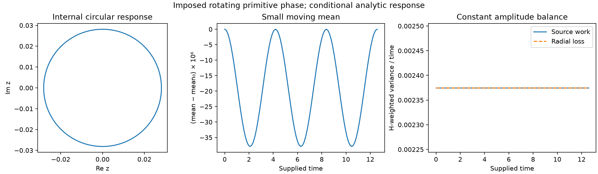

# Phase-to-form source matching and exchange

Causal source admission, regional frames, directed exchange and the prescribed-input response.

Section numbers are stable locators across this document family.
The [parameter reference](../NODAL_PARAMETER_FOUNDATIONS.md) owns the
reading map; the [execution plan](../research/FIVE_STAGE_EXECUTION_PLAN.md#current-g3-gate)
alone owns active tasks. Each result retains its stated model and scope.

## 15. When an observed phase can be a causal source

[Section 14](INHERITED_FORM_DYNAMICS.md#14-causal-support-versus-changing-geometry) establishes possible instantaneous compensation under a prepared
primitive phase. It does not establish that an angle observed in another
model can be inserted as that source. This admission question uses the
existing [morphism](../../src/tnfr/physics/structural_morphism.py),
[projection and memory](../../src/tnfr/physics/epi_memory.py),
[phase response](../../src/tnfr/physics/phase_response.py) and regional-balance
owners. No additional phase equation is selected here.

### 15.1 Source matching precedes phase tangency

Let `X_dot=f(X)` be an already closed fine law and let a proposed complete
macro state be `J(X)=(rho(X),Theta(X),V(X),...)`. On a regular chart, an
autonomous macro law `Z_dot=F(Z)` represents that fine evolution only if

\[
F(J(X))=DJ(X)f(X).
\]

The right side must also agree at fine states with identical `J(X)`;
otherwise the observation is not a closed state. For a proposed canonical
macro EPI channel, one necessary component of this identity is

\[
D\rho(X)f(X)
=\operatorname{diag}(V(X))\,
  \Delta\mathrm{NFR}_{\rm macro}(J(X)).
\]

The phase component separately requires `F_theta(J(X))=DTheta(X)f(X)`.
Tangency of the phase assignment cannot repair a failure of the EPI row.
An inherited decomposition can have a nonzero source if it is already
present in the projected fine vector field. It cannot count that field once
as passive transport and again as an independently added force. The
internal vector-form observation used below is not asserted to have the
canonical scalar macro pressure formula rejected in [section 13](INHERITED_FORM_DYNAMICS.md#13-faithful-macro-state-and-tetrad-inheritance-on-the-retained-prism).

For the retained unit prism with fine pure-EPI coefficient `e`, the existing
exact identity is `c_dot=e*INDUCED*c`. Adding canonical phase pressure `F_phi`
on those same fine nodes changes this projection by `R_int*F_phi` at unit
capacity. Preserving the same internal law requires that projection to
vanish. This does not require the entire source vector to vanish: a
fiberwise-constant source affects the omitted mean coordinates instead.
Preserving the full EPI state requires the full EPI row of the identity.

At the preparation of [section 14.3](INHERITED_FORM_DYNAMICS.md#143-canonical-phase-pressure-can-compensate-the-loss-instantaneously), `e=1/2` and each nonzero `u=1/16`.
The original pure-EPI model gives `u_dot=-1/32`; the added ideal phase
source contributes `1/24`, producing `u_dot=1/96`. The actual captured
projection is retained exactly and compared with an independent represented
phase-source evaluation. Its difference from the ideal is recorded rather
than fixed to one platform's binary64 literal. The contribution is nonzero
and reverses the sign of the retained rate. Thus this pressure changes fine dynamics,
not the pushforward of the original passive model. No choice of a phase
velocity can remove that instantaneous EPI mismatch.

A regular observation makes the same issue explicit without polar
singularities. On the common internal eigenray
`x=mu*1+u*(1,-1,0,1,-1,0)`, define, only as a conditional observation,
`theta_i=beta-k*(x_i-mu)`. Take `k>0` and a local chart with
`0<k*u<pi/4`. All edges satisfy strict U3, the mean direction is `beta`,
and the ideal canonical phase source equals `(w_phi*k*u/pi)*p` in each
triangle. The observed passive form still has `u_dot=-e*u`. Feeding this
source back instead gives

\[
\dot u=(-e+w_\phi k/\pi)u.
\]

Choosing `w_phi*k/pi=e` would cancel decay, but that is a selected new
interaction and not an identity derived by observing the old law. The
example introduces no installed coefficient or phase rule.

Changing the constant EPI coefficient cannot generally rescue an
amplitude-independent modal angle either. For fixed capacity/support, a
linear EPI observation with inherited rate `-e_0*L*x` would need
`w_phi*g(Theta(x))=(e-e_0)*L*x` to represent the same evolution with a new
passive coefficient `e`. Along positive rescalings of a centered field,
modal arguments and the left side are unchanged, while the right side
scales with amplitude. Matching two distinct positive amplitudes therefore
forces both sides to vanish. For internal-only matching the same statement
applies to the projected source, not necessarily the full pressure vector.
This excludes a fixed-coefficient interpretation on that amplitude family;
it does not exclude separately derived amplitude-dependent interactions.

### 15.2 Regular observation and the zero-amplitude boundary

For a fixed finite connected reversible pure-EPI model with strictly
positive fixed capacities and `e>0`, the fine state tends to its conserved
weighted consensus `mu*1`. A continuous phase-source observation `F_obs`
therefore vanishes asymptotically **if** it satisfies
`F_obs(mu*1)=0`. Local Lipschitz regularity also transfers the exponential
fine-state bound to that source. The same statement holds for just its
internal projection when that projection vanishes at consensus.

Consensus compatibility is an essential hypothesis. A constant map
`Theta(X)=theta_prepared` can be smooth while prescribing a nonuniform
phase source forever. It encodes the prepared pattern and does not derive
it from EPI. On the vertex-transitive prism, a nodewise phase observation
equivariant under graph automorphisms must be constant across nodes at
uniform EPI, provided no other state breaks that symmetry. Its available
canonical phase source is then zero. For a non-transitive graph symmetry
only enforces equality within vertex orbits; the stronger conclusion does
not follow automatically. Equivariance here is equality of the nodewise
phasor vector under permutation, not equality only up to an extra rotation.

Polar orientation avoids continuity at consensus rather than this argument.
The internal rays `z=r` and `z=i*r`, `r>0`, approach the same zero form
with different angles. Both can be decaying exact modes of the retained
fine law. Their angle difference remains finite while their amplitudes
vanish, so no continuous angle extension at the common origin exists.
An amplitude-independent angle can be a useful observation on the punctured
domain, but it does not by itself provide a finite sustaining mechanism.
The normalized-shape term `+kappa*q` from [section 12](INHERITED_FORM_DYNAMICS.md#12-intrinsic-response-from-a-closed-fine-nodal-model) is likewise a chain-rule
term, not a source that may be added back to EPI.

There is also a bound that does not assume angle continuity. Along the
unchanged passive unit-prism trajectory, `S(t)<=S(0)*exp(-2*e*t)`.
An available canonical phase channel obeys `|g_i|<=1`; for fixed finite
`w_phi`, its six-node vector satisfies `||F_phi||_2<=w_phi*sqrt(6)`.
Consequently its **diagnostic** work on that passive trajectory obeys

\[
|2\langle y,F_\phi\rangle|
\le 2w_\phi\sqrt{6S(0)}e^{-et},\qquad
\int_0^\infty |2\langle y,F_\phi\rangle|\,dt
\le \frac{2w_\phi\sqrt{6S(0)}}e.
\]

This bounds a measured comparison, not an executed source contribution.
It does not apply unchanged after feeding the source back and thereby
changing the fine law. Phase availability, wrap branches and binary64
realization remain separate from this exact-real bound.

### 15.3 The current supporting phase has only common-rotation freedom

For the prepared phases `(0,pi/3,pi/6)` in each triangle, every node's
neighbor resultant has direction `pi/6` and magnitude `1+sqrt(3)`.
The canonical phase-source derivative uses the existing mean-response
matrix, not an operator-stage Jacobian:

\[
R_{ij}=\mathbf1_{j\in N(i)}
  \frac{\cos(\theta_j-\pi/6)}{1+\sqrt3},\qquad
Dg=(R-I)/\pi.
\]

All three nonzero row entries are strictly positive and sum to one.
Connected support makes this stochastic matrix irreducible, so
`ker(R-I)=span(1)` and `rank(R-I)=5`. This property persists in a regular
neighborhood where all these entries stay positive. Thus a differentiable
path in that neighborhood that preserves the full phase source can only
rotate all phases together; its relative phase profile is fixed. This
specialization reuses the general source-tangency result in
[support balance, section 22](FORCED_SOURCE_AND_CLOCK.md#22-source-tangency-without-a-telemetry-controller).
The exact coefficients contain `sqrt(3)`; symbolic controls do not pass
rounded surds into the owner's exact rational Gram validator.

With fixed unit capacity, fixed EPI, held conductance/support and channel
coefficients, nonzero `w_phi` and no other changing source, stationarity
requires constant `g`. The result gives a precise
necessary phase-motion condition for that candidate. It does not impose
constant source on every moving or periodic pattern, and does not select
the common rotation speed or derive a law preserving the relative phases.
Known higher-dimensional source tangents on other graphs are unaffected.

### 15.4 Persistent support requires persistent directed work

For a separately justified coupled law on this same unit-capacity,
unit-conductance prism, with fixed `e>0`, exact canonical pressure and no
pressure residual, [section 14](INHERITED_FORM_DYNAMICS.md#14-causal-support-versus-changing-geometry) gives

\[
\dot S=-2eS-\frac{2e}{3}D+W_F,\qquad
D=|z_0-z_1|^2,\quad W_F=2\langle y,F_{\rm int}\rangle.
\]

Here `F_int` is the orthogonal internal projection of the true source.
At `S>0`, nondecrease requires and is equivalent to

\[
\frac{\langle y,F_{\rm int}\rangle}{S}
\ge e\left(1+\frac{D}{3S}\right).
\]

Large source magnitude alone is insufficient: its sign and direction
matter. Cauchy-Schwarz gives the necessary norm bound
`||F_int||>=e*sqrt(S)+e*D/(3*sqrt(S))`. In particular, a proposed local
source with `||F_int||<=L*sqrt(S)` and `L<e` cannot compensate loss there.
This condition tests a given source law; it does not prescribe a gain.

If a solution maintains `S(t)>=s_*>0` throughout `[0,T]`, integration
requires

\[
\int_0^T W_F(t)\,dt
\ge 2e s_*T+s_*-S(0).
\]

The omitted disagreement integral is nonnegative. Indefinite active
maintenance therefore needs sustained directed source work. One positive
snapshot or a finite passive transfer does not prove it. A supplied fixed
phase can algebraically support forced equilibrium, but assuming it remains
fixed does not explain the source's autonomous origin or preservation.
Actual pressure defects, changing capacity/metric and events require their
own retained terms before this inequality is used.

The bounded admission result excludes promoting passive internal angles to
a new autonomous source without a matching vector-field identity. It does
not exclude an independently derived nonlinear, non-gradient or hybrid
TNFR completion. Existing memory, directed transport, configured phase maps
and auxiliary wave models supply their declared dynamics, but none of the
reviewed owners derives the missing primitive phase law without an extra
premise. The constitutive origin remains open; no source-preserving velocity
or compensating gain is installed as its answer.

Portable controls are centralized in
[source matching](../../tests/physics/test_internal_mode_source_closure.py),
[observation regularity and work](../../tests/physics/test_internal_mode_source_regularity.py)
and [prepared-source tangency](../../tests/physics/test_internal_mode_phase_tangency.py).
They reuse the previous prism fixture and physics owners without changing
runtime dynamics. Exact conditional identities, actual binary64 captures
and supplied counterexamples retain distinct evidence scopes.

The joint-law analysis establishes the following conditional representation:
canonical phase pressure has an exact state-dependent positive diagonal
metric on its regular reciprocal-support domain. Its alignment cost and
connection to current/curvature are derived once in
[variational sections 13.6-13.7](../TNFR_VARIATIONAL_PRINCIPLE.md#136-exact-state-dependent-metric-for-canonical-phase-pressure).
This supplies a geometric representation, not the missing phase clock or
reciprocal EPI response. A separately supplied phase-only relaxation has a
finite cost budget and cannot maintain the prism's internal amplitude under
the stated uniform regularity assumptions. The earlier constant-metric and
passive-source obstructions remain valid in their respective scopes.

## 16. Phase and form: directed exchange, frames and the moving mean

**Consolidated result: a restricted driven phase/form response.** On the
fixed unit triangular prism, canonical phase pressure from a prescribed
rotating phase contrast has an exact circular particular EPI response with
nonzero internal amplitude and a periodic, nonconstant mean. This result
requires unit capacity, fixed positive EPI/phase weights, the regular strict-U3
chart below, and no other active source, clipping, event or pressure defect.
It is a theorem of the stated ideal model, not an autonomous NFR or a physical
measurement. The normalized structural-time input is part of the prescription.

| Claim | Evidence and scope |
| --- | --- |
| Directed phase/form coupling and complete mean | Exact nodal projection, sections 16.1 and 16.3 |
| Circular response and threefold mean modulation | Prescribed input and its derived particular response, sections 16.4-16.5 |
| Convergence from another EPI preparation | Exact comparison under the **same entire prescribed input**, with a free mean offset, section 16.7 |
| Reproducible numerical illustration | Example 179 and its declared rounding/quadrature comparisons, section 16.8 |
| Autonomous source generation, phase-clock selection and source robustness | Open; not supplied by the displayed response or the same-input comparison |

The phase/form question has three distinct objects. Their existing owners
remain authoritative; none is renamed into another state variable.

| Object | What it represents | What is needed to evolve it |
| --- | --- | --- |
| Primitive nodal `theta_i` | The circular coordinate consumed by canonical phase pressure and U3 | A specified phase law or a justified relation to a complete evolving state |
| Internal form angle `psi_a=arg(z_a)` | Orientation of two nonzero internal EPI coordinates in a declared basis | The pushforward of the fine nodal rate, including amplitude ratios and source projections |
| Local frame angle `chi_a` | Choice of basis used to report the same internal form | The chosen coordinate transformation; its derivative is not a physical source |

[Section 9](JOINT_PARAMETER_RESPONSE.md#9-signed-epi-and-phase-an-explicit-representation-test)
and section 15 already delimit signed scalar EPI, primitive phase and
causal closure. This section sharpens their relation through the retained
prism without introducing a phase law or another observation API.

### 16.1 Radial and angular effects of an actual phase source

Keep the fixed unit prism, unit capacities and EPI weight `e>0`, using the
same normalized structural-time convention as the earlier cycle controls. For each
triangle write `x_a=m_a*1+u_a*P+v_a*Q`, where `P=(1,-1,0)`,
`Q=(1,1,-2)`, and `z_a=sqrt(2)*u_a+i*sqrt(6)*v_a`. Let `F_a` be an
independently computed fine forcing vector; pressure defects, if present,
must be retained as separate source terms. Its internal projection is

\[
f_a=\frac{P^TF_a}{\sqrt2}+i\frac{Q^TF_a}{\sqrt6},\qquad
\dot z_a=\frac e3(z_b-4z_a)+f_a.
\]

For `r_a=|z_a|>0`, put `psi_a=arg(z_a)` and
`exp(-i psi_a)f_a=s_a+i t_a`. The same nodal rate gives

\[
\dot r_a=\frac e3\{r_b\cos(\psi_b-\psi_a)-4r_a\}+s_a,
\qquad
\dot\psi_a=\frac e3\frac{r_b}{r_a}\sin(\psi_b-\psi_a)+\frac{t_a}{r_a}.
\]

The displayed neighbor-angle expressions require `r_b>0`. At `z_b=0`, use
the real and imaginary parts of `exp(-i psi_a)z_b` instead of assigning that
neighbor an angle. Thus angular alignment is generally not closed on angles alone: neighbor
amplitudes and projected sources matter. For `S=|z_0|^2+|z_1|^2`, the
shared regional budget becomes

\[
\dot S=-2eS-\frac{2e}{3}|z_0-z_1|^2+2\sum_a r_a s_a.
\]

Only the radial source projection contributes to instantaneous amplitude
maintenance. A source tangent to the nonzero modes can turn the form while
the amplitude still dissipates. Conversely a primitive **phase** channel
can have a radial projection: its name does not restrict it to changing
the internal angle. At `z_a=0`, the Cartesian rate remains defined while
the angle and its rate are unavailable. A nonzero prepared source can seed
an internal mode there; it does not prove spontaneous generation of that source.

### 16.2 Internal phase requires a frame and transported comparisons

Let `B=[P/sqrt(2),Q/sqrt(6)]` be the orthonormal internal basis. Change
only coordinates using `B'_a=B O_a`, `O_a` orthogonal, and let `y_a=O_a^T z_a`
in two-real-component notation. The fine EPI is unchanged. The inherited
edge transport is `T_ab=O_a^T O_b`, so fixed frames give

\[
\dot y_a=\frac e3(T_{ab}y_b-4y_a)+O_a^Tf_a.
\]

Alignment and the interaction energy use `y_a^T T_ab y_b` and
`||y_a-T_ab y_b||^2`, not the untransported coordinate difference. For
rotations `O_a=R(chi_a)`, the meaningful angular difference is
`psi'_b-psi'_a+chi_b-chi_a`. Reflections additionally reverse orientation.
A common **active** O(2) transformation of form is a symmetry of this pure-EPI
generator; independent active rotations need not be. An active change of
form and a passive change of basis are different operations.

For moving frames put `Omega_a=O_a^T O_dot_a`. Then

\[
D_t y_a:=\dot y_a+\Omega_a y_a
       =\frac e3(T_{ab}y_b-4y_a)+O_a^Tf_a,
\qquad \dot\psi'_a=\dot\psi_a-\dot\chi_a.
\]

The displayed angular formula assumes SO(2); a reflected frame also reverses
angular orientation. The matrix covariant derivative covers both. A rotating
chart can create an arbitrary displayed angular speed without changing the
fine field. Source work must likewise use the physical
tangent, represented by `dy_a+Omega_a y_a dt`. Omitting the frame term can
fabricate work. These matrices are induced by basis changes; they are not
the auxiliary `arg(K_phi+i J_phi)` connection in `physics/gauge.py`, a new
fundamental gauge field, or a derivation of the primitive phase clock.

### 16.3 Exact primitive-phase to internal-form coupling on repeated triples

Now let both triangles have the same form `(mu,u,v)` and the same primitive
phase triple. On a common regular lift write

\[
\theta=\beta\mathbf1+\eta,\quad
\eta=s_\theta P+t_\theta Q=(s_\theta+t_\theta,-s_\theta+t_\theta,-2t_\theta),\quad
\zeta=\sqrt2s_\theta+i\sqrt6t_\theta.
\]

Assume `max(eta)-min(eta)<pi/2`, fixed unit capacity, and only EPI and phase
pressure with weights `e>0,w>0`. Each node sees one copy of each triple phase.
Since `sum eta=0`, the strict range condition implies `|eta_i|<pi/3`; the
common resultant `Z(eta)=sum_i exp(i eta_i)` has positive real part. Define
`c(eta)=Arg Z(eta)/pi`. Without a branch jump, the **canonical ideal phase-pressure channel** is

\[
g=-\frac{\eta}{\pi}+c(\eta)\mathbf1,\qquad
\boxed{\ \dot z=-ez-\frac w\pi\zeta,\quad \dot\mu=w c(\eta)\ }.
\]

This is the fine canonical source projected by the existing internal and
mean rows, not the different block-constant quotient of `phase_quotient.py`.
No primitive phase evolution is supplied by this projection. In particular,
the internal coordinate `zeta` describes contrasts of primitive phase; its
argument is neither any one `theta_i` nor an independently derived clock.
The real and imaginary parts of `zeta` are not new free physical coefficients.

Writing `z=r exp(i psi)`, `zeta=rho exp(i alpha)` gives

\[
\dot r=-er-\frac w\pi\rho\cos(\alpha-\psi),\qquad
\dot\psi=-\frac{w\rho}{\pi r}\sin(\alpha-\psi).
\]

Antiparallel phase contrast can support amplitude without turning it;
quadrature contrast can turn it without paying the radial loss. Constant
nonzero `r` requires the independently realized contrast to satisfy

\[
\zeta=-\frac\pi w(e+i\dot\psi)z.
\]

This is a necessary balance for a proposed curve, not a method for fitting
pressure after seeing the desired motion. It specifies what a missing
source law would have to generate. At `z=0`, `z_dot=-(w/pi)zeta` remains
regular without inventing an angle for the zero form.

### 16.4 The common source reveals nonlinear threefold geometry

The mean row cannot generally be discarded. Since `eta_0+eta_1+eta_2=0`,

\[
\operatorname{Im}Z=-4\prod_i\sin(\eta_i/2).
\]

On the stated strict chart this vanishes exactly when one `eta_i` is zero.
Consequently `mu_dot=0` requires `t_theta=0` or `t_theta=s_theta` or `t_theta=-s_theta`: the contrast
`zeta` lies on three lines, not on a full circle. This is a nonlinear
geometric restriction of the actual phasor mean, not a new phase threshold.

For small `rho=|zeta|`, with a fixed orientation `alpha`,

\[
\sum_i\eta_i^3=\frac{\rho^3}{\sqrt6}\sin(3\alpha),\qquad
c(\eta)=-\frac{\rho^3}{18\sqrt6\pi}\sin(3\alpha)+O(\rho^5).
\]

The internal source projection is isotropic and linear in `zeta`, whereas
the omitted mean first sees a cubic, threefold angular dependence. A linear
mode calculation alone misses it. This does not break passive coordinate
covariance; it limits promotion of a pure-EPI active O(2) symmetry to the
full canonical phase source.

For fixed `mu` and constant positive `r`, the required nonzero `zeta` must
remain on one of the three lines along a continuous regular curve. A uniform
nonzero rotation would rotate `zeta` off that line and is therefore impossible
under these restrictions. Transient turning remains possible: for fixed line
angle `gamma`, the radial balance gives `psi_dot=e*tan(gamma-psi)` wherever
the balance is admissible. More generally a closed constant-radius form
cycle on that line has zero perpendicular component, since that component
obeys `b_dot=-e*b`; its orientation cannot recur nontrivially. These statements
do not exclude moving means, varying amplitudes, other phase families or graphs.

### 16.5 Prescribed rotating phase contrast: periodic particular response

Allowing the mean to respond supplies a constructive comparison. Prescribe
the primitive phase contrast first, with `rho>0`, `omega!=0` and fixed `beta`.
The internal EPI row then gives its periodic particular response:

\[
\zeta(t)=\rho e^{i(\omega t+\alpha_0)},\qquad
z(t)=-\frac{w}{\pi(e+i\omega)}\zeta(t),\qquad
\mu(t)=\mu_0+w\int_0^t c(\eta(\tau))d\tau.
\]

These expressions solve both displayed EPI rows exactly. The form is calculated
from a declared phase source; pressure is not reconstructed from a measured
desired trajectory. The phase curve and angular clock are supplied, making
this a conditional analytic control,
not an autonomous emergence mechanism or a numerical maintenance campaign.
Other internal initial values also contribute their decaying homogeneous
term under this supplied source; the displayed circular response is the
periodic particular solution.
The form radius is `r=w*rho/(pi*sqrt(e^2+omega^2))`. The sufficient bound
`rho<pi/(2*sqrt(2))` keeps every phase gap strictly below `pi/2` through
the full rotation, since every pair difference is at most `sqrt(2)*rho`.

Cyclic permutation of the triple leaves `Z` unchanged, while negating the
triple conjugates `Z`. Thus exactly
`c(alpha+2pi/3)=c(alpha)` and `c(alpha+pi/3)=-c(alpha)` on this rotating family.
For constant `omega` the mean source has zero integral over each `T/3`,
`T=2pi/|omega|`; `mu` is periodic rather than drifting. Its leading
small-contrast modulation is at `3|omega|`. Distinguish the source from its
integral: `c` has leading amplitude `rho^3/(18*sqrt(6)*pi)`, whereas the
mean's oscillatory component has leading amplitude
`w*rho^3/(54*sqrt(6)*pi*|omega|)`. More precisely, for fixed nonzero `omega`,

\[
\mu(t)-\mu_0=
\frac{w\rho^3}{54\sqrt6\pi\omega}
 \{\cos(3\alpha(t))-\cos(3\alpha_0)\}+O(\rho^5)
\]

uniformly over a fixed number of cycles as `rho -> 0`. The exact response
can contain higher harmonics permitted by the same symmetry.
This is a prediction within the supplied family, not an observed physical
frequency or an independently selected TNFR clock. The complete EPI returns
while its internal amplitude never vanishes. If a runtime EPI band is needed,
the whole supplied curve, including the mean modulation, must fit that band.

The full work retains this moving mean. With `D=H=3I`, the Dirichlet energy
is constant and

\[
F^TD\dot x=\|\dot x\|_H^2
          =6r^2\omega^2+18\dot\mu^2.
\]

The time integral of the mean source is zero, but its work is not. Discarding the mean
would both violate its EPI equation and lose that work. This reuses the
oriented cycle identity rather than inventing a second energy definition.

### 16.6 What the result does and does not close

The derived relations identify how primitive phase geometry can maintain
amplitude, turn internal form, and modulate the common mean together. They
also identify which apparent phase changes depend on the observer's frame.
The missing equation is still the evolution or justified constitutive origin
of `zeta` and any other primitive channels. Defining it retrospectively from
the required circular motion would prescribe the answer. The source's clock,
formation, perturbation response and autonomous selection remain G3 gates.

Controls reuse the shared fine generator, phase support and regional budgets:
[frame covariance](../../tests/physics/test_internal_phase_frame_scope.py) and
[phase/form exchange](../../tests/physics/test_phase_form_exchange_scope.py).
No new production phase rule, force, topology or gauge API is introduced.

### 16.7 Same-input response theorem and an all-time band bound

Fix the graph, capacity and coefficients of section 16.3, and supply the
same regular phase contrast to both triangles. For any continuous prescribed
contrast `zeta(t)`, the repeated-form sector has the exact response

\[
z(t)=e^{-et}z(0)-\frac w\pi\int_0^t e^{-e(t-s)}\zeta(s)ds,
\qquad \mu(t)=\mu(0)+w\int_0^t c(\eta(s))ds.
\]

This is the solution of the projected nodal equation, not a fitted kernel.
The preceding circular expression is its periodic particular solution.
Under that same phase input, two repeated-form preparations satisfy
`delta z(t)=exp(-e*t)*delta z(0)` and `delta mu(t)=delta mu(0)`.
In the actual six-node metric `H=3I`,

\[
\|\delta x(t)\|_H^2=
6e^{-2et}|\delta z(0)|^2+18\delta\mu(0)^2.
\]

The result also admits a full EPI preparation that is initially different
in the two triangles. Put
`mu=(m_0+m_1)/2`, `d=(m_0-m_1)/2`,
`Z=(z_0+z_1)/2` and `D=(z_0-z_1)/2`. Here `D` denotes the difference
mode only; the degree metric elsewhere remains `3I`. The inherited rows are

\[
\dot\mu=wc,\quad \dot d=-\frac{2e}{3}d,\quad
\dot Z=-eZ-\frac w\pi\zeta,\quad \dot D=-\frac{5e}{3}D.
\]

For two full EPI preparations under the same complete phase input,

\[
\|\delta x(t)\|_H^2=
18\delta\mu(0)^2+18e^{-4et/3}\delta d(0)^2
+6e^{-2et}|\delta Z(0)|^2+6e^{-10et/3}|\delta D(0)|^2.
\]

After removing the neutral common-mean offset, the norm contracts at least
as `exp(-2*e*t/3)`. Thus a rotating prescribed contrast has a unique periodic
EPI response per mean offset, approached under that fixed input. This is
conditional attraction of the EPI response, not an isolated attractor of the
full state, stability to phase/capacity/support perturbations, or a binary64
runtime convergence theorem. When a phase-from-form rule changes the input
after perturbing EPI, the same-input hypothesis must be checked rather than
assumed. If the prescribed contrast is instead held at zero, the common mean
stops moving and all nonuniform modes decay; the source remains necessary
for the displayed maintained response.

**A sufficient band bound for the periodic particular solution.** For
`rho<pi/(2*sqrt(2))`, the exact mean-source magnitude obeys

\[
|c|\le C_0:=\frac{\rho^3}{6\pi(3-\rho^2/2)}.
\]

Indeed, `sum eta=0` cancels the linear sine term,
`|sum sin eta|<=sum |eta|^3/6<=rho^3/6`, and
`Re Z>=3-rho^2/2>0`; use `|atan y|<=|y|` on the regular branch. The
mean-source period is `P=2pi/(3|omega|)`, with zero integral over that
period. Reducing time modulo `P` bounds the partial integral by
`C_0*min(t_mod,P-t_mod)<=C_0*P/2`. Hence, for the particular response,

\[
|\mu(t)-\mu_0|\le
\frac{w\rho^3}{18|\omega|(3-\rho^2/2)}=:M_0,
\qquad
|x_i(t)-\mu_0|\le M_0+\sqrt{\frac23}\,r.
\]

The last term uses the norm of each row of the orthonormal internal lift.
This is an all-time exact-model bound, not merely the range of plotted
samples. A declared open EPI band containing that whole interval needs no
clipping for this particular solution. General initial data add the explicitly
decaying transient above and need their own band check. The band bound
follows from the inequalities above. The same-input response controls are in
[response theorem tests](../../tests/physics/test_phase_form_response_theorem.py).

### 16.8 Reproduce and interpret the documented result

From the repository root, with its Python dependencies installed, run

```bash
python examples/08_emergent_geometry/179_phase_form_driven_response.py --output-dir artifacts/phase_form_driven_response
```

The example declares its phase input first, reconstructs the analytic EPI
response and evaluates it at fixed sample points. It compares nodal rates
with shared pressure readers and numerically integrates only the explicit
scalar mean-source integral. It does not execute an engine/glyph trajectory,
derive a primitive phase law or reset the mean to force endpoint closure.
The command records the parameters, sample grid, finite rounding residuals,
mean quadrature comparison and numerical endpoint residuals. These finite
readings illustrate the exact results above; they are not their proof.

The default demonstration uses `e=1/2`, `w=1/4`, unit capacity, `rho=1/4`,
`omega=1/2`, `beta=pi` and `mu_0=1/2`. The inactive capacity channel has
weight `1/4`; its gradient vanishes on this uniform-capacity preparation.
These are declared illustration values, not fitted parameters or selected
physical constants. The source definition, regular branch and entire nodal
state must be retained when reproducing the result.

The recorded [JSON](../../docs/assets/phase_form_driven_response/phase_form_driven_response.json)
and [CSV](../../docs/assets/phase_form_driven_response/phase_form_driven_response.csv)
contain 97 snapshots over one supplied cycle. Composite Simpson integration
uses 16 and 32 subdivisions per output interval; their maximum mean-offset
difference is `4.48e-15`, a refinement comparison rather than a certified
quadrature bound. The radius is `0.02813488488`; the sampled mean variation
is `3.789703416e-5` peak-to-peak. The maximum shared nodal-rate residual is
`8.33e-17`. The uncorrected accumulated endpoint offsets are about `2.34e-19`
and `1.20e-19`; adding the initial mean rounds these differences to zero,
so the raw offsets are retained separately. No endpoint reset is applied.



The middle panel magnifies the mean offset by `10^6`; the right panel shows
the internal radial balance, distinct from the full velocity-work identity
above. The optional plot requires Matplotlib (`viz-basic` extra). Displaying
the endpoint tetrad does not certify closure of these reduced coordinates;
its primitive-state and representation dependencies remain those of [section 13.4](INHERITED_FORM_DYNAMICS.md#134-full-tetrad-dependency-and-representation-boundary).

The controls have distinct responsibilities:

| Owner | Reproducible obligation |
| --- | --- |
| [Internal projection fixture](../../tests/physics/_internal_mode_fixture.py) and [exchange controls](../../tests/physics/test_phase_form_exchange_scope.py) | Actual graph support, signed EPI projection, radial/tangential budgets, nonlinear mean and full work |
| [Frame controls](../../tests/physics/test_internal_phase_frame_scope.py) | Passive basis covariance versus active changes of form; physical tangent in moving frames |
| [Response theorem controls](../../tests/physics/test_phase_form_response_theorem.py) | Same-input solution and decay of full EPI preparation differences |
| [Example 179](../../examples/08_emergent_geometry/179_phase_form_driven_response.py) | Finite numerical reproduction with explicit source, quadrature and represented-pressure residuals |
| [Single G3 gate](../research/FIVE_STAGE_EXECUTION_PLAN.md#current-g3-gate) | Still-missing origin of the primitive source, clock and autonomous response |
