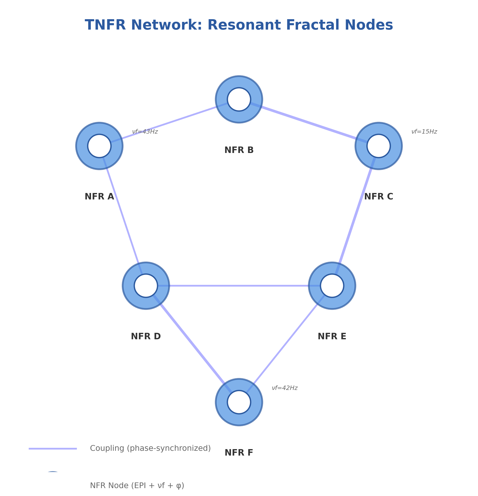
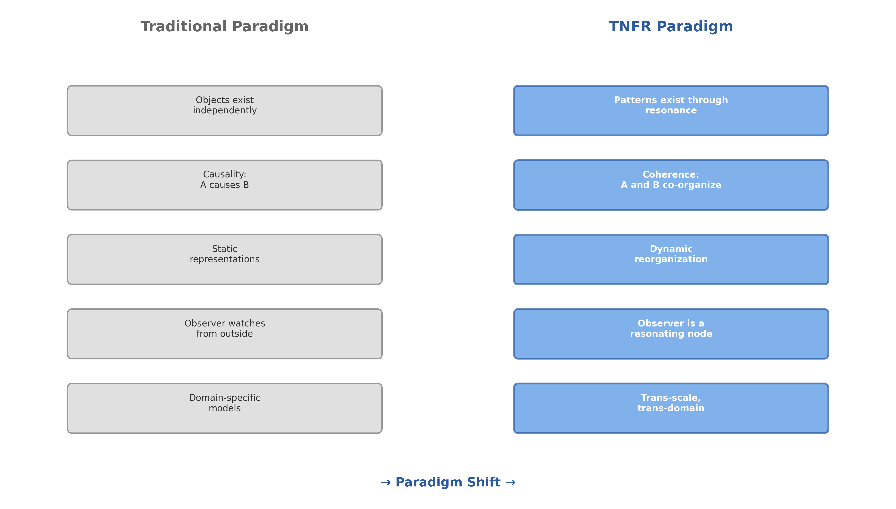
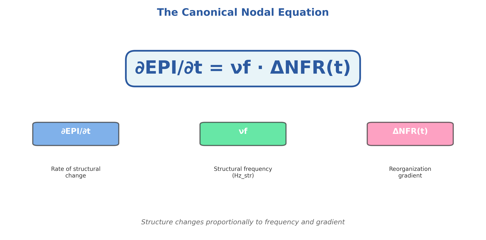
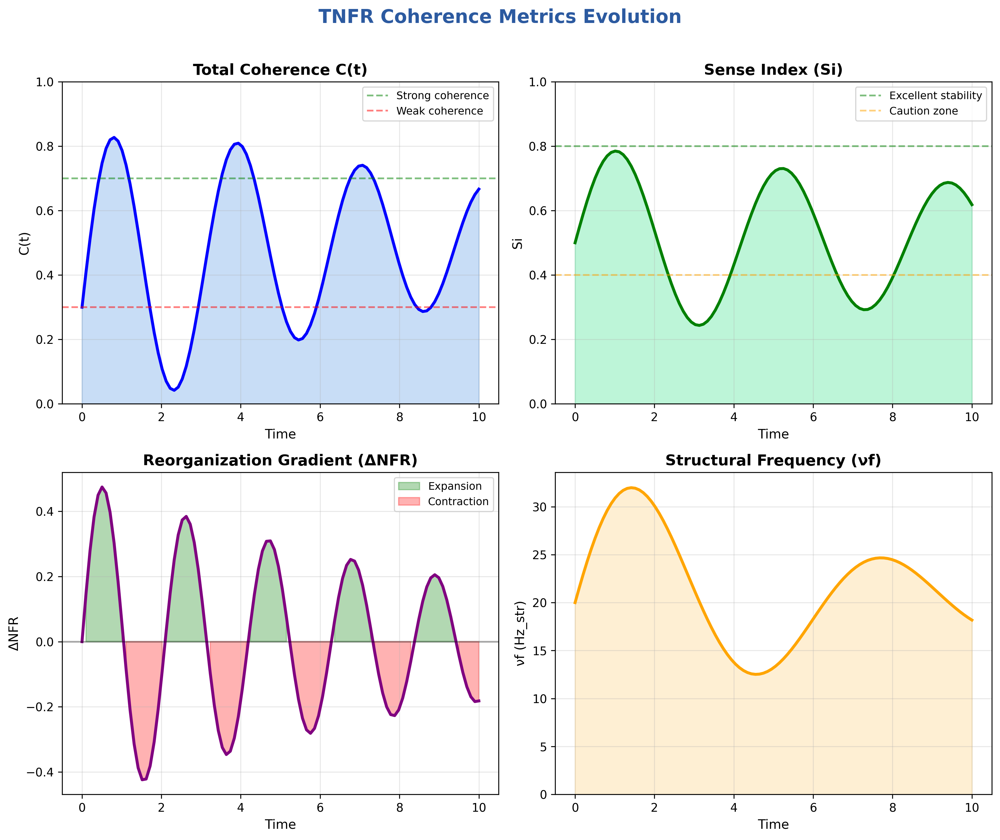
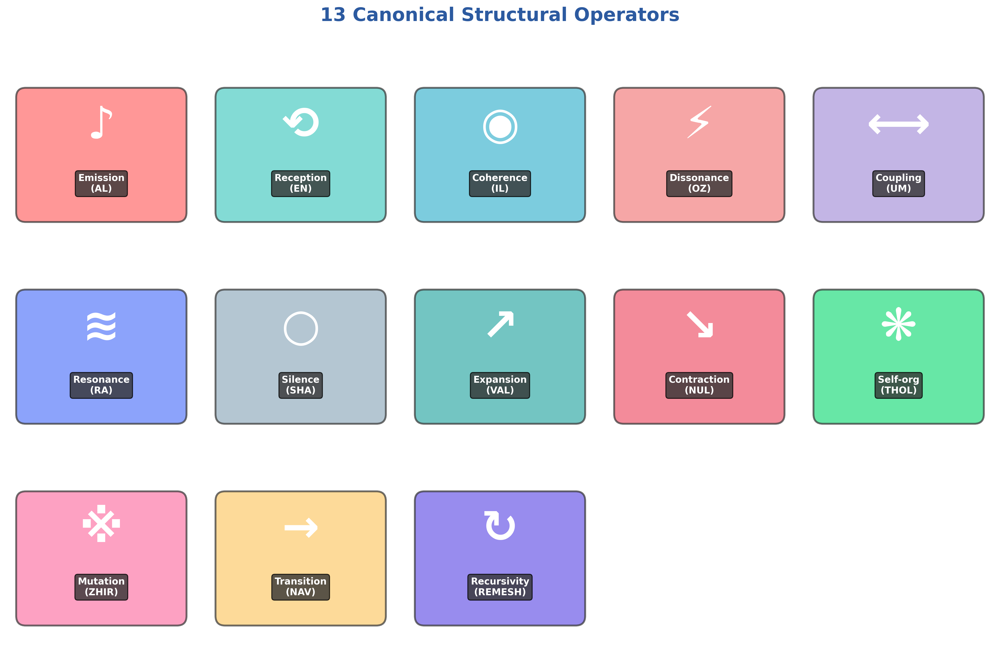

# Welcome to the TNFR Python Engine Wiki 🌊

<div align="center">



**Model reality as resonant patterns, not isolated objects**

[](https://pypi.org/project/tnfr/)
[](https://tnfr.netlify.app)
[](https://github.com/fermga/TNFR-Python-Engine)

</div>

---

## 🎯 What is TNFR?

**TNFR** (**Resonant Fractal Nature Theory** / **Teoría de la Naturaleza Fractal Resonante**) is a revolutionary paradigm for modeling complex systems. Instead of viewing reality as isolated "things" that interact through cause-and-effect, TNFR models it as **coherent patterns that persist through resonance**.

Think of it like a choir: each singer maintains their unique voice while synchronizing with others to create harmony. When voices resonate, they produce stable, beautiful structures. When they clash, patterns fragment. **TNFR captures this principle mathematically and makes it operational in code.**

## 🚀 Quick Navigation

### 📚 Core Resources

- **[Getting Started](Getting-Started.md)** - Install and run your first TNFR network in 5 minutes
- **[Core Concepts](Core-Concepts.md)** - Understand the fundamental principles of TNFR
- **[Examples & Use Cases](Examples.md)** - See TNFR in action across different domains
- **[API Reference](https://tnfr.netlify.app/api/overview/)** - Complete technical documentation

### 🎓 Learning Path

**New to TNFR?** Follow this path:

1. **10 minutes**: Read the [Core Concepts](Core-Concepts.md) overview
2. **5 minutes**: Try the [Quick Start](Getting-Started.md#quick-start) tutorial
3. **30 minutes**: Explore [domain examples](Examples.md) relevant to your field
4. **Ongoing**: Dive into the [full documentation](https://tnfr.netlify.app)

## 🌟 Why TNFR?



### Key Advantages

- 🔄 **Operational Fractality**: Patterns scale without losing structure
- 📊 **Complete Traceability**: Every reorganization is observable and reproducible
- 🎯 **Guaranteed Reproducibility**: Same conditions → same outcomes
- 🌐 **Domain Neutral**: Works from quantum to social systems
- ⚡ **Production-Ready**: Optimized backends (NumPy/JAX/PyTorch), comprehensive testing

## 🧬 Use Cases

TNFR is being used to model:

- **🧬 Biology**: Cellular networks, neuronal synchronization, protein dynamics
- **🌐 Social Systems**: Information spread, community formation, opinion dynamics  
- **🤖 AI & ML**: Resonant symbolic systems, emergent learning patterns
- **🔬 Network Science**: Structural coherence analysis, pattern detection
- **🏗️ Distributed Systems**: Decentralized coordination, self-organization
- **📊 Finance**: Market dynamics, risk coherence, systemic stability

## 📖 The Canonical Nodal Equation



At the heart of TNFR is one elegant equation that governs how structures evolve:

```
∂EPI/∂t = νf · ΔNFR(t)
```

**What it means:**
- **EPI**: Primary Information Structure (the "shape" of a node)
- **νf**: Structural frequency (reorganization rate in Hz_str)
- **ΔNFR**: Internal reorganization operator (structural gradient)

*Structure changes proportionally to frequency and gradient*

## 🛠️ Installation

```bash
pip install tnfr
```

Requires Python ≥ 3.9

## 💡 Quick Example

```python
from tnfr.sdk import TNFRNetwork

# Create, activate, and measure a network in 3 lines!
network = TNFRNetwork("hello_world")
results = (network
    .add_nodes(10)
    .connect_nodes(0.3, "random")
    .apply_sequence("basic_activation", repeat=3)
    .measure())

print(results.summary())
```

🎉 **That's it!** You just created a resonant network.

## 📊 Structural Metrics



TNFR provides precise, observable metrics to measure network health:

- **C(t)**: Total network coherence [0, 1] - measures pattern stability
- **Si**: Sense Index [0, 1+] - measures reorganization stability
- **ΔNFR**: Reorganization gradient - indicates expansion or contraction
- **νf**: Structural frequency (Hz_str) - rate of structural change

## 🔧 Structural Operators



TNFR defines **13 canonical operators** that are the only way to modify network structures. These ensure all changes are traceable, coherent, and reproducible:

- **Emission/Reception**: Initiate & capture resonant patterns
- **Coherence/Dissonance**: Stabilize or destabilize structures
- **Coupling/Resonance**: Connect nodes & propagate patterns
- **Expansion/Contraction**: Increase or reduce complexity
- **Self-organization**: Create emergent nested structures
- **Mutation/Transition**: Transform structural states
- **Silence/Recursivity**: Pause evolution & enable fractality

Learn more in [Core Concepts](Core-Concepts.md).

## 🤝 Contributing

We welcome contributions! Here's how to get started:

1. **Understand TNFR**: Read the [Mathematical Foundations](https://tnfr.netlify.app/theory/mathematical_foundations/)
2. **Check Guidelines**: Follow the [AGENTS.md](https://github.com/fermga/TNFR-Python-Engine/blob/main/AGENTS.md) rules
3. **Write Tests**: Cover all canonical invariants
4. **Submit PR**: See [CONTRIBUTING.md](https://github.com/fermga/TNFR-Python-Engine/blob/main/CONTRIBUTING.md)

## 🔗 Resources

- **GitHub**: https://github.com/fermga/TNFR-Python-Engine
- **Documentation**: https://tnfr.netlify.app
- **PyPI Package**: https://pypi.org/project/tnfr/
- **Issues & Support**: https://github.com/fermga/TNFR-Python-Engine/issues

## 📜 Citation

When publishing research or applications based on TNFR, please cite:
- This repository: `fermga/TNFR-Python-Engine`
- Theoretical foundations: [TNFR.pdf](https://github.com/fermga/TNFR-Python-Engine/blob/main/TNFR.pdf)
- Mathematical formalization: [Mathematical Foundations](https://tnfr.netlify.app/theory/mathematical_foundations/)

---

<div align="center">

**Made with ❤️ for researchers, developers, and explorers of complex systems**

*Reality is not made of things—it's made of resonance*

[Get Started →](Getting-Started.md) | [Learn Concepts →](Core-Concepts.md) | [See Examples →](Examples.md)

</div>
