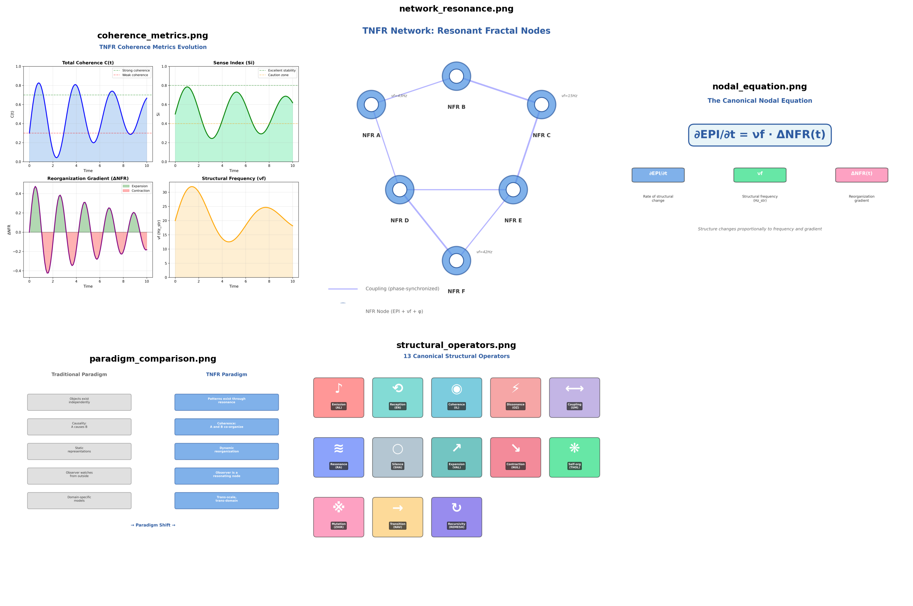

# TNFR Wiki - Quick Reference



## 📖 Wiki Pages

Start here: **[Home](Home.md)**

### Main Pages

| Page | Description | Content |
|------|-------------|---------|
| **[Home](Home.md)** | Main landing page | Overview, installation, quick example, navigation |
| **[Getting Started](Getting-Started.md)** | First steps with TNFR | Installation, tutorials, workflow, troubleshooting |
| **[Core Concepts](Core-Concepts.md)** | Theory and fundamentals | NFRs, nodal equation, operators, metrics, fractality |
| **[Examples](Examples.md)** | Real-world applications | Biology, social, AI, distributed systems, finance, physics |

## 🎨 Visual Assets (5 Graphics)

All graphics are high-resolution (300 DPI) and located in the `images/` directory:

1. **network_resonance.png** - NFR nodes in a resonant network
2. **structural_operators.png** - The 13 canonical operators
3. **paradigm_comparison.png** - Traditional vs TNFR paradigms
4. **coherence_metrics.png** - Metrics evolution over time (C(t), Si, ΔNFR, νf)
5. **nodal_equation.png** - The canonical nodal equation explained

## 📊 Statistics

- **Total lines**: ~1,700 lines of markdown
- **Total size**: ~1.8 MB (including graphics)
- **Code examples**: 30+ executable Python examples
- **Visualizations**: 5 custom-generated graphics
- **Use cases**: 10+ domain-specific applications

## 🚀 Quick Start

```python
from tnfr.sdk import TNFRNetwork

# Create, activate, and measure a network
network = TNFRNetwork("hello_world")
results = (network
    .add_nodes(10)
    .connect_nodes(0.3, "random")
    .apply_sequence("basic_activation", repeat=3)
    .measure())

print(results.summary())
```

## 🔧 Regenerating Graphics

```bash
cd wiki
python generate_graphics.py
```

## 📝 Using This Wiki

### For GitHub Wiki

1. Navigate to repository's Wiki tab
2. Create pages: Home, Getting-Started, Core-Concepts, Examples
3. Copy content from .md files
4. Upload images where referenced

### For Documentation Site

Add to `mkdocs.yml`:

```yaml
nav:
  - Wiki:
      - Home: wiki/Home.md
      - Getting Started: wiki/Getting-Started.md
      - Core Concepts: wiki/Core-Concepts.md
      - Examples: wiki/Examples.md
```

### For Local Reading

View markdown files directly on GitHub or with any markdown viewer.

## 🎯 Design Principles

- ✅ **English only** per TNFR guidelines
- ✅ **Visual-first** approach with lots of diagrams
- ✅ **Paradigm-aligned** with strict TNFR concepts
- ✅ **Beginner-friendly** progressive complexity
- ✅ **Code-heavy** with executable examples
- ✅ **Self-contained** pages work independently

## 🔗 External Resources

- **Full Documentation**: https://tnfr.netlify.app
- **GitHub Repository**: https://github.com/fermga/TNFR-Python-Engine
- **PyPI Package**: https://pypi.org/project/tnfr/

---

**Start exploring**: [→ Go to Home Page](Home.md)
